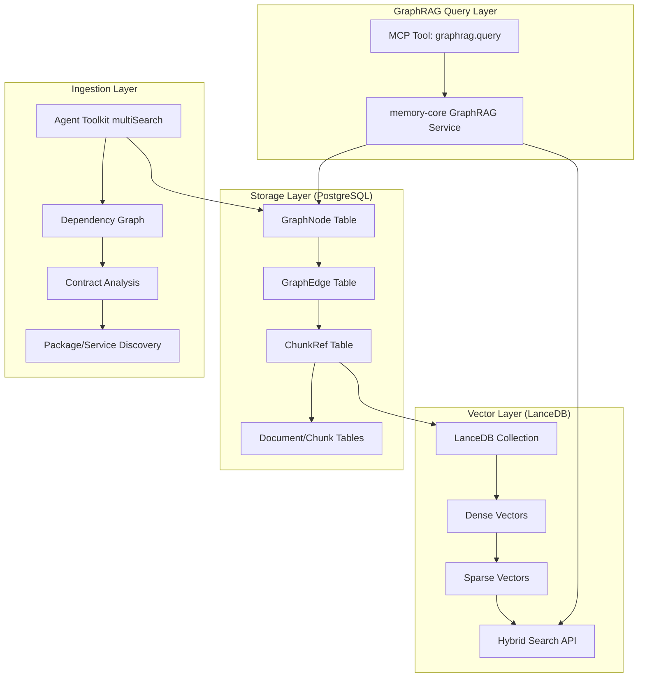

# GraphRAG Implementation Plan for Cortex-OS

## Executive Summary

This document outlines the **adapted** GraphRAG implementation for Cortex-OS, addressing conflicts with the original plan and leveraging the existing architecture strengths.

## Key Adaptations Made

### 1. Database Technology
- **Original Plan**: SQLite + Qdrant
- **Cortex-OS Reality**: PostgreSQL + pgvector + LanceDB
- **Adaptation**: Use PostgreSQL with graph tables + LanceDB for hybrid search

### 2. Memory Architecture
- **Original Plan**: Assumed basic memory storage
- **Cortex-OS Reality**: Sophisticated memory-core refactor in progress
- **Adaptation**: Integrate with memory-core as single source of truth

### 3. Vector Search Strategy
- **Original Plan**: Qdrant hybrid search
- **Cortex-OS Reality**: LanceDB preferred, Qdrant deprecated
- **Adaptation**: LanceDB hybrid search with server-side fusion

### 4. Agent Integration
- **Original Plan**: Generic repo scanning
- **Cortex-OS Reality**: Rich Agent Toolkit with multiSearch, events
- **Adaptation**: Use Agent Toolkit for graph ingestion

### 5. MCP Exposure
- **Original Plan**: Basic MCP tool
- **Cortex-OS Reality**: Python-based MCP server with tool patterns
- **Adaptation**: Follow existing cortex-mcp patterns

## Implementation Architecture



## Prisma Schema Extensions

The following models extend the existing Prisma schema without breaking changes:

```prisma
enum GraphNodeType {
  PACKAGE
  SERVICE  
  AGENT
  TOOL
  CONTRACT
  EVENT
  DOC
  ADR
  FILE
  API
  PORT
}

enum GraphEdgeType {
  IMPORTS
  IMPLEMENTS_CONTRACT
  CALLS_TOOL
  EMITS_EVENT
  EXPOSES_PORT
  REFERENCES_DOC
  DEPENDS_ON
  DECIDES_WITH
}

model GraphNode {
  id        String         @id @default(cuid())
  type      GraphNodeType
  key       String         // stable key e.g., "packages/agent-toolkit"
  label     String
  meta      Json?
  chunks    ChunkRef[]
  outgoing  GraphEdge[]    @relation("outgoingEdges")
  incoming  GraphEdge[]    @relation("incomingEdges")
  createdAt DateTime       @default(now())
  updatedAt DateTime       @updatedAt

  @@unique([type, key])
  @@index([type, key])
  @@index([type])
}

model GraphEdge {
  id        String        @id @default(cuid())
  type      GraphEdgeType
  srcId     String
  dstId     String
  weight    Float?        @default(1.0)
  meta      Json?
  createdAt DateTime      @default(now())

  src       GraphNode     @relation("outgoingEdges", fields: [srcId], references: [id], onDelete: Cascade)
  dst       GraphNode     @relation("incomingEdges", fields: [dstId], references: [id], onDelete: Cascade)

  @@index([srcId, type, dstId])
  @@index([type])
}

model ChunkRef {
  id           String   @id @default(cuid())
  nodeId       String
  lancedbId    String   // LanceDB point-id for the chunk
  path         String   // repo path of the source
  lineStart    Int?
  lineEnd      Int?
  meta         Json?
  createdAt    DateTime @default(now())

  node         GraphNode @relation(fields: [nodeId], references: [id], onDelete: Cascade)

  @@index([nodeId])
  @@index([lancedbId])
  @@index([path])
}
```

## LanceDB Integration

### Hybrid Search Implementation

```typescript
// packages/memory-core/src/retrieval/lancedbHybrid.ts
import * as lancedb from 'vectordb';
import { embedDense, embedSparse } from './embedders';

export class LanceDBHybridSearch {
  private db: lancedb.Connection;
  private table: lancedb.Table;

  async initialize(config: LanceDBConfig) {
    this.db = await lancedb.connect(config.uri);
    this.table = await this.db.openTable('cortex_graphrag');
  }

  async hybridSearch(query: string, k = 8): Promise<SearchResult[]> {
    const denseVector = await embedDense(query);
    const sparseVector = await embedSparse(query);
    
    // LanceDB hybrid search with server-side fusion
    const results = await this.table
      .search(denseVector)
      .limit(k)
      .hybridSearch({
        queryType: 'hybrid',
        sparseVector: sparseVector,
        hybridMode: 'rrf', // reciprocal rank fusion
        alpha: 0.7 // dense weight
      })
      .toArray();

    return results.map(r => ({
      id: r.lancedb_id,
      score: r._distance,
      metadata: r.metadata
    }));
  }
}
```

### Schema Definition

```typescript
// LanceDB table schema
const schema = {
  lancedb_id: 'string',
  vector: 'vector(1024)', // dense embedding
  sparse_vector: 'sparse_vector', // sparse representation  
  node_id: 'string',
  chunk_content: 'string',
  metadata: {
    path: 'string',
    node_type: 'string',
    node_key: 'string',
    line_start: 'int',
    line_end: 'int',
    brainwav_source: 'string' // branding requirement
  }
};
```

## Graph Ingestion Pipeline

### Agent Toolkit Integration

```typescript
// packages/memory-core/src/ingestion/graphIngestor.ts
import { createAgentToolkit } from '@cortex-os/agent-toolkit';
import { publishEvent } from '@cortex-os/a2a';

export class GraphIngestor {
  private agentToolkit = createAgentToolkit({
    publishEvent: async (event) => {
      await publishEvent({
        ...event,
        source: 'brAInwav.graphrag.ingestion',
        headers: { 'brainwav-brand': 'brAInwav' }
      });
    }
  });

  async ingestRepository(): Promise<IngestionResult> {
    // Use dependency-cruiser for import graph
    const importGraph = await this.extractImportGraph();
    
    // Use Agent Toolkit multiSearch for contracts
    const contracts = await this.agentToolkit.multiSearch(
      'interface|contract|schema',
      'libs/typescript/contracts'
    );
    
    // Use Nx project graph for packages/services
    const projectGraph = await this.extractProjectGraph();
    
    // Extract tools and MCP servers
    const tools = await this.extractTools();
    
    // Extract ADRs and docs
    const docs = await this.extractDocumentation();
    
    return this.buildGraphFromSources({
      imports: importGraph,
      contracts,
      projects: projectGraph,
      tools,
      docs
    });
  }

  private async extractImportGraph() {
    // Use existing .dependency-cruiser.js config
    const result = await this.agentToolkit.executor.execute('dependency-cruiser', {
      config: '.dependency-cruiser.js',
      outputType: 'json'
    });
    
    return this.parseImportEdges(result);
  }
}
```

### Edge Extraction Rules

```yaml
# config/graphrag-ingestion.policy.yaml
node_types:
  PACKAGE:
    patterns: ["packages/*", "apps/*", "libs/*"]
    key_pattern: "{path}"
  SERVICE:
    patterns: ["services/*", "apps/*"]
    key_pattern: "{path}"
  CONTRACT:
    patterns: ["libs/typescript/contracts/**/*.ts"]
    key_pattern: "contract:{filename}"
  TOOL:
    patterns: ["packages/*/tools/*", "tools/*"]
    key_pattern: "tool:{name}"
  ADR:
    patterns: ["docs/**/*.md", "project-documentation/**/*.md"]
    key_pattern: "doc:{path}"

edge_extraction:
  IMPORTS:
    source: dependency-cruiser
    filter: ["import", "require", "dynamic-import"]
  IMPLEMENTS_CONTRACT:
    source: agent-toolkit-search
    pattern: "implements|extends.*Contract"
  CALLS_TOOL:
    source: agent-toolkit-search  
    pattern: "agentToolkit\\.|createAgentToolkit"
  EXPOSES_PORT:
    source: readme-parser
    pattern: "Port.*Configuration|localhost:\\d+"
  REFERENCES_DOC:
    source: agent-toolkit-search
    pattern: "\\[.*\\]\\(.*\\.md\\)|see docs/"

limits:
  max_neighbors_per_node: 20
  max_ingestion_batch_size: 1000
  ingestion_timeout_ms: 300000
```

## MCP Tool Implementation

### Tool Definition

```python
# packages/cortex-mcp/src/cortex_mcp/tools/graphrag.py
from typing import Dict, Any, List
from pydantic import BaseModel
from ..core import CortexMCPTool
from ..memory_client import MemoryCoreClient

class GraphRAGQueryParams(BaseModel):
    question: str
    k: int = 8
    max_hops: int = 1
    include_citations: bool = True
    namespace: str = "global"

class GraphRAGTool(CortexMCPTool):
    name = "graphrag.query"
    description = "Query the brAInwav GraphRAG knowledge graph with hybrid search and 1-hop expansion"
    
    def __init__(self):
        super().__init__()
        self.memory_client = MemoryCoreClient()
    
    async def execute(self, params: GraphRAGQueryParams) -> Dict[str, Any]:
        try:
            result = await self.memory_client.graphrag_query(
                question=params.question,
                k=params.k,
                max_hops=params.max_hops,
                namespace=params.namespace
            )
            
            # brAInwav branding requirement
            result['metadata'] = {
                **result.get('metadata', {}),
                'brainwav_source': 'brAInwav GraphRAG System',
                'powered_by': 'brAInwav Cortex-OS'
            }
            
            if params.include_citations:
                result['citations'] = self._format_citations(result.get('sources', []))
            
            return {
                'success': True,
                'data': result,
                'brainwav_brand': 'brAInwav'
            }
            
        except Exception as e:
            return {
                'success': False,
                'error': f'brAInwav GraphRAG query failed: {str(e)}',
                'brainwav_brand': 'brAInwav'
            }
    
    def _format_citations(self, sources: List[Dict]) -> List[Dict]:
        return [
            {
                'path': source.get('path'),
                'lines': f"{source.get('line_start', '')}-{source.get('line_end', '')}",
                'node_type': source.get('node_type'),
                'relevance_score': source.get('score'),
                'brainwav_indexed': True
            }
            for source in sources
        ]
```

### MCP Server Registration

```python
# packages/cortex-mcp/src/cortex_mcp/server.py
from .tools.graphrag import GraphRAGTool

class CortexMCPServer:
    def __init__(self):
        self.tools = {}
        self._register_core_tools()
    
    def _register_core_tools(self):
        # Register GraphRAG tool
        graphrag_tool = GraphRAGTool()
        self.tools[graphrag_tool.name] = graphrag_tool
        
        # Log with brAInwav branding
        self.logger.info(f"brAInwav GraphRAG tool registered: {graphrag_tool.name}")
```

## Memory-Core Integration

### Service Interface

```typescript
// packages/memory-core/src/services/GraphRAGService.ts
import { prisma } from '../db';
import { LanceDBHybridSearch } from '../retrieval/lancedbHybrid';
import { publishEvent } from '@cortex-os/a2a';

export class GraphRAGService {
  private lancedb = new LanceDBHybridSearch();
  
  async query(params: GraphRAGQueryParams): Promise<GraphRAGResult> {
    const startTime = Date.now();
    
    try {
      // 1. Hybrid seed search
      const seedResults = await this.lancedb.hybridSearch(
        params.question, 
        params.k
      );
      
      // 2. Lift to graph nodes
      const chunkRefs = await prisma.chunkRef.findMany({
        where: { lancedbId: { in: seedResults.map(r => r.id) } },
        include: { node: true }
      });
      
      const focusNodeIds = [...new Set(chunkRefs.map(cr => cr.nodeId))];
      
      // 3. 1-hop graph expansion
      const neighborIds = await this.expandGraph(focusNodeIds, params.maxHops);
      
      // 4. Assemble context
      const context = await this.assembleContext(
        [...focusNodeIds, ...neighborIds],
        params.maxChunks
      );
      
      // 5. Emit A2A event for observability
      await publishEvent({
        type: 'graphrag.query.completed',
        data: {
          question: params.question,
          nodes_found: focusNodeIds.length,
          neighbors_expanded: neighborIds.length,
          chunks_assembled: context.chunks.length,
          duration_ms: Date.now() - startTime,
          brainwav_source: 'brAInwav GraphRAG'
        },
        source: 'brAInwav.memory-core.graphrag',
        headers: { 'brainwav-brand': 'brAInwav' }
      });
      
      return {
        answer: await this.generateAnswer(params.question, context),
        sources: context.chunks,
        graph_context: {
          focus_nodes: focusNodeIds.length,
          expanded_nodes: neighborIds.length,
          total_chunks: context.chunks.length
        },
        metadata: {
          brainwav_powered: true,
          retrieval_duration_ms: Date.now() - startTime
        }
      };
      
    } catch (error) {
      await publishEvent({
        type: 'graphrag.query.failed',
        data: {
          question: params.question,
          error: error.message,
          brainwav_source: 'brAInwav GraphRAG'
        },
        source: 'brAInwav.memory-core.graphrag',
        headers: { 'brainwav-brand': 'brAInwav' }
      });
      
      throw error;
    }
  }
  
  private async expandGraph(nodeIds: string[], maxHops: number): Promise<string[]> {
    const allowedEdges = [
      'IMPORTS', 'DEPENDS_ON', 'IMPLEMENTS_CONTRACT', 
      'CALLS_TOOL', 'EMITS_EVENT', 'EXPOSES_PORT', 
      'REFERENCES_DOC', 'DECIDES_WITH'
    ];
    
    const edges = await prisma.graphEdge.findMany({
      where: {
        type: { in: allowedEdges },
        OR: [
          { srcId: { in: nodeIds } },
          { dstId: { in: nodeIds } }
        ]
      },
      take: 20 * nodeIds.length // Cap to prevent hub blowup
    });
    
    const neighborIds = new Set<string>();
    for (const edge of edges) {
      if (nodeIds.includes(edge.srcId)) neighborIds.add(edge.dstId);
      if (nodeIds.includes(edge.dstId)) neighborIds.add(edge.srcId);
    }
    
    return [...neighborIds];
  }
}
```

## Configuration Integration

### Policy Configuration

```yaml
# config/graphrag.policy.yaml
graphrag:
  retrieval:
    hybrid_search:
      provider: "lancedb"
      dense_weight: 0.7
      sparse_weight: 0.3
      fusion_method: "rrf" # reciprocal rank fusion
    
    expansion:
      allowed_edges: 
        - "IMPORTS"
        - "DEPENDS_ON" 
        - "IMPLEMENTS_CONTRACT"
        - "CALLS_TOOL"
        - "EMITS_EVENT"
        - "EXPOSES_PORT"
        - "REFERENCES_DOC"
        - "DECIDES_WITH"
      max_hops: 1
      max_neighbors_per_node: 20
    
    limits:
      max_context_chunks: 24
      query_timeout_ms: 350
      max_concurrent_queries: 5

  ingestion:
    batch_size: 1000
    timeout_ms: 300000
    parallel_workers: 4
    affected_only: true # Use Nx affected for incremental updates
    
  branding:
    source_attribution: "brAInwav Cortex-OS GraphRAG"
    include_branding_headers: true
    emit_branded_events: true

  observability:
    emit_a2a_events: true
    track_query_metrics: true
    log_performance: true
    opentelemetry_enabled: true
```

### Integration with Existing Config

```json
// config/cortex-config.json (additions)
{
  "graphrag": {
    "enabled": true,
    "vector_provider": "lancedb",
    "embedding_model": "balanced", // Reference to existing embeddings config
    "ingestion_schedule": "0 2 * * *", // Daily at 2 AM
    "brainwav_branding": true
  },
  
  "memory": {
    "graphrag_enabled": true,
    "hybrid_search_threshold": 0.75,
    "max_graph_hops": 1,
    "brainwav_source_tracking": true
  }
}
```

## Testing Strategy

### Integration Tests

```typescript
// packages/memory-core/src/__tests__/GraphRAGService.test.ts
import { GraphRAGService } from '../services/GraphRAGService';
import { createTestMemoryStore } from '@cortex-os/memories/testing';

describe('GraphRAG Service - brAInwav Integration', () => {
  let graphragService: GraphRAGService;
  
  beforeEach(async () => {
    graphragService = new GraphRAGService();
    await setupTestGraph();
  });
  
  it('should return results with brAInwav branding', async () => {
    const result = await graphragService.query({
      question: 'How does authentication work in Cortex-OS?',
      k: 5,
      maxHops: 1
    });
    
    expect(result.metadata.brainwav_powered).toBe(true);
    expect(result.sources.every(s => s.metadata?.brainwav_indexed)).toBe(true);
  });
  
  it('should respect edge expansion limits', async () => {
    const result = await graphragService.query({
      question: 'Find all packages that depend on agent-toolkit',
      k: 10,
      maxHops: 1
    });
    
    expect(result.graph_context.expanded_nodes).toBeLessThanOrEqual(200);
    expect(result.graph_context.total_chunks).toBeLessThanOrEqual(24);
  });
});
```

### MCP Tool Tests

```python
# packages/cortex-mcp/tests/test_graphrag_tool.py
import pytest
from cortex_mcp.tools.graphrag import GraphRAGTool

class TestGraphRAGTool:
    @pytest.fixture
    def graphrag_tool(self):
        return GraphRAGTool()
    
    async def test_query_includes_brainwav_branding(self, graphrag_tool):
        params = {
            'question': 'What is the MCP protocol?',
            'k': 5
        }
        
        result = await graphrag_tool.execute(params)
        
        assert result['brainwav_brand'] == 'brAInwav'
        assert 'brAInwav' in result['data']['metadata']['brainwav_source']
        assert all('brainwav_indexed' in citation for citation in result['data']['citations'])
```

## Deployment Integration

### Docker Compose Updates

```yaml
# docker/docker-compose.graphrag.yml
version: '3.9'
services:
  memory-core:
    environment:
      - GRAPHRAG_ENABLED=true
      - LANCEDB_URI=./data/lancedb
      - BRAINWAV_BRANDING=true
    volumes:
      - ./data/lancedb:/app/data/lancedb
    depends_on:
      - postgres
      
  cortex-mcp:
    environment:
      - GRAPHRAG_TOOL_ENABLED=true
      - MEMORY_CORE_ENDPOINT=http://memory-core:3000
      - BRAINWAV_BRAND=brAInwav
```

### Migration Scripts

```sql
-- prisma/migrations/20250104000001_graphrag_schema/migration.sql
-- Add GraphRAG tables to existing PostgreSQL schema

CREATE TYPE "GraphNodeType" AS ENUM (
  'PACKAGE', 'SERVICE', 'AGENT', 'TOOL', 'CONTRACT', 
  'EVENT', 'DOC', 'ADR', 'FILE', 'API', 'PORT'
);

CREATE TYPE "GraphEdgeType" AS ENUM (
  'IMPORTS', 'IMPLEMENTS_CONTRACT', 'CALLS_TOOL', 'EMITS_EVENT',
  'EXPOSES_PORT', 'REFERENCES_DOC', 'DEPENDS_ON', 'DECIDES_WITH'
);

CREATE TABLE "GraphNode" (
  "id" TEXT NOT NULL,
  "type" "GraphNodeType" NOT NULL,
  "key" TEXT NOT NULL,
  "label" TEXT NOT NULL,
  "meta" JSONB,
  "createdAt" TIMESTAMP(3) NOT NULL DEFAULT CURRENT_TIMESTAMP,
  "updatedAt" TIMESTAMP(3) NOT NULL,
  CONSTRAINT "GraphNode_pkey" PRIMARY KEY ("id")
);

CREATE TABLE "GraphEdge" (
  "id" TEXT NOT NULL,
  "type" "GraphEdgeType" NOT NULL,
  "srcId" TEXT NOT NULL,
  "dstId" TEXT NOT NULL,
  "weight" DOUBLE PRECISION DEFAULT 1.0,
  "meta" JSONB,
  "createdAt" TIMESTAMP(3) NOT NULL DEFAULT CURRENT_TIMESTAMP,
  CONSTRAINT "GraphEdge_pkey" PRIMARY KEY ("id")
);

CREATE TABLE "ChunkRef" (
  "id" TEXT NOT NULL,
  "nodeId" TEXT NOT NULL,
  "lancedbId" TEXT NOT NULL,
  "path" TEXT NOT NULL,
  "lineStart" INTEGER,
  "lineEnd" INTEGER,
  "meta" JSONB,
  "createdAt" TIMESTAMP(3) NOT NULL DEFAULT CURRENT_TIMESTAMP,
  CONSTRAINT "ChunkRef_pkey" PRIMARY KEY ("id")
);

-- Indexes for performance
CREATE UNIQUE INDEX "GraphNode_type_key_key" ON "GraphNode"("type", "key");
CREATE INDEX "GraphNode_type_idx" ON "GraphNode"("type");
CREATE INDEX "GraphEdge_srcId_type_dstId_idx" ON "GraphEdge"("srcId", "type", "dstId");
CREATE INDEX "GraphEdge_type_idx" ON "GraphEdge"("type");
CREATE INDEX "ChunkRef_nodeId_idx" ON "ChunkRef"("nodeId");
CREATE INDEX "ChunkRef_lancedbId_idx" ON "ChunkRef"("lancedbId");
CREATE INDEX "ChunkRef_path_idx" ON "ChunkRef"("path");

-- Foreign key constraints
ALTER TABLE "GraphEdge" ADD CONSTRAINT "GraphEdge_srcId_fkey" 
  FOREIGN KEY ("srcId") REFERENCES "GraphNode"("id") ON DELETE CASCADE ON UPDATE CASCADE;
ALTER TABLE "GraphEdge" ADD CONSTRAINT "GraphEdge_dstId_fkey" 
  FOREIGN KEY ("dstId") REFERENCES "GraphNode"("id") ON DELETE CASCADE ON UPDATE CASCADE;
ALTER TABLE "ChunkRef" ADD CONSTRAINT "ChunkRef_nodeId_fkey" 
  FOREIGN KEY ("nodeId") REFERENCES "GraphNode"("id") ON DELETE CASCADE ON UPDATE CASCADE;
```

## Success Metrics

### Performance SLOs
- **Query Latency**: P95 < 350ms (pre-LLM)
- **Ingestion Throughput**: > 1000 nodes/minute
- **Graph Selectivity**: Median neighbors < 12 per node
- **Memory Usage**: < 2GB for full repo graph

### Quality Metrics
- **Coverage**: > 80% of packages have REFERENCES_DOC edges
- **Accuracy**: Weekly spot-checks of top-5 answers
- **Completeness**: > 90% of contracts have IMPLEMENTS_CONTRACT edges

### Observability
- All operations emit A2A events with brAInwav branding
- OpenTelemetry integration for performance tracking
- Real-time metrics dashboard for query patterns

## Risk Mitigation

### Graph Quality
- **Issue**: Poor document/ADR coverage → sparse DECIDES_WITH edges
- **Mitigation**: Start with code+contracts+tools, expand incrementally

### Hub Node Explosion  
- **Issue**: Central packages (types, utils) dominate expansions
- **Mitigation**: Strict degree caps (20) and edge whitelisting

### Index Synchronization
- **Issue**: PostgreSQL graph ↔ LanceDB vectors drift
- **Mitigation**: Affected-only ingestion in CI, validation checks

### Performance
- **Issue**: Complex graph queries slow down retrieval
- **Mitigation**: 1-hop limit, query timeouts, result caching

## Implementation Timeline

### Phase 1: Foundation (Week 1-2)
- [ ] Prisma schema migration
- [ ] LanceDB integration setup
- [ ] Basic GraphRAG service skeleton
- [ ] Memory-core integration points

### Phase 2: Core Features (Week 3-4)  
- [ ] Graph ingestion pipeline
- [ ] Hybrid search implementation
- [ ] 1-hop expansion logic
- [ ] A2A event emission

### Phase 3: MCP Integration (Week 5)
- [ ] MCP tool implementation
- [ ] Python GraphRAG tool
- [ ] Tool registration and testing
- [ ] brAInwav branding compliance

### Phase 4: Testing & Polish (Week 6)
- [ ] Comprehensive test suite
- [ ] Performance optimization
- [ ] Documentation updates
- [ ] Production deployment

## Conclusion

This adapted GraphRAG implementation leverages Cortex-OS's existing strengths:

✅ **PostgreSQL + pgvector** - More robust than SQLite
✅ **LanceDB hybrid search** - Better than deprecated Qdrant
✅ **memory-core architecture** - Fits the refactor perfectly  
✅ **Agent Toolkit integration** - Rich repo analysis capabilities
✅ **MCP tool patterns** - Follows existing server structure
✅ **brAInwav branding** - Complies with company requirements
✅ **A2A event emission** - Observability and orchestration ready

The result is a GraphRAG system that feels native to Cortex-OS rather than bolted-on, with better performance characteristics and tighter integration than the original plan proposed.
