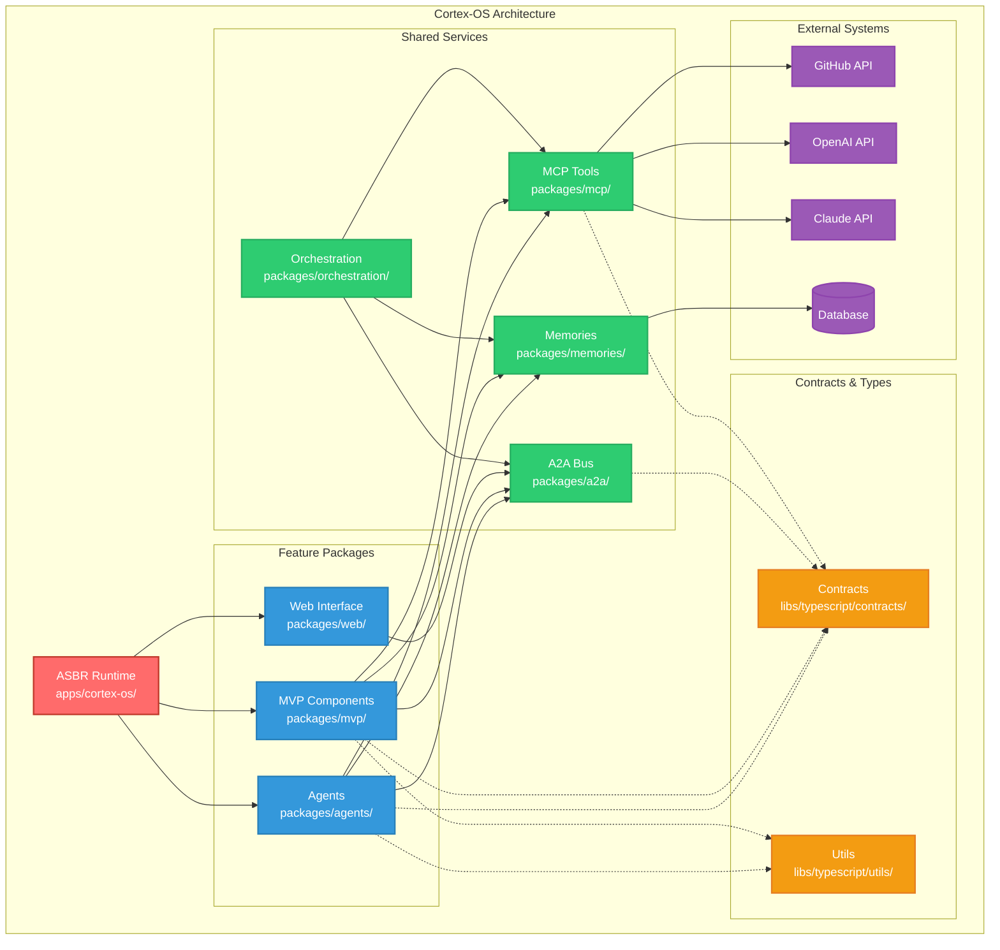

# Cortex-OS System Architecture

## System Overview

This diagram shows the high-level architecture of the Cortex-OS system:

### Core Components

1. **ASBR Runtime** - The main application coordinator that mounts feature packages
2. **Feature Packages** - Domain-specific functionality (agents, MVP components, web interface)
3. **Shared Services** - Cross-cutting concerns (messaging, tools, memory, orchestration)
4. **Contracts & Types** - Shared interfaces and utilities
5. **External Systems** - Third-party APIs and storage

### Communication Patterns

- **Solid arrows**: Direct dependencies and service calls
- **Dotted arrows**: Contract/interface usage
- **No direct feature-to-feature connections**: Features communicate via A2A events or shared services

### Key Principles

- Domain separation through message contracts
- No direct imports between feature packages
- Dependency injection via ASBR runtime
- Event-driven architecture via A2A bus
