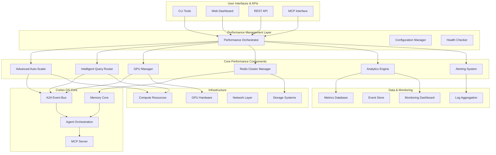
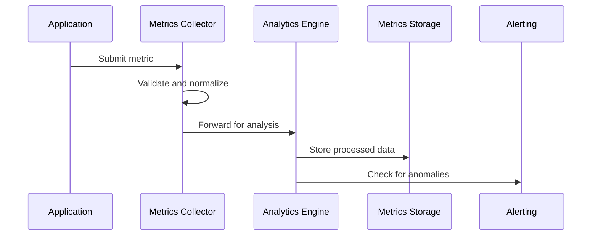
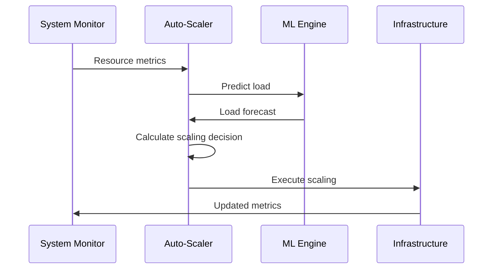
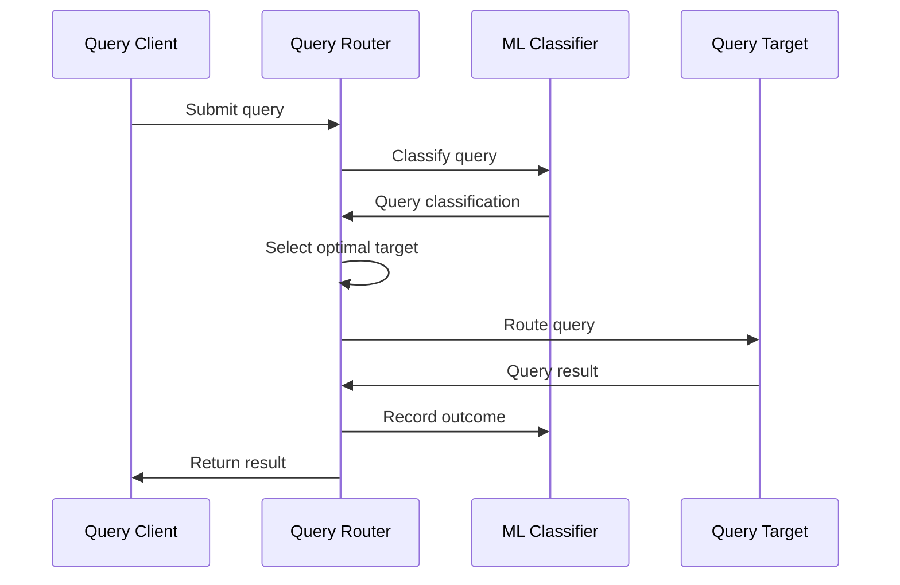

# Performance Architecture

> Comprehensive overview of Cortex-OS performance optimization system architecture and integration patterns.

## Overview

The Cortex-OS Performance Optimization System is a comprehensive, multi-layered architecture designed to provide intelligent resource management, predictive scaling, and real-time performance monitoring. It operates as a cross-cutting concern that integrates seamlessly with the existing ASBR (Autonomous Software Behavior Reasoning) runtime.

## Architecture Diagram



## Core Components

### 1. Performance Orchestrator

The central coordinator that manages all performance components:

```typescript
interface PerformanceOrchestrator {
  // Lifecycle management
  initialize(): Promise<void>
  start(): Promise<void>
  stop(): Promise<void>

  // Component coordination
  registerComponent(component: PerformanceComponent): void
  coordinateScaling(request: ScalingRequest): Promise<void>
  handleAlert(alert: PerformanceAlert): Promise<void>

  // Health and status
  getSystemHealth(): SystemHealth
  getComponentStatus(): ComponentStatus[]
}
```

**Key Features:**
- **Component Lifecycle Management**: Coordinates startup/shutdown of all performance components
- **Event Coordination**: Routes performance events to appropriate handlers
- **Configuration Management**: Centralized configuration distribution
- **Health Monitoring**: Overall system health aggregation

### 2. Advanced Auto-Scaler

Intelligent scaling system with ML-based prediction:

```typescript
interface AdvancedAutoScaler {
  // Core scaling operations
  scaleUp(targetInstances?: number): Promise<void>
  scaleDown(targetInstances?: number): Promise<void>
  emergencyScale(): Promise<void>

  // ML and prediction
  trainModel(): Promise<ModelMetrics>
  predictLoad(horizon: number): Promise<LoadForecast>
  optimizeForCost(): Promise<CostOptimization>

  // Metrics and monitoring
  getScalingMetrics(): ScalingMetrics
  getRecommendations(): ScalingRecommendation[]
}
```

**Architecture Patterns:**
- **Predictive Scaling**: Uses multiple ML models (linear, exponential, seasonal, neural networks)
- **Cost Optimization**: Balances performance against operational costs
- **Emergency Handling**: Rapid response to critical load conditions
- **Multi-Target Support**: Can scale different types of resources (compute, memory, GPU)

### 3. Intelligent Query Router

ML-powered query routing with adaptive load balancing:

```typescript
interface IntelligentQueryRouter {
  // Query processing
  routeQuery(query: Query): Promise<QueryResult>
  routeBatch(queries: Query[]): Promise<QueryResult[]>

  // Learning and adaptation
  recordQueryResult(query: Query, result: QueryResult): void
  trainModel(): Promise<TrainingResult>
  updateRoutingStrategy(strategy: RoutingStrategy): void

  // Circuit breaker and health
  enableCircuitBreaker(target: string): void
  getHealthStatus(): HealthStatus[]
}
```

**Architecture Features:**
- **ML-Based Classification**: Intelligent query categorization and routing
- **Adaptive Load Balancing**: Dynamic distribution based on real-time performance
- **Circuit Breaker Patterns**: Fault tolerance with automatic recovery
- **Performance Learning**: Continuously improves routing decisions

### 4. Advanced GPU Manager

Sophisticated GPU resource management and scheduling:

```typescript
interface GPUMemoryManager {
  // Task management
  submitTask(task: GPUTask): Promise<string>
  cancelTask(taskId: string): Promise<boolean>
  getTaskStatus(taskId: string): Promise<GPUTask>

  // GPU management
  detectGPUs(): Promise<GPUInfo[]>
  optimizeMemoryAllocation(): Promise<OptimizationResult>
  setLoadBalancingStrategy(strategy: LoadBalancingStrategy): void

  // Monitoring
  getPerformanceMetrics(): GPUMetrics
  getRecommendations(): GPURecommendation[]
}
```

**Architecture Highlights:**
- **Memory Pool Management**: Intelligent GPU memory allocation and fragmentation handling
- **Multi-GPU Support**: Load balancing across multiple GPU devices
- **Task Scheduling**: Priority-based queuing with intelligent GPU selection
- **Real-time Monitoring**: GPU utilization, temperature, and performance tracking

### 5. Distributed Redis Cluster

High-performance distributed caching system:

```typescript
interface RedisClusterManager {
  // Cluster operations
  addNode(node: RedisNode): Promise<void>
  removeNode(nodeId: string): Promise<void>
  rebalanceCluster(): Promise<void>

  // Cache operations
  get(key: string): Promise<any>
  set(key: string, value: any, ttl?: number): Promise<void>
  warmCache(patterns: string[]): Promise<void>

  // Monitoring and analytics
  getClusterStats(): ClusterStats
  getPerformanceMetrics(): RedisMetrics[]
}
```

**Architecture Characteristics:**
- **Multi-Region Support**: Geographic distribution with automatic failover
- **Intelligent Sharding**: Automatic data distribution across cluster nodes
- **High Availability**: Master-slave replication with automatic failover
- **Cache Warming**: Proactive population of frequently accessed data

### 6. Performance Analytics Engine

Comprehensive analytics with anomaly detection:

```typescript
interface PerformanceAnalyticsEngine {
  // Data collection
  recordMetric(metric: MetricData): void
  recordBatch(metrics: MetricData[]): void

  // Analytics and insights
  generateInsights(timeRange?: TimeRange): Promise<Insight[]>
  detectAnomalies(timeRange?: TimeRange): Promise<Anomaly[]>
  forecastMetrics(metric: string, horizon: number): Promise<Forecast>

  // Reporting
  generatePerformanceReport(timeRange?: TimeRange): Promise<PerformanceReport>
  exportAnalytics(format: string): Promise<Buffer>
}
```

**Architecture Capabilities:**
- **Time-Series Analysis**: Comprehensive performance trend analysis
- **Anomaly Detection**: ML-based identification of performance issues
- **Predictive Analytics**: Performance forecasting and capacity planning
- **Root Cause Analysis**: Automated identification of performance bottlenecks

### 7. Real-Time Alerting System

Intelligent alerting with correlation and escalation:

```typescript
interface PerformanceAlertingSystem {
  // Alert management
  addRule(rule: AlertRule): string
  acknowledgeAlert(alertId: string, acknowledgedBy: string): boolean
  resolveAlert(alertId: string, reason?: string): boolean

  // Monitoring
  submitMetric(data: MetricData): void
  getStatus(): AlertingSystemStatus
  getStatistics(): AlertStatistics
}
```

**Architecture Features:**
- **Multi-Channel Alerting**: Console, email, Slack, webhook notifications
- **Intelligent Correlation**: Alert deduplication and intelligent grouping
- **Escalation Policies**: Automated escalation with configurable policies
- **Alert Fatigue Prevention**: Rate limiting and smart filtering

## Integration Patterns

### 1. Event-Driven Integration

Performance components integrate with the Cortex-OS event bus:

```typescript
// Performance events
interface PerformanceEvent {
  type: 'scaling.triggered' | 'query.routed' | 'gpu.allocated' | 'cache.miss'
  timestamp: number
  source: string
  data: Record<string, any>
  metadata: EventMetadata
}

// Event handlers
const performanceEventHandler = {
  'scaling.triggered': handleScalingEvent,
  'query.routed': handleQueryEvent,
  'gpu.allocated': handleGPUEvent,
  'cache.miss': handleCacheEvent
};
```

### 2. Service Integration

Performance components expose service interfaces:

```typescript
interface PerformanceService {
  name: string
  version: string
  health: () => Promise<HealthStatus>
  metrics: () => Promise<ServiceMetrics>
  configure: (config: ServiceConfig) => Promise<void>
}

// Service registration
const performanceServices = [
  new AutoScalingService(),
  new QueryRoutingService(),
  new GPUManagementService(),
  new CacheManagementService()
];
```

### 3. Configuration Integration

Unified configuration management:

```typescript
interface PerformanceConfig {
  // Auto-scaling
  autoScaling: {
    enabled: boolean
    thresholds: ScalingThresholds
    algorithms: ScalingAlgorithms
  }

  // Query routing
  queryRouting: {
    strategy: RoutingStrategy
    loadBalancing: LoadBalancingConfig
    circuitBreaker: CircuitBreakerConfig
  }

  // GPU management
  gpu: {
    enabled: boolean
    schedulingPolicy: SchedulingPolicy
    memoryManagement: MemoryManagementConfig
  }

  // Caching
  caching: {
    strategy: CachingStrategy
    cluster: RedisClusterConfig
    warming: CacheWarmingConfig
  }
}
```

## Data Flow Architecture

### 1. Metrics Collection Flow



### 2. Scaling Decision Flow



### 3. Query Routing Flow



## Performance Monitoring Architecture

### 1. Metrics Hierarchy

```typescript
interface MetricsHierarchy {
  // System-level metrics
  system: {
    cpu: CPUMetrics
    memory: MemoryMetrics
    disk: DiskMetrics
    network: NetworkMetrics
  }

  // Application-level metrics
  application: {
    requests: RequestMetrics
    latency: LatencyMetrics
    errors: ErrorMetrics
    throughput: ThroughputMetrics
  }

  // Performance-component metrics
  performance: {
    scaling: ScalingMetrics
    routing: RoutingMetrics
    gpu: GPUMetrics
    cache: CacheMetrics
    alerts: AlertMetrics
  }
}
```

### 2. Alerting Architecture

```typescript
interface AlertingArchitecture {
  // Alert sources
  sources: {
    metrics: MetricsAlertSource
    logs: LogAlertSource
    health: HealthAlertSource
    custom: CustomAlertSource
  }

  // Alert processing
  processing: {
    correlation: AlertCorrelator
    deduplication: AlertDeduplicator
    enrichment: AlertEnricher
    routing: AlertRouter
  }

  // Alert delivery
  delivery: {
    channels: AlertChannel[]
    escalation: EscalationEngine
    suppression: SuppressionEngine
    aggregation: AlertAggregator
  }
}
```

## Security Architecture

### 1. Secure Component Communication

```typescript
interface SecurityArchitecture {
  // Authentication
  authentication: {
    mTLS: MutualTLSConfig
    jwt: JWTConfig
    oauth: OAuthConfig
  }

  // Authorization
  authorization: {
    rbac: RBACConfig
    abac: ABACConfig
    policies: SecurityPolicy[]
  }

  // Data protection
  protection: {
    encryption: EncryptionConfig
    secrets: SecretManagementConfig
    audit: AuditConfig
  }
}
```

### 2. Performance Security

```typescript
interface PerformanceSecurity {
  // Input validation
  validation: {
    schemas: ValidationSchema[]
    sanitization: SanitizationConfig
    rateLimit: RateLimitConfig
  }

  // Resource protection
  protection: {
    quotas: ResourceQuota[]
    throttling: ThrottlingConfig
    isolation: IsolationConfig
  }

  // Monitoring
  monitoring: {
    audit: AuditMonitoringConfig
    intrusion: IntrusionDetectionConfig
    compliance: ComplianceConfig
  }
}
```

## Deployment Architecture

### 1. Component Deployment Patterns

```typescript
interface DeploymentArchitecture {
  // Container orchestration
  orchestration: {
    kubernetes: KubernetesConfig
    docker: DockerConfig
    helm: HelmConfig
  }

  // Service mesh
  serviceMesh: {
    istio: IstioConfig
    linkerd: LinkerdConfig
    consul: ConsulConfig
  }

  // Infrastructure
  infrastructure: {
    cloud: CloudProviderConfig
    onPrem: OnPremConfig
    hybrid: HybridConfig
  }
}
```

### 2. High Availability Architecture

```typescript
interface HighAvailabilityArchitecture {
  // Redundancy
  redundancy: {
    activeActive: ActiveActiveConfig
    activePassive: ActivePassiveConfig
    multiRegion: MultiRegionConfig
  }

  // Failover
  failover: {
    automatic: AutomaticFailoverConfig
    manual: ManualFailoverConfig
    testing: FailoverTestingConfig
  }

  // Disaster recovery
  disasterRecovery: {
    backup: BackupConfig
    restore: RestoreConfig
    testing: DisasterTestingConfig
  }
}
```

## Configuration Architecture

### 1. Configuration Management

```typescript
interface ConfigurationArchitecture {
  // Configuration sources
  sources: {
    files: FileConfigSource[]
    environment: EnvironmentConfigSource
    vault: VaultConfigSource
    api: APIConfigSource
  }

  // Configuration layers
  layers: {
    defaults: DefaultConfig
    environment: EnvironmentConfig
    overrides: OverrideConfig
    runtime: RuntimeConfig
  }

  // Configuration validation
  validation: {
    schemas: ConfigSchema[]
    policies: ConfigPolicy[]
    tests: ConfigTest[]
  }
}
```

### 2. Dynamic Configuration

```typescript
interface DynamicConfiguration {
  // Hot reloading
  hotReload: {
    enabled: boolean
    watchers: FileWatcher[]
    validators: ConfigValidator[]
  }

  // Configuration changes
  changes: {
    detection: ChangeDetectionConfig
    validation: ChangeValidationConfig
    application: ChangeApplicationConfig
    rollback: RollbackConfig
  }

  // Configuration distribution
  distribution: {
    pubsub: PubSubConfig
    cache: ConfigCacheConfig
    persistence: ConfigPersistenceConfig
  }
}
```

## Testing Architecture

### 1. Performance Testing Framework

```typescript
interface PerformanceTestingFramework {
  // Test types
  tests: {
    unit: UnitTestConfig
    integration: IntegrationTestConfig
    load: LoadTestConfig
    stress: StressTestConfig
    endurance: EnduranceTestConfig
  }

  // Test infrastructure
  infrastructure: {
    testEnvironment: TestEnvironmentConfig
    dataGeneration: DataGenerationConfig
    monitoring: TestMonitoringConfig
    reporting: TestReportingConfig
  }

  // Test automation
  automation: {
    scheduling: TestSchedulingConfig
    execution: TestExecutionConfig
    analysis: TestAnalysisConfig
    reporting: TestReportingConfig
  }
}
```

### 2. Monitoring and Observability

```typescript
interface ObservabilityArchitecture {
  // Logging
  logging: {
    structured: StructuredLoggingConfig
    correlation: CorrelationConfig
    aggregation: LogAggregationConfig
    analysis: LogAnalysisConfig
  }

  // Tracing
  tracing: {
    distributed: DistributedTracingConfig
    sampling: SamplingConfig
    propagation: PropagationConfig
    storage: TracingStorageConfig
  }

  // Metrics
  metrics: {
    collection: MetricsCollectionConfig
    storage: MetricsStorageConfig
    analysis: MetricsAnalysisConfig
    alerting: MetricsAlertingConfig
  }
}
```

## Evolution and Extensibility

### 1. Plugin Architecture

```typescript
interface PluginArchitecture {
  // Plugin types
  types: {
    components: ComponentPluginType[]
    algorithms: AlgorithmPluginType[]
    connectors: ConnectorPluginType[]
    visualizers: VisualizerPluginType[]
  }

  // Plugin management
  management: {
    discovery: PluginDiscoveryConfig
    loading: PluginLoadingConfig
    lifecycle: PluginLifecycleConfig
    isolation: PluginIsolationConfig
  }

  // Plugin development
  development: {
    sdk: PluginSDKConfig
    templates: PluginTemplateConfig
    testing: PluginTestingConfig
    documentation: PluginDocumentationConfig
  }
}
```

### 2. Extension Points

```typescript
interface ExtensionPoints {
  // Custom algorithms
  algorithms: {
    scaling: ScalingAlgorithmExtension
    routing: RoutingAlgorithmExtension
    prediction: PredictionAlgorithmExtension
    optimization: OptimizationAlgorithmExtension
  }

  // Custom integrations
  integrations: {
    monitoring: MonitoringIntegrationExtension
    alerting: AlertingIntegrationExtension
    storage: StorageIntegrationExtension
    compute: ComputeIntegrationExtension
  }

  // Custom visualizations
  visualizations: {
    dashboards: DashboardExtension
    reports: ReportExtension
    charts: ChartExtension
    alerts: AlertVisualizationExtension
  }
}
```

## Best Practices and Guidelines

### 1. Performance Component Development

- **Interface-First Design**: Define clear interfaces before implementation
- **Event-Driven Communication**: Use events for loose coupling
- **Configuration-Driven**: Make behavior configurable without code changes
- **Observability-Built-In**: Include comprehensive monitoring and logging
- **Graceful Degradation**: Handle failures gracefully
- **Resource Management**: Proper cleanup and resource management
- **Testing**: Comprehensive unit, integration, and performance tests

### 2. System Integration

- **Backward Compatibility**: Maintain compatibility with existing systems
- **Incremental Deployment**: Deploy changes incrementally with rollback capability
- **Configuration Management**: Use centralized configuration management
- **Security First**: Implement security best practices throughout
- **Monitoring**: Comprehensive monitoring and alerting
- **Documentation**: Maintain up-to-date documentation
- **Performance Testing**: Regular performance testing and optimization

This architecture provides a solid foundation for the Cortex-OS Performance Optimization System, enabling scalable, maintainable, and performant AI agent systems with intelligent resource management and real-time optimization capabilities.