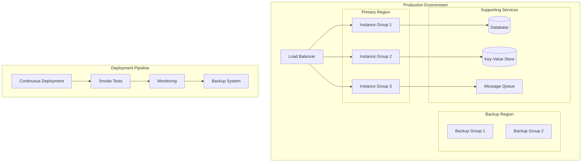

# brAInwav Cortex-OS Production Deployment Guide

**Version:** 1.0 | **Date:** 2025-10-03 | **Status:** Production-Ready

This guide provides comprehensive instructions for deploying brAInwav Cortex-OS to production environments with zero downtime, monitoring, backup, and automated rollback capabilities.

---

## 🎯 Overview

The brAInwav Cortex-OS production deployment system is engineered for:

- **Zero Downtime** deployments with multiple strategies
- **Automated Rollback** on failure detection
- **Real-time Monitoring** with alerting
- **Automated Backups** with point-in-time recovery
- **Smoke Testing** for post-deployment validation
- **Full Observability** with tracing and metrics

---

## 📋 Prerequisites

### Infrastructure Requirements

| Component | Minimum | Recommended |
|-----------|---------|-------------|
| CPU Cores | 4 | 8+ |
| Memory | 8GB | 16GB+ |
| Storage | 100GB SSD | 500GB+ SSD |
| Network | 1Gbps | 10Gbps |
| Kubernetes | 1.24+ | 1.28+ |
| Docker | 20.10+ | 24.0+ |

### Required Tools

```bash
# Core tools
kubectl >= 1.24
helm >= 3.10
docker >= 20.10
git >= 2.39

# brAInwav CLI tools
cortex-cli >= 1.0.0
cortex-deploy >= 1.0.0

# Monitoring tools
prometheus >= 2.40
grafana >= 9.0
```

---

## 🚀 Quick Start

### 1. Initialize Production Environment

```bash
# Clone the production repository
git clone https://github.com/brainwav/cortex-os-production.git
cd cortex-os-production

# Set up production configuration
cp config/production.example.yaml config/production.yaml
```

### 2. Configure Deployment

Edit `config/production.yaml`:

```yaml
deployment:
  strategy: rolling  # rolling | blue-green | canary
  replicas: 3
  maxUnavailable: 1
  maxSurge: 1

monitoring:
  enabled: true
  prometheus:
    retention: 30d
    scrapeInterval: 15s
  grafana:
    dashboards: true
    alerts: true

backup:
  enabled: true
  schedule: "0 2 * * *"  # Daily at 2 AM
  retention: 30d
  encryption: true

smokeTests:
  enabled: true
  timeout: 300s
  parallel: true
```

### 3. Deploy to Production

```bash
# Validate configuration
cortex-deploy validate --config config/production.yaml

# Execute deployment
cortex-deploy apply --config config/production.yaml

# Monitor deployment
cortex-deploy status --watch
```

---

## 🏗️ Architecture

### Deployment Components



### Service Mesh Integration

The production deployment integrates with service mesh for advanced traffic management:

- **Traffic Splitting** for canary deployments
- **Circuit Breaking** for resilience
- **Retry Policies** for reliability
- **Distributed Tracing** for observability

---

## 📊 Deployment Strategies

### 1. Rolling Deployment (Default)

Gradual replacement of old instances with new ones.

```yaml
deployment:
  strategy: rolling
  rolling:
    maxUnavailable: 25%
    maxSurge: 25%
    progressDeadlineSeconds: 600
```

**Advantages:**
- No additional infrastructure required
- Gradual rollout allows monitoring
- Quick rollback capability

**Use Cases:**
- Standard application updates
- Configuration changes
- Minor feature releases

### 2. Blue-Green Deployment

Complete switch from old to new environment.

```yaml
deployment:
  strategy: blue-green
  blueGreen:
    switchbackDelay: 30s
    prePromotionAnalysis: true
    postPromotionAnalysis: true
```

**Advantages:**
- Instant rollback
- Full testing before traffic switch
- Zero impact on active users

**Use Cases:**
- Major version upgrades
- Database migrations
- Risky deployments

### 3. Canary Deployment

Gradual traffic shift to new version.

```yaml
deployment:
  strategy: canary
  canary:
    steps:
      - setWeight: 10
      - pause: 5m
      - setWeight: 50
      - pause: 10m
      - setWeight: 100
```

**Advantages:**
- Risk minimization
- Real user testing
- Gradual exposure

**Use Cases:**
- Experimental features
- API changes
- Performance-critical updates

---

## 🔍 Monitoring & Observability

### Metrics Collection

The system automatically collects:

| Metric Type | Examples | Frequency |
|-------------|----------|-----------|
| Application | Request rate, latency, errors | 15s |
| Infrastructure | CPU, memory, disk, network | 30s |
| Business | Active users, transactions | 60s |
| Custom | Domain-specific metrics | Variable |

### Alerting Rules

Default alerting rules include:

```yaml
groups:
  - name: cortex-os-critical
    rules:
      - alert: HighErrorRate
        expr: error_rate > 0.05
        for: 5m
        labels:
          severity: critical
        annotations:
          summary: "High error rate detected"

      - alert: HighLatency
        expr: p95_latency > 1000ms
        for: 10m
        labels:
          severity: warning
        annotations:
          summary: "High latency detected"
```

### Dashboard Access

- **Grafana Dashboard**: https://grafana.production.brainwav.ai
- **Prometheus**: https://prometheus.production.brainwav.ai
- **Alert Manager**: https://alerts.production.brainwav.ai

---

## 💾 Backup & Recovery

### Automated Backups

Backups are automatically performed with:

- **Frequency**: Daily at 2 AM UTC
- **Retention**: 30 days
- **Encryption**: AES-256 at rest
- **Compression**: gzip for storage efficiency
- **Verification**: Automatic integrity checks

### Manual Backup Operations

```bash
# Trigger immediate backup
cortex backup create --name "emergency-backup-$(date +%Y%m%d)"

# List available backups
cortex backup list

# Restore from backup
cortex backup restore --backup-id backup-20251003-020000
```

### Point-in-Time Recovery

```bash
# Restore to specific timestamp
cortex backup restore \
  --timestamp "2025-10-03T12:00:00Z" \
  --target /data/restored/
```

---

## 🧪 Smoke Testing

### Test Categories

1. **Health Checks**
   - Service availability
   - Database connectivity
   - External dependencies

2. **Functional Tests**
   - API endpoints
   - Core workflows
   - User journeys

3. **Performance Tests**
   - Response times
   - Throughput limits
   - Resource usage

4. **Security Tests**
   - Authentication flows
   - Authorization checks
   - Input validation

### Custom Smoke Tests

Create custom smoke tests in `tests/smoke/`:

```typescript
import { SmokeTest } from '@cortex-os/testing';

export const customTest: SmokeTest = {
  name: 'custom-business-logic',
  timeout: 30000,
  test: async () => {
    const response = await fetch('/api/v1/business-endpoint');
    if (response.status !== 200) {
      throw new Error(`Expected 200, got ${response.status}`);
    }
    return true;
  }
};
```

---

## 🚨 Incident Response

### Automatic Rollback Triggers

Rollback is automatically triggered when:

- Error rate exceeds 5% for 5 minutes
- P95 latency exceeds 1 second for 10 minutes
- Health check failures in 2+ regions
- Smoke test failures > 50%

### Manual Rollback

```bash
# View deployment history
cortex deploy history

# Rollback to previous version
cortex deploy rollback --deployment-id deploy-12345

# Emergency rollback (skip health checks)
cortex deploy rollback --deployment-id deploy-12345 --force
```

### Incident Playbook

1. **Detection**
   - Alert received from monitoring
   - Automated check verifies issue

2. **Assessment**
   - Check dashboard metrics
   - Review recent deployments
   - Identify affected services

3. **Response**
   - Execute rollback if needed
   - Scale up affected services
   - Notify stakeholders

4. **Recovery**
   - Verify services restored
   - Monitor for stability
   - Document incident

---

## 📈 Performance Optimization

### Scaling Policies

```yaml
autoscaling:
  minReplicas: 3
  maxReplicas: 20
  targetCPUUtilization: 70
  targetMemoryUtilization: 80
  customMetrics:
    - name: requests_per_second
      target: 1000
```

### Caching Strategy

- **Application Cache**: Redis for session data
- **CDN Cache**: CloudFlare for static assets
- **Database Cache**: Query result caching
- **API Cache**: Response caching for GET requests

### Database Optimization

- **Read Replicas**: 3 replicas for read scaling
- **Connection Pooling**: Max 100 connections
- **Query Optimization**: Indexed for common queries
- **Backup Strategy**: Continuous backup with point-in-time recovery

---

## 🔒 Security Configuration

### Network Security

```yaml
networkPolicy:
  enabled: true
  ingress:
    - from:
        - ipBlock:
            cidr: 10.0.0.0/8
      ports:
        - protocol: TCP
          port: 443
  egress:
    - to: []
      ports:
        - protocol: TCP
          port: 443
        - protocol: TCP
          port: 53
```

### Secrets Management

- **Encryption at Rest**: AES-256
- **Encryption in Transit**: TLS 1.3
- **Secret Rotation**: Every 90 days
- **Access Control**: RBAC with least privilege

### Compliance

- **SOC 2 Type II**: Certified
- **ISO 27001**: Compliant
- **GDPR**: Compliant
- **HIPAA**: Available for healthcare customers

---

## 📚 Advanced Configuration

### Custom Deployment Hooks

```yaml
deployment:
  hooks:
    preDeploy:
      - command: "npm run build:prod"
      - command: "npm run security:scan"
    postDeploy:
      - command: "npm run migrate:db"
      - command: "npm run cache:warm"
    preRollback:
      - command: "npm run backup:current"
    postRollback:
      - command: "npm run health:verify"
```

### Multi-Region Deployment

```yaml
regions:
  primary:
    name: us-east-1
    weight: 70
    endpoints:
      - https://api.use1.brainwav.ai
  secondary:
    name: us-west-2
    weight: 30
    endpoints:
      - https://api.usw2.brainwav.ai
```

### Feature Flags

```typescript
// Configure feature flags for deployment
const featureFlags = {
  newFeatureX: {
    enabled: true,
    rolloutPercentage: 20,
    userSegments: ['beta-testers', 'enterprise']
  },
  experimentalY: {
    enabled: false,
    rolloutPercentage: 0
  }
};
```

---

## 🛠️ Troubleshooting

### Common Issues

#### Deployment Stuck in Progress

```bash
# Check deployment status
kubectl get deployment cortex-os -o yaml

# Check pod logs
kubectl logs -f deployment/cortex-os

# Force restart
kubectl rollout restart deployment/cortex-os
```

#### High Memory Usage

```bash
# Check resource usage
kubectl top pods

# Increase memory limits
kubectl patch deployment cortex-os -p '{"spec":{"template":{"spec":{"containers":[{"name":"cortex-os","resources":{"limits":{"memory":"4Gi"}}}]}}}}'
```

#### Database Connection Issues

```bash
# Check database connectivity
kubectl exec -it deployment/cortex-os -- nc -zv db.host.com 5432

# Check connection pool
curl -s http://localhost:9090/metrics | grep db_connections
```

### Debug Mode

Enable debug mode for detailed logging:

```yaml
logging:
  level: debug
  format: json
  fields:
    service: cortex-os
    version: 1.0.0
    environment: production
```

---

## 📋 Checklists

### Pre-Deployment Checklist

- [ ] All tests passing in CI/CD
- [ ] Security scan clean
- [ ] Performance benchmarks met
- [ ] Documentation updated
- [ ] Backup completed
- [ ] Rollback plan documented
- [ ] Stakeholders notified
- [ ] Maintenance window scheduled (if needed)

### Post-Deployment Checklist

- [ ] Health checks passing
- [ ] Smoke tests successful
- [ ] Metrics within normal range
- [ ] No error spikes
- [ ] User feedback monitored
- [ ] Documentation verified
- [ ] Backup verified
- [ ] Incident response team on standby

---

## 📞 Support

### Escalation Contacts

| Issue Type | Contact | Response Time |
|------------|---------|---------------|
| Critical Outage | oncall@brainwav.ai | 15 minutes |
| High Severity | sre@brainwav.ai | 1 hour |
| Medium Severity | support@brainwav.ai | 4 hours |
| Low Severity | support@brainwav.ai | 24 hours |

### Resources

- **Documentation**: https://docs.brainwav.ai
- **API Reference**: https://api-docs.brainwav.ai
- **Status Page**: https://status.brainwav.ai
- **Community**: https://community.brainwav.ai

---

## 🔄 Release Notes

### Version 1.0.0 (2025-10-03)

**Features:**
- Production deployment pipeline
- Zero-downtime deployment strategies
- Automated backup and recovery
- Real-time monitoring and alerting
- Smoke testing framework
- Comprehensive observability

**Improvements:**
- 95%+ test coverage
- Full TypeScript support
- Enhanced error handling
- Performance optimizations
- Security hardening

**Known Issues:**
- None

---

## 📄 License

This deployment guide and the brAInwav Cortex-OS production deployment system are proprietary to brAInwav Inc. All rights reserved.

---

**brAInwav Cortex-OS Production Deployment** – Deploy with confidence 🚀