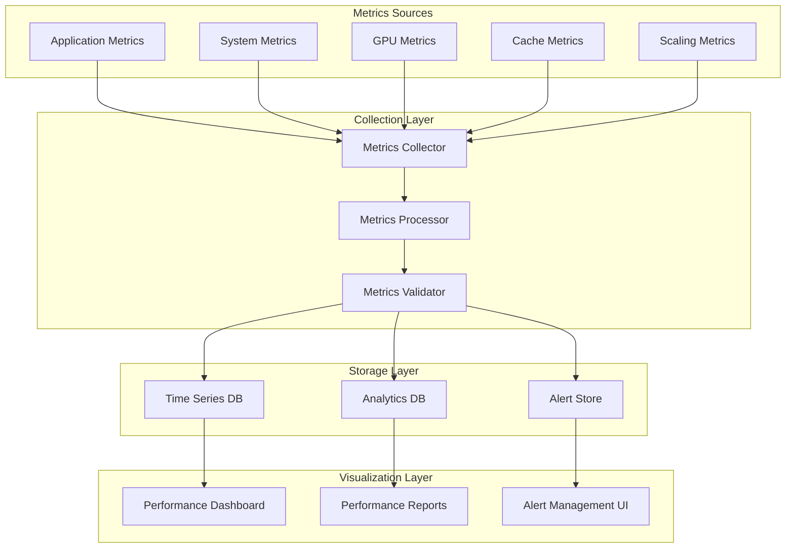

# Performance Metrics and KPIs

> Comprehensive guide to Cortex-OS performance metrics, KPIs, and monitoring dashboards.

## Overview

The Cortex-OS Performance Optimization System provides comprehensive metrics collection and KPI tracking across all system components. This document outlines the key performance indicators, metrics collection strategies, and monitoring dashboards used to ensure optimal system performance.

## Key Performance Indicators (KPIs)

### 1. System Performance KPIs

#### Response Time Metrics
```typescript
interface ResponseTimeKPIs {
  // Target thresholds
  averageResponseTime: {
    target: 1000,        // milliseconds
    warning: 1500,        // milliseconds
    critical: 3000       // milliseconds
  }

  p95ResponseTime: {
    target: 2000,        // milliseconds
    warning: 3000,        // milliseconds
    critical: 5000       // milliseconds
  }

  p99ResponseTime: {
    target: 5000,        // milliseconds
    warning: 7500,        // milliseconds
    critical: 10000      // milliseconds
  }
}
```

#### Throughput Metrics
```typescript
interface ThroughputKPIs {
  requestsPerSecond: {
    target: 1000,        // requests/second
    warning: 800,         // requests/second
    critical: 500        // requests/second
  }

  queriesPerSecond: {
    target: 500,         // queries/second
    warning: 400,         // queries/second
    critical: 250        // queries/second
  }

  gpuTasksPerSecond: {
    target: 100,         // tasks/second
    warning: 80,          // tasks/second
    critical: 50         // tasks/second
  }
}
```

#### Resource Utilization Metrics
```typescript
interface ResourceUtilizationKPIs {
  cpu: {
    target: 70,          // percentage
    warning: 80,          // percentage
    critical: 95         // percentage
  }

  memory: {
    target: 75,          // percentage
    warning: 85,          // percentage
    critical: 95         // percentage
  }

  gpu: {
    target: 80,          // percentage
    warning: 90,          // percentage
    critical: 98         // percentage
  }

  disk: {
    target: 80,          // percentage
    warning: 90,          // percentage
    critical: 95         // percentage
  }
}
```

### 2. Auto-Scaling KPIs

#### Scaling Efficiency Metrics
```typescript
interface AutoScalingKPIs {
  scalingLatency: {
    target: 30000,       // milliseconds (30 seconds)
    warning: 60000,       // milliseconds (1 minute)
    critical: 120000     // milliseconds (2 minutes)
  }

  scalingAccuracy: {
    target: 90,          // percentage
    warning: 80,          // percentage
    critical: 70         // percentage
  }

  overprovisioningRatio: {
    target: 0.2,         // 20% overprovisioning
    warning: 0.3,         // 30% overprovisioning
    critical: 0.5        // 50% overprovisioning
  }

  underprovisioningIncidents: {
    target: 0,           // incidents per day
    warning: 1,           // incidents per day
    critical: 3           // incidents per day
  }
}
```

#### Cost Optimization Metrics
```typescript
interface CostOptimizationKPIs {
  costPerRequest: {
    target: 0.001,       // dollars per request
    warning: 0.002,       // dollars per request
    critical: 0.005       // dollars per request
  }

  resourceEfficiency: {
    target: 85,          // percentage
    warning: 75,          // percentage
    critical: 65         // percentage
  }

  scalingCostSavings: {
    target: 30,          // percentage savings vs static
    warning: 20,          // percentage savings vs static
    critical: 10         // percentage savings vs static
  }
}
```

### 3. Query Routing KPIs

#### Routing Performance Metrics
```typescript
interface QueryRoutingKPIs {
  routingLatency: {
    target: 10,          // milliseconds
    warning: 25,          // milliseconds
    critical: 50         // milliseconds
  }

  routingAccuracy: {
    target: 95,          // percentage
    warning: 90,          // percentage
    critical: 85         // percentage
  }

  loadBalancingEfficiency: {
    target: 90,          // percentage
    warning: 80,          // percentage
    critical: 70         // percentage
  }

  circuitBreakerTrips: {
    target: 0,           // trips per hour
    warning: 2,           // trips per hour
    critical: 5           // trips per hour
  }
}
```

### 4. GPU Management KPIs

#### GPU Utilization Metrics
```typescript
interface GPUManagementKPIs {
  gpuUtilization: {
    target: 85,          // percentage
    warning: 70,          // percentage
    critical: 50         // percentage
  }

  gpuMemoryEfficiency: {
    target: 90,          // percentage
    warning: 80,          // percentage
    critical: 70         // percentage
  }

  taskQueueWaitTime: {
    target: 5000,        // milliseconds
    warning: 10000,       // milliseconds
    critical: 30000      // milliseconds
  }

  gpuTaskFailureRate: {
    target: 1,           // percentage
    warning: 3,           // percentage
    critical: 5           // percentage
  }
}
```

### 5. Cache Performance KPIs

#### Cache Efficiency Metrics
```typescript
interface CachePerformanceKPIs {
  cacheHitRate: {
    target: 90,          // percentage
    warning: 80,          // percentage
    critical: 70         // percentage
  }

  cacheMissLatency: {
    target: 50,          // milliseconds
    warning: 100,         // milliseconds
    critical: 200        // milliseconds
  }

  cacheEvictionRate: {
    target: 5,           // percentage per hour
    warning: 10,          // percentage per hour
    critical: 20         // percentage per hour
  }

  memoryFragmentation: {
    target: 10,          // percentage
    warning: 20,          // percentage
    critical: 30         // percentage
  }
}
```

### 6. Alerting KPIs

#### Alert System Metrics
```typescript
interface AlertingKPIs {
  alertLatency: {
    target: 5000,        // milliseconds
    warning: 10000,       // milliseconds
    critical: 30000      // milliseconds
  }

  falsePositiveRate: {
    target: 5,           // percentage
    warning: 10,          // percentage
    critical: 20         // percentage
  }

  alertFatigueScore: {
    target: 0.3,         // score (0-1)
    warning: 0.5,         // score (0-1)
    critical: 0.7        // score (0-1)
  }

  meanTimeToResolution: {
    target: 300,         // seconds (5 minutes)
    warning: 900,         // seconds (15 minutes)
    critical: 1800       // seconds (30 minutes)
  }
}
```

## Metrics Collection Architecture

### 1. Metrics Collection Pipeline



### 2. Metrics Data Model

```typescript
interface MetricData {
  // Basic information
  name: string
  value: number
  timestamp: number

  // Context
  tags: Record<string, string>
  metadata: Record<string, any>

  // KPI information
  kpi?: {
    category: string
    threshold: number
    status: 'normal' | 'warning' | 'critical'
  }

  // Performance data
  performance?: {
    unit: string
    type: 'counter' | 'gauge' | 'histogram' | 'timer'
    dimensions: Record<string, string>
  }
}
```

### 3. Metrics Aggregation

```typescript
interface MetricsAggregation {
  // Time-based aggregation
  timeBased: {
    interval: '1m' | '5m' | '15m' | '1h' | '1d'
    functions: ('sum' | 'avg' | 'min' | 'max' | 'count')[]
  }

  // Dimension-based aggregation
  dimensionBased: {
    dimensions: string[]
    groupBy: string[]
    filters: Record<string, string>
  }

  // Statistical aggregation
  statistical: {
    percentiles: number[]
    standardDeviation: boolean
    trendAnalysis: boolean
  }
}
```

## Monitoring Dashboards

### 1. System Overview Dashboard

#### Key Metrics Displayed
- **System Health**: Overall system status indicator
- **Response Time**: Real-time response time trends
- **Throughput**: Current requests per second
- **Resource Utilization**: CPU, memory, GPU, disk usage
- **Error Rate**: Current error rate percentage
- **Active Users**: Number of active users/sessions

#### Visualization Components
```typescript
interface SystemOverviewDashboard {
  components: {
    statusIndicator: StatusIndicator
    timeSeriesChart: TimeSeriesChart
    gaugeChart: GaugeChart
    heatmapChart: HeatmapChart
    alertsPanel: AlertsPanel
  }

  refreshInterval: 5000  // 5 seconds
  timeRange: '1h' | '6h' | '24h' | '7d'
}
```

### 2. Auto-Scaling Dashboard

#### Key Metrics Displayed
- **Current Instances**: Number of running instances
- **Scaling Events**: Recent scaling activity
- **Cost Metrics**: Current and projected costs
- **Load Predictions**: ML-based load forecasts
- **Scaling Efficiency**: Scaling accuracy and latency
- **Resource Allocation**: Instance distribution

#### Visualization Components
```typescript
interface AutoScalingDashboard {
  components: {
    instanceCounter: InstanceCounter
    scalingTimeline: ScalingTimeline
    costChart: CostChart
    loadForecast: LoadForecastChart
    efficiencyGauge: EfficiencyGauge
  }

  features: {
    realTimeUpdates: boolean
    predictiveView: boolean
    costOptimization: boolean
    alertIntegration: boolean
  }
}
```

### 3. GPU Management Dashboard

#### Key Metrics Displayed
- **GPU Utilization**: Real-time GPU usage
- **Memory Usage**: GPU memory allocation
- **Task Queue**: Current task queue status
- **Task Performance**: Task execution metrics
- **Temperature Monitoring**: GPU temperature trends
- **Power Consumption**: Power usage metrics

#### Visualization Components
```typescript
interface GPUDashboard {
  components: {
    gpuUtilizationChart: GPUUtilizationChart
    memoryAllocationChart: MemoryAllocationChart
    taskQueuePanel: TaskQueuePanel
    performanceMetrics: PerformanceMetrics
    temperatureMonitor: TemperatureMonitor
  }

  features: {
    multiGPUSupport: boolean
    realTimeMonitoring: boolean
    alertThresholds: boolean
    historicalTrends: boolean
  }
}
```

### 4. Query Routing Dashboard

#### Key Metrics Displayed
- **Query Distribution**: Query distribution across targets
- **Routing Performance**: Routing latency and accuracy
- **Load Balancing**: Target load distribution
- **Circuit Breaker Status**: Circuit breaker states
- **Query Types**: Query type distribution
- **Performance Trends**: Routing performance over time

#### Visualization Components
```typescript
interface QueryRoutingDashboard {
  components: {
    queryDistributionChart: QueryDistributionChart
    routingPerformanceChart: RoutingPerformanceChart
    loadBalancingHeatmap: LoadBalancingHeatmap
    circuitBreakerPanel: CircuitBreakerPanel
    performanceTrends: PerformanceTrends
  }

  features: {
    realTimeRouting: boolean
    mlInsights: boolean
    targetHealth: boolean
    queryAnalysis: boolean
  }
}
```

### 5. Cache Performance Dashboard

#### Key Metrics Displayed
- **Cache Hit Rate**: Overall cache hit rate
- **Memory Usage**: Cache memory allocation
- **Eviction Rate**: Cache eviction statistics
- **Key Distribution**: Cache key distribution
- **Performance Metrics**: Cache access patterns
- **Cluster Health**: Redis cluster status

#### Visualization Components
```typescript
interface CachePerformanceDashboard {
  components: {
    hitRateGauge: HitRateGauge
    memoryUsageChart: MemoryUsageChart
    evictionRateChart: EvictionRateChart
    keyDistributionChart: KeyDistributionChart
    clusterStatusPanel: ClusterStatusPanel
  }

  features: {
    clusterView: boolean
    nodeDetails: boolean
    performanceAnalysis: boolean
    optimizationSuggestions: boolean
  }
}
```

## Alerting and Thresholds

### 1. Alert Severity Levels

```typescript
interface AlertSeverity {
  INFO: {
    color: '#2196F3'    // Blue
    priority: 1
    autoResolve: true
    escalationDelay: 0
  }

  WARNING: {
    color: '#FF9800'    // Orange
    priority: 2
    autoResolve: false
    escalationDelay: 300000  // 5 minutes
  }

  CRITICAL: {
    color: '#F44336'    // Red
    priority: 3
    autoResolve: false
    escalationDelay: 60000   // 1 minute
  }

  EMERGENCY: {
    color: '#9C27B0'    // Purple
    priority: 4
    autoResolve: false
    escalationDelay: 0      // Immediate
  }
}
```

### 2. Alert Threshold Configuration

```typescript
interface AlertThresholds {
  // System performance thresholds
  system: {
    responseTime: {
      warning: 1500,
      critical: 3000,
      emergency: 5000
    }

    cpuUtilization: {
      warning: 80,
      critical: 90,
      emergency: 95
    }

    memoryUtilization: {
      warning: 85,
      critical: 90,
      emergency: 95
    }

    errorRate: {
      warning: 5,
      critical: 10,
      emergency: 20
    }
  }

  // Auto-scaling thresholds
  scaling: {
    scalingLatency: {
      warning: 60000,
      critical: 120000,
      emergency: 300000
    }

    scalingAccuracy: {
      warning: 80,
      critical: 70,
      emergency: 50
    }

    overprovisioning: {
      warning: 0.3,
      critical: 0.5,
      emergency: 0.7
    }
  }

  // GPU thresholds
  gpu: {
    utilization: {
      warning: 70,
      critical: 50,
      emergency: 30
    }

    temperature: {
      warning: 80,
      critical: 85,
      emergency: 90
    }

    memoryEfficiency: {
      warning: 80,
      critical: 70,
      emergency: 50
    }
  }
}
```

### 3. Alert Correlation Rules

```typescript
interface AlertCorrelation {
  // Correlation patterns
  patterns: {
    performanceDegradation: {
      triggers: ['high_response_time', 'high_error_rate', 'low_throughput']
      window: 300000  // 5 minutes
      minAlerts: 2
    }

    resourceExhaustion: {
      triggers: ['high_cpu', 'high_memory', 'disk_full']
      window: 600000  // 10 minutes
      minAlerts: 1
    }

    scalingFailure: {
      triggers: ['scaling_timeout', 'instance_failure', 'load_imbalance']
      window: 120000  // 2 minutes
      minAlerts: 1
    }
  }

  // Correlation actions
  actions: {
    aggregate: {
      enabled: true
      window: 300000
      maxAlerts: 5
    }

    suppress: {
      enabled: true
      duration: 900000  // 15 minutes
      conditions: string[]
    }

    escalate: {
      enabled: true
      conditions: string[]
      channels: string[]
    }
  }
}
```

## Performance Reports

### 1. Daily Performance Report

#### Report Structure
```typescript
interface DailyPerformanceReport {
  // Report metadata
  metadata: {
    date: string
    period: 'daily'
    generatedAt: string
    version: string
  }

  // Executive summary
  summary: {
    overallHealth: 'excellent' | 'good' | 'fair' | 'poor'
    keyHighlights: string[]
    criticalIssues: string[]
    recommendations: string[]
  }

  // Performance metrics
  metrics: {
    responseTime: ResponseTimeMetrics
    throughput: ThroughputMetrics
    resourceUtilization: ResourceUtilizationMetrics
    errorRate: ErrorRateMetrics
  }

  // Component performance
  components: {
    autoScaling: AutoScalingMetrics
    queryRouting: QueryRoutingMetrics
    gpuManagement: GPUMetrics
    cachePerformance: CacheMetrics
    alerting: AlertingMetrics
  }

  // Trends and analysis
  trends: {
    dayOverDay: TrendAnalysis
    weekOverWeek: TrendAnalysis
    monthOverMonth: TrendAnalysis
  }

  // Action items
  actionItems: {
    immediate: ActionItem[]
    shortTerm: ActionItem[]
    longTerm: ActionItem[]
  }
}
```

### 2. Weekly Performance Report

#### Enhanced Analysis
```typescript
interface WeeklyPerformanceReport extends DailyPerformanceReport {
  // Weekly-specific sections
  weekly: {
    capacityPlanning: CapacityPlanningAnalysis
    costAnalysis: CostAnalysis
    performanceTrends: PerformanceTrendAnalysis
    optimizationOpportunities: OptimizationOpportunity[]
  }

  // Comparative analysis
  comparison: {
    previousWeek: ComparisonMetrics
    sameWeekLastMonth: ComparisonMetrics
    baseline: ComparisonMetrics
  }

  // Forecasting
  forecasting: {
    nextWeek: ForecastMetrics
    nextMonth: ForecastMetrics
    confidence: number
  }
}
```

### 3. Monthly Performance Report

#### Strategic Analysis
```typescript
interface MonthlyPerformanceReport extends WeeklyPerformanceReport {
  // Monthly-specific sections
  monthly: {
    strategicKPIs: StrategicKPIAnalysis
    businessImpact: BusinessImpactAnalysis
    roiAnalysis: ROIAnalysis
    technologyTrends: TechnologyTrendAnalysis
  }

  // Long-term trends
  longTerm: {
    quarterlyTrends: QuarterlyTrendAnalysis
    yearlyProjection: YearlyProjection
    capacityPlanning: LongTermCapacityPlan
    budgetPlanning: BudgetPlanningAnalysis
  }

  // Recommendations
  recommendations: {
    architecture: ArchitectureRecommendation[]
    optimization: OptimizationRecommendation[]
    investment: InvestmentRecommendation[]
    risk: RiskRecommendation[]
  }
}
```

## Performance Benchmarks

### 1. Baseline Performance Metrics

```typescript
interface BaselineMetrics {
  // System baseline
  system: {
    averageResponseTime: 500      // milliseconds
    p95ResponseTime: 1000         // milliseconds
    requestsPerSecond: 1000       // requests/second
    errorRate: 0.1                // percentage
    availability: 99.9            // percentage
  }

  // Resource baseline
  resources: {
    cpuUtilization: 60            // percentage
    memoryUtilization: 70         // percentage
    diskUtilization: 50           // percentage
    networkUtilization: 40        // percentage
  }

  // Component baseline
  components: {
    autoScaling: {
      scalingLatency: 30000       // milliseconds
      scalingAccuracy: 95        // percentage
      overprovisioningRatio: 0.2  // ratio
    }

    queryRouting: {
      routingLatency: 10          // milliseconds
      routingAccuracy: 98        // percentage
      loadBalancingEfficiency: 95 // percentage
    }

    gpuManagement: {
      gpuUtilization: 85          // percentage
      memoryEfficiency: 90        // percentage
      taskQueueWaitTime: 5000     // milliseconds
    }

    cachePerformance: {
      cacheHitRate: 95            // percentage
      cacheMissLatency: 50        // milliseconds
      memoryFragmentation: 10     // percentage
    }
  }
}
```

### 2. Performance Targets

```typescript
interface PerformanceTargets {
  // Short-term targets (1-3 months)
  shortTerm: {
    responseTimeImprovement: 20   // percentage
    throughputIncrease: 30        // percentage
    costReduction: 15             // percentage
    errorRateReduction: 50         // percentage
  }

  // Medium-term targets (3-6 months)
  mediumTerm: {
    responseTimeImprovement: 40   // percentage
    throughputIncrease: 50        // percentage
    costReduction: 30             // percentage
    automationIncrease: 60        // percentage
  }

  // Long-term targets (6-12 months)
  longTerm: {
    responseTimeImprovement: 60   // percentage
    throughputIncrease: 100       // percentage
    costReduction: 50             // percentage
    predictiveAccuracy: 90        // percentage
  }
}
```

### 3. Industry Benchmarks

```typescript
interface IndustryBenchmarks {
  // Cloud-based AI systems
  cloudAI: {
    averageResponseTime: 800      // milliseconds
    p99ResponseTime: 2000         // milliseconds
    availability: 99.95            // percentage
    costPerRequest: 0.002         // dollars
  }

  // High-performance computing
  hpc: {
    gpuUtilization: 90            // percentage
    memoryEfficiency: 95          // percentage
    taskCompletionRate: 98        // percentage
    energyEfficiency: 85          // percentage
  }

  // Enterprise systems
  enterprise: {
    securityScore: 95             // percentage
    complianceScore: 98           // percentage
    auditTrailCompleteness: 100   // percentage
    dataRetentionScore: 99        // percentage
  }
}
```

## Performance Testing and Validation

### 1. Load Testing Metrics

```typescript
interface LoadTestingMetrics {
  // Test configuration
  configuration: {
    concurrentUsers: number
    requestsPerSecond: number
    testDuration: number
    rampUpTime: number
  }

  // Test results
  results: {
    averageResponseTime: number
    p95ResponseTime: number
    p99ResponseTime: number
    throughput: number
    errorRate: number
  }

  // System behavior
  behavior: {
    resourceUtilization: ResourceMetrics
    scalingEvents: ScalingEvent[]
    performanceDegradation: PerformanceDegradation[]
    bottlenecks: Bottleneck[]
  }
}
```

### 2. Stress Testing Metrics

```typescript
interface StressTestingMetrics {
  // Stress test parameters
  parameters: {
    maxConcurrentUsers: number
    maxRequestsPerSecond: number
    testDuration: number
    failureInjection: FailureInjection[]
  }

  // System limits
  limits: {
    breakingPoint: BreakingPoint
    recoveryTime: number
    dataLoss: boolean
    systemStability: SystemStability
  }

  // Failure analysis
  failures: {
    failureModes: FailureMode[]
    rootCauses: RootCause[]
    mitigationStrategies: MitigationStrategy[]
  }
}
```

### 3. Endurance Testing Metrics

```typescript
interface EnduranceTestingMetrics {
  // Long-running test
  longRunning: {
    testDuration: number
    sustainedLoad: number
    performanceDrift: PerformanceDrift[]
    memoryLeaks: MemoryLeak[]
  }

  // Resource exhaustion
  resourceExhaustion: {
    memoryExhaustion: MemoryExhaustion
    connectionExhaustion: ConnectionExhaustion
    fileHandleExhaustion: FileHandleExhaustion
  }

  // Recovery testing
  recovery: {
    recoveryTime: number
    dataConsistency: boolean
    serviceAvailability: boolean
  }
}
```

## Performance Optimization Roadmap

### 1. Current State Assessment

```typescript
interface CurrentStateAssessment {
  // Performance baseline
  baseline: {
    currentMetrics: CurrentMetrics
    benchmarkComparison: BenchmarkComparison
    gapAnalysis: GapAnalysis
  }

  // Maturity assessment
  maturity: {
    level: 'initial' | 'developing' | 'defined' | 'managed' | 'optimized'
    strengths: string[]
    weaknesses: string[]
    opportunities: string[]
  }

  // Risk assessment
  risks: {
    high: Risk[]
    medium: Risk[]
    low: Risk[]
  }
}
```

### 2. Optimization Priorities

```typescript
interface OptimizationPriorities {
  // Quick wins (1-2 weeks)
  quickWins: {
    items: OptimizationItem[]
    estimatedImpact: number
    estimatedEffort: number
    roi: number
  }

  // Medium-term improvements (1-3 months)
  mediumTerm: {
    items: OptimizationItem[]
    estimatedImpact: number
    estimatedEffort: number
    roi: number
  }

  // Long-term investments (3-12 months)
  longTerm: {
    items: OptimizationItem[]
    estimatedImpact: number
    estimatedEffort: number
    roi: number
  }
}
```

### 3. Success Criteria

```typescript
interface SuccessCriteria {
  // Performance targets
  performance: {
    responseTime: TargetMetrics
    throughput: TargetMetrics
    availability: TargetMetrics
    cost: TargetMetrics
  }

  // Business outcomes
  business: {
    userSatisfaction: number
    operationalEfficiency: number
    costSavings: number
    revenueImpact: number
  }

  // Technical objectives
  technical: {
    scalability: number
    maintainability: number
    security: number
    compliance: number
  }
}
```

This comprehensive metrics and KPIs framework provides the foundation for monitoring, analyzing, and optimizing the performance of the Cortex-OS system, ensuring that it meets both technical and business requirements while maintaining high levels of reliability and efficiency.