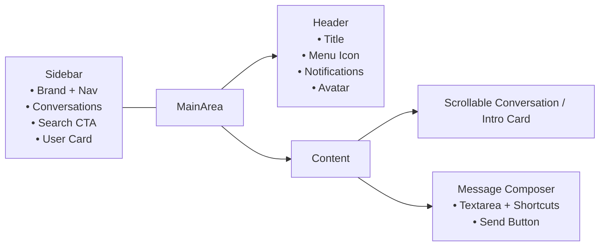

# Cortex WebUI — Interface Inventory & Design Assessment

## Overview
- **Application shell:** `App.tsx` wires the authentication provider around the router and exposes routes for authentication, dashboard, chat, settings, and profile screens while tracking theme state and a (currently unused) `sidebarOpen` toggle.【F:apps/cortex-webui/frontend/src/App.tsx†L3-L170】
- **Primary layout pattern:** Chat-centric pages pair a fixed-width sidebar with a header and scrollable main panel, while auth forms center modals on a neutral background. Settings and profile pages reuse the header but omit the sidebar, yielding a lighter-weight management canvas.【F:apps/cortex-webui/frontend/src/pages/ChatPage.tsx†L39-L66】【F:apps/cortex-webui/frontend/src/pages/Dashboard.tsx†L24-L55】【F:apps/cortex-webui/frontend/src/pages/SettingsPage.tsx†L11-L22】【F:apps/cortex-webui/frontend/src/pages/LoginPage.tsx†L17-L39】

## UI Inventory by Screen

### Shared Elements
- **Header:** Displays screen title, hamburger trigger (for future sidebar toggling), notification icon, and static user avatar placeholder.【F:apps/cortex-webui/frontend/src/components/Layout/Header.tsx†L8-L52】
- **Sidebar:** Includes brand masthead, command palette trigger, conversation list, hard-coded navigation links, and a static user summary with logout action. The component also mounts a search modal populated with mock data.【F:apps/cortex-webui/frontend/src/components/Layout/Sidebar.tsx†L30-L138】【F:apps/cortex-webui/frontend/src/components/Layout/SearchModal.tsx†L12-L192】
- **Chat surface:** `ChatInterface` wraps the message log and composer. The message list streams assistant responses with a typing indicator, while the composer supports history navigation and shortcut hints.【F:apps/cortex-webui/frontend/src/components/Chat/ChatInterface.tsx†L16-L35】【F:apps/cortex-webui/frontend/src/components/Chat/MessageList.tsx†L13-L32】【F:apps/cortex-webui/frontend/src/components/Chat/MessageInput.tsx†L11-L221】

### Dashboard
- Uses the shared sidebar/header layout and presents a hero card encouraging users to start or resume conversations.【F:apps/cortex-webui/frontend/src/pages/Dashboard.tsx†L24-L55】

### Chat Page
- Mirrors dashboard layout but injects the active conversation title and renders live messages plus the composer. Sidebar props allow for selecting/creating conversations (though selection currently falls back to anchor navigation).【F:apps/cortex-webui/frontend/src/pages/ChatPage.tsx†L25-L66】【F:apps/cortex-webui/frontend/src/components/Layout/Sidebar.tsx†L75-L91】

### Authentication Suite
- **Login/Register:** Centered cards with form fields, OAuth buttons, and cross-links between flows.【F:apps/cortex-webui/frontend/src/pages/LoginPage.tsx†L17-L39】【F:apps/cortex-webui/frontend/src/components/Auth/LoginForm.tsx†L31-L109】【F:apps/cortex-webui/frontend/src/pages/RegisterPage.tsx†L17-L39】【F:apps/cortex-webui/frontend/src/components/Auth/RegisterForm.tsx†L40-L136】
- **Password Recovery:** `ForgotPasswordForm` shows success and error states; `ResetPasswordForm` validates tokens and enforces minimum password length before redirecting back to login.【F:apps/cortex-webui/frontend/src/components/Auth/ForgotPasswordForm.tsx†L34-L91】【F:apps/cortex-webui/frontend/src/components/Auth/ResetPasswordForm.tsx†L12-L127】

### Settings
- Presents appearance, model selection, and API key storage options with optimistic status messaging. Theme toggling relies on a pill switch.【F:apps/cortex-webui/frontend/src/pages/SettingsPage.tsx†L12-L109】【F:apps/cortex-webui/frontend/src/components/Settings/ThemeSwitcher.tsx†L4-L21】

### Profile & Security
- Tabbed interface splits profile editing from security features. Profile form includes avatar preview, contact details, and account metadata. Security tab bundles OAuth account linking, password change, and a toggleable (state-only) two-factor section.【F:apps/cortex-webui/frontend/src/pages/ProfilePage.tsx†L14-L221】【F:apps/cortex-webui/frontend/src/components/Auth/ProfileForm.tsx†L17-L155】【F:apps/cortex-webui/frontend/src/components/Auth/OAuthLinking.tsx†L8-L119】

## Wireframes

### Chat & Dashboard Shell


### Authentication Flow
```mermaid
flowchart TB
    Entry[Landing<br/>(Redirects based on auth)] --> LoginCard[Login Card<br/>• Email/Password<br/>• OAuth Buttons<br/>• Forgot Link]
    LoginCard --> RegisterSwitch["Don't have an account? Register"]
    RegisterSwitch --> RegisterCard[Registration Card<br/>• Name/Email<br/>• Password + Confirm<br/>• OAuth Sign-up]
    LoginCard --> ForgotLink[Forgot Password]
    ForgotLink --> ResetRequest[Reset Request Form<br/>• Email Field<br/>• Success Banner]
    ResetRequest --> ResetCard[Reset Form<br/>• Token Validation<br/>• New Password Inputs]
```

## Interaction Notes
- Composer shortcuts (Enter to send, Ctrl/Cmd+R to recall last message, etc.) are surfaced inline beneath the input, promoting discoverability.【F:apps/cortex-webui/frontend/src/components/Chat/MessageInput.tsx†L94-L218】
- Search modal supports keyboard navigation and uses mock results to illustrate intended behavior pending API integration.【F:apps/cortex-webui/frontend/src/components/Layout/SearchModal.tsx†L37-L192】
- Password flows provide inline alerts and success states to guide recovery and enforce minimum complexity.【F:apps/cortex-webui/frontend/src/components/Auth/ForgotPasswordForm.tsx†L34-L91】【F:apps/cortex-webui/frontend/src/components/Auth/ResetPasswordForm.tsx†L22-L127】

## Missing Features & Gaps
1. **Mobile navigation:** Sidebars are hidden on smaller breakpoints (`hidden md:block`), and while `App.tsx` exposes `onToggleSidebar`, no component renders an alternative drawer or references the `sidebarOpen` state. This leaves mobile users without navigation access.【F:apps/cortex-webui/frontend/src/pages/ChatPage.tsx†L39-L66】【F:apps/cortex-webui/frontend/src/pages/Dashboard.tsx†L24-L55】【F:apps/cortex-webui/frontend/src/App.tsx†L23-L170】
2. **Conversation selection callback unused:** `Sidebar` ignores the `onSelectConversation` prop and instead relies on anchor navigation, preventing upstream state updates (e.g., analytics, optimistic selection) and making tests harder.【F:apps/cortex-webui/frontend/src/components/Layout/Sidebar.tsx†L5-L91】
3. **Placeholder navigation targets:** Sidebar links reference `/mvp/*`, `/approvals`, `/crawl`, and `/puck` routes that are not defined in `App.tsx`, yielding dead navigation endpoints.【F:apps/cortex-webui/frontend/src/components/Layout/Sidebar.tsx†L16-L111】【F:apps/cortex-webui/frontend/src/App.tsx†L84-L170】
4. **Static user identity:** Both the header avatar and sidebar user card display hard-coded placeholders instead of authenticated user data, undercutting personalization and status cues.【F:apps/cortex-webui/frontend/src/components/Layout/Header.tsx†L34-L51】【F:apps/cortex-webui/frontend/src/components/Layout/Sidebar.tsx†L114-L133】
5. **Search modal stubs:** Global search currently filters mock data and performs `window.location` redirects rather than SPA navigation or API-backed querying, signaling incomplete integration.【F:apps/cortex-webui/frontend/src/components/Layout/SearchModal.tsx†L61-L114】【F:apps/cortex-webui/frontend/src/components/Layout/SearchModal.tsx†L160-L192】
6. **Settings persistence risk:** API key entry is stored in localStorage without masking, validation, or integration feedback; there is no indication of server-side synchronization or encryption strategy.【F:apps/cortex-webui/frontend/src/components/Settings/SettingsPage.tsx†L12-L109】
7. **Two-factor toggle is non-functional:** The 2FA switch in the security tab updates local state only and does not tie into backend enrollment flows, risking false confidence for users.【F:apps/cortex-webui/frontend/src/pages/ProfilePage.tsx†L180-L221】

## Recommendations
- Implement a responsive drawer or modal navigation that honors the existing `sidebarOpen` flag and `onToggleSidebar` callbacks to restore parity on mobile devices.【F:apps/cortex-webui/frontend/src/App.tsx†L23-L170】
- Wire `Sidebar` interactions through callback props and router navigation helpers (e.g., `useNavigate`) to keep app state consistent with URL changes.【F:apps/cortex-webui/frontend/src/components/Layout/Sidebar.tsx†L75-L111】
- Replace placeholder navigation items or gate them behind feature flags until the corresponding routes exist, reducing dead-end experiences.【F:apps/cortex-webui/frontend/src/components/Layout/Sidebar.tsx†L16-L111】
- Surface authenticated identity (name, avatar) in the header and sidebar using `useAuthContext` to reinforce personalization.【F:apps/cortex-webui/frontend/src/components/Layout/Header.tsx†L34-L51】【F:apps/cortex-webui/frontend/src/components/Layout/Sidebar.tsx†L114-L133】
- Integrate the search modal and security toggles with backend services or clearly mark them as previews to manage expectations.【F:apps/cortex-webui/frontend/src/components/Layout/SearchModal.tsx†L61-L192】【F:apps/cortex-webui/frontend/src/pages/ProfilePage.tsx†L180-L221】
- Extend settings to capture validation, encryption guidance, and explicit save feedback beyond optimistic toasts, aligning with enterprise governance requirements.【F:apps/cortex-webui/frontend/src/components/Settings/SettingsPage.tsx†L12-L109】
