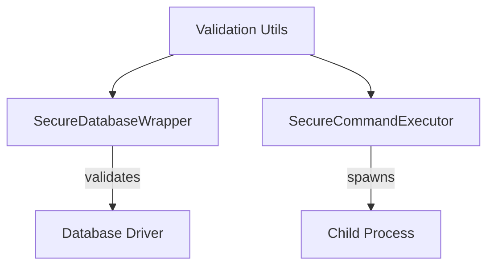

# Architecture

```mermaid
graph TD
  A[SecureDatabaseWrapper] -->|validates| B[Database Driver]
  C[SecureCommandExecutor] -->|spawns| D[Child Process]
  E[Validation Utils] --> A
  E --> C
```

Modules:
- `SecureDatabaseWrapper` – wraps DB clients.
- `SecureCommandExecutor` – mediates shell access.
- `validation` – shared sanitisation helpers.
