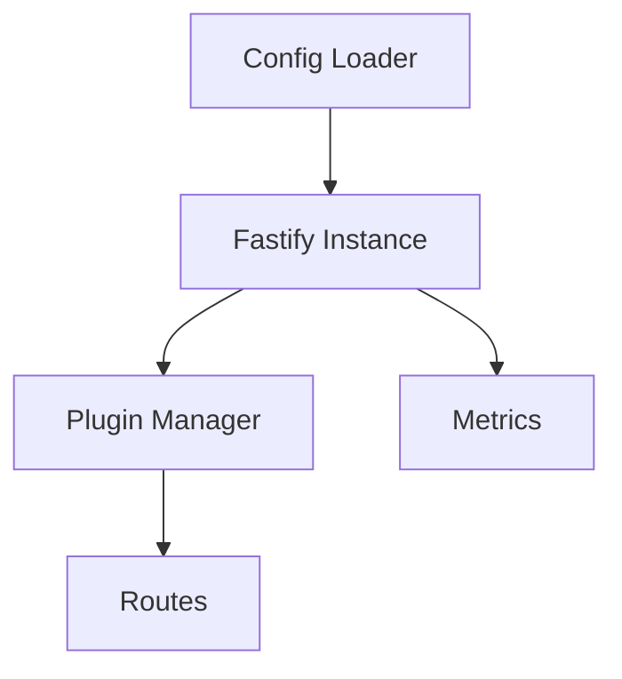

# Architecture

MVP Server centers on a Fastify core wrapped by a plugin manager.

- **Config Loader** reads JSON and environment variables.
- **Plugin Manager** registers routes and hooks.
- **Metrics Module** exposes Prometheus counters.
