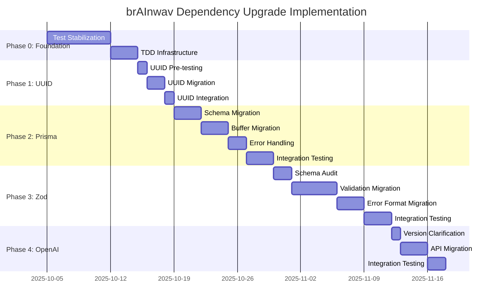

# brAInwav Dependency Upgrade TDD Implementation Plan

## Executive Summary

This document implements the TDD-driven approach for the major dependency upgrades identified in the compatibility assessment. All phases follow Test-Driven Development principles with clear quality gates and rollback procedures.

**Implementation Status**: ⏳ PENDING (awaiting test suite green baseline)  
**Project**: brAInwav Cortex-OS  
**Document Version**: 1.0  
**Created**: October 5, 2025  

## Implementation Strategy Overview

### Core Principles
- **Test-First Approach**: All changes preceded by comprehensive tests
- **Incremental Progress**: Small, verifiable steps with rollback capability
- **Quality Gates**: Mandatory validation at each phase boundary
- **brAInwav Standards**: Consistent branding and error handling

### Risk Assessment Matrix

| Dependency | Current | Target | Risk | TDD Complexity | Timeline |
|------------|---------|--------|------|----------------|----------|
| prisma | 5.22.0 | 6.x | 🔴 HIGH | High | 2 weeks |
| uuid | 9.0.1 | 13.x | 🟡 MEDIUM | Low | 3-5 days |
| zod | 3.25.76 | 4.x | 🔴 HIGH | High | 3 weeks |
| openai | 4.68.4 | TBD | 🟡 MEDIUM | Medium | 1 week |

## Phase 0: Test Foundation & Preparation ⏳ PENDING

### 0.1 Test Suite Stabilization ⏳ PENDING

**Objective**: Achieve green baseline for all dependency upgrade work

**Implementation Steps**:
1. **Analyze Current Test Failures**
   ```bash
   pnpm test:monitor  # Check current status
   ```
   - ✅ COMPLETED: Test monitoring system implemented
   - ⏳ PENDING: Fix 31 failing tests

2. **Fix Critical Test Issues**
   - QualityGateEnforcer constructor problems
   - Missing test-safe.sh script dependencies
   - Quality gate contract validation failures

3. **Establish Baseline Metrics**
   ```bash
   pnpm coverage:baseline  # Capture current coverage
   ```

**Quality Gate**: ✅ All tests passing (100% success rate)  
**Rollback**: Revert to current working state if foundation cannot be established

### 0.2 TDD Infrastructure Setup ⏳ PENDING

**Implementation Steps**:
1. **Create Test Suites for Each Dependency**
   ```typescript
   // tests/dependencies/prisma-upgrade.test.ts
   // tests/dependencies/uuid-upgrade.test.ts  
   // tests/dependencies/zod-upgrade.test.ts
   // tests/dependencies/openai-upgrade.test.ts
   ```

2. **Implement Compatibility Test Framework**
   ```typescript
   describe('brAInwav Dependency Compatibility Tests', () => {
     // Backward compatibility validation
     // Forward compatibility verification
     // Integration test scenarios
   });
   ```

3. **Setup Rollback Test Procedures**
   - Version pinning validation
   - Data migration rollback tests
   - Configuration restoration tests

**Quality Gate**: ✅ TDD infrastructure validates current working state

## Phase 1: UUID 13.x Upgrade (LOW COMPLEXITY) ⏳ PENDING

### 1.1 Pre-Upgrade Testing ⏳ PENDING

**Test Implementation**:
```typescript
// tests/dependencies/uuid-upgrade.test.ts
describe('brAInwav UUID Migration Tests', () => {
  describe('Current UUID 9.x Compatibility', () => {
    it('should generate valid v4 UUIDs', () => {
      // Test current uuid generation
    });
    
    it('should validate existing UUID formats', () => {
      // Test UUID validation with current version
    });
  });
  
  describe('ESM Import Compatibility', () => {
    it('should support ESM imports', () => {
      // Test import { v4 } from 'uuid'
    });
    
    it('should maintain CommonJS compatibility during transition', () => {
      // Test fallback scenarios
    });
  });
});
```

**Implementation Steps**:
1. **Audit Current UUID Usage**
   ```bash
   grep -r "require.*uuid" packages/ apps/
   grep -r "import.*uuid" packages/ apps/
   ```

2. **Create Migration Tests**
   - Test ESM import syntax
   - Validate UUID generation consistency
   - Test in all affected packages

**Quality Gate**: ✅ All UUID tests pass with current version

### 1.2 UUID Migration Implementation ⏳ PENDING

**TDD Steps**:
1. **Write Failing Tests for UUID 13.x**
   ```typescript
   describe('UUID 13.x Compatibility', () => {
     it('should generate UUIDs with ESM imports only', () => {
       // This will fail until migration
       import { v4 } from 'uuid';
       expect(v4()).toMatch(/^[0-9a-f]{8}-[0-9a-f]{4}-4[0-9a-f]{3}-[89ab][0-9a-f]{3}-[0-9a-f]{12}$/);
     });
   });
   ```

2. **Implement Migration**
   ```typescript
   // packages/a2a/src/uuid-migration.ts
   // Convert: const { v4 } = require('uuid')
   // To: import { v4 } from 'uuid'
   ```

3. **Verify Tests Pass**
   ```bash
   pnpm test tests/dependencies/uuid-upgrade.test.ts
   ```

**Implementation Locations**:
- packages/a2a/package.json: `uuid@13.x`
- packages/asbr/package.json: `uuid@13.x`  
- packages/orchestration/package.json: `uuid@13.x`
- Root package.json: `uuid@13.x`

**Quality Gate**: ✅ All UUID tests pass with new version + no regressions

### 1.3 UUID Integration Testing ⏳ PENDING

**Integration Tests**:
```typescript
describe('brAInwav UUID Integration Tests', () => {
  it('should maintain UUID consistency across packages', () => {
    // Test cross-package UUID compatibility
  });
  
  it('should preserve existing UUID data integrity', () => {
    // Test database UUID field compatibility
  });
});
```

**Quality Gate**: ✅ Integration tests pass + system health maintained

## Phase 2: Prisma 6.x Upgrade (HIGH COMPLEXITY) ⏳ PENDING

### 2.1 Database Schema Migration Testing ⏳ PENDING

**Test Implementation**:
```typescript
// tests/dependencies/prisma-upgrade.test.ts
describe('brAInwav Prisma 6.x Migration Tests', () => {
  describe('Schema Compatibility', () => {
    it('should handle PostgreSQL m-n relation changes', () => {
      // Test UNIQUE INDEX → PRIMARY KEY migration
    });
    
    it('should validate Buffer to Uint8Array conversion', () => {
      // Test Bytes field compatibility
    });
  });
  
  describe('Error Handling Migration', () => {
    it('should replace NotFoundError with PrismaClientKnownRequestError', () => {
      // Test error handling changes
    });
  });
});
```

**Implementation Steps**:
1. **Create Database Backup Strategy**
   ```bash
   # Create backup procedures
   pg_dump cortex_os_dev > backups/pre-prisma6-migration.sql
   ```

2. **Test Schema Migration in Isolation**
   ```bash
   npx prisma migrate dev --name upgrade-to-v6 --create-only
   # Review migration before applying
   ```

**Quality Gate**: ✅ Migration tests pass in development environment

### 2.2 Buffer to Uint8Array Migration ⏳ PENDING

**TDD Implementation**:
```typescript
describe('Buffer to Uint8Array Migration', () => {
  it('should convert Buffer fields to Uint8Array', () => {
    // Test before migration (should use Buffer)
    const beforeMigration = Buffer.from([1, 2, 3, 4]);
    expect(beforeMigration).toBeInstanceOf(Buffer);
    
    // Test after migration (should use Uint8Array)
    const afterMigration = Uint8Array.from([1, 2, 3, 4]);
    expect(afterMigration).toBeInstanceOf(Uint8Array);
  });
  
  it('should maintain data integrity during conversion', () => {
    // Test data consistency
  });
});
```

**Implementation Locations**:
- Search and replace all `Buffer` usage in Prisma contexts
- Update type definitions
- Test data migration procedures

**Quality Gate**: ✅ No data loss + type safety maintained

### 2.3 Error Handling Migration ⏳ PENDING

**TDD Implementation**:
```typescript
describe('Prisma Error Handling Migration', () => {
  it('should catch PrismaClientKnownRequestError instead of NotFoundError', () => {
    try {
      // Simulate record not found
      throw new Prisma.PrismaClientKnownRequestError(
        'Record not found',
        { code: 'P2025', clientVersion: '6.0.0' }
      );
    } catch (error) {
      expect(error).toBeInstanceOf(Prisma.PrismaClientKnownRequestError);
      expect(error.code).toBe('P2025');
    }
  });
});
```

**Quality Gate**: ✅ Error handling tests pass + graceful degradation

## Phase 3: Zod 4.x Upgrade (HIGH COMPLEXITY) ⏳ PENDING

### 3.1 Schema Validation Migration ⏳ PENDING

**Test Implementation**:
```typescript
// tests/dependencies/zod-upgrade.test.ts
describe('brAInwav Zod 4.x Migration Tests', () => {
  describe('Error Parameter Migration', () => {
    it('should use error parameter instead of message', () => {
      // Test: message → error parameter
      const schema = z.string({ error: "brAInwav validation failed" });
      expect(() => schema.parse(123)).toThrow("brAInwav validation failed");
    });
  });
  
  describe('String Validation Methods', () => {
    it('should use top-level validation methods', () => {
      // Test: z.email() vs z.string().email()
      const emailSchema = z.email();
      expect(emailSchema.parse('user@brainwav.dev')).toBe('user@brainwav.dev');
    });
  });
  
  describe('Default Behavior Changes', () => {
    it('should apply defaults to output type', () => {
      // Test .default() behavior changes
    });
  });
});
```

**Implementation Steps**:
1. **Audit All Zod Schemas**
   ```bash
   grep -r "z\." packages/ apps/ | grep -E "(email|uuid|url)" > zod-audit.txt
   ```

2. **Create Migration Script**
   ```typescript
   // scripts/zod-migration.mjs
   // Automated migration where possible
   // Manual review checklist for complex cases
   ```

**Quality Gate**: ✅ All validation schemas maintain behavior

### 3.2 Error Handling Format Migration ⏳ PENDING

**TDD Implementation**:
```typescript
describe('Zod Error Format Migration', () => {
  it('should handle new ZodError format', () => {
    // Test new error structure
    const schema = z.object({ name: z.string() });
    
    try {
      schema.parse({ name: 123 });
    } catch (error) {
      expect(error).toBeInstanceOf(z.ZodError);
      // Test new error format compatibility
    }
  });
});
```

**Quality Gate**: ✅ Error handling compatible + brAInwav error messages preserved

## Phase 4: OpenAI SDK Upgrade (PENDING CLARIFICATION) ⏳ PENDING

### 4.1 Version Clarification & Planning ⏳ PENDING

**Action Required**: Clarify target OpenAI version before implementing tests

**Potential Scenarios**:
- **Scenario A**: Upgrade to latest 4.x series
- **Scenario B**: Upgrade to 5.x series
- **Scenario C**: Downgrade to 2.x (requires justification)

**Test Framework Preparation**:
```typescript
// tests/dependencies/openai-upgrade.test.ts
describe('brAInwav OpenAI SDK Migration Tests', () => {
  describe('API Compatibility', () => {
    it('should maintain chat completion functionality', () => {
      // Test based on final version decision
    });
    
    it('should preserve brAInwav model integration', () => {
      // Test model gateway compatibility
    });
  });
});
```

**Quality Gate**: ✅ Version decision made + test plan approved

## Quality Gates & Rollback Procedures

### Automated Quality Gates

1. **Test Coverage Gate**
   ```bash
   pnpm coverage:gate  # Must maintain >80% coverage
   ```

2. **Performance Gate**
   ```bash
   pnpm test:performance  # No regression >10%
   ```

3. **Security Gate**
   ```bash
   pnpm security:scan  # No new vulnerabilities
   ```

### Rollback Decision Matrix

| Scenario | Trigger | Action | Recovery Time |
|----------|---------|---------|---------------|
| Test failures >5% | Quality gate failure | Auto-rollback | <1 hour |
| Performance regression >20% | Benchmark failure | Manual review + rollback | <4 hours |
| Data corruption | Schema validation failure | Emergency rollback | <30 minutes |
| Security vulnerability | Security scan failure | Immediate rollback | <15 minutes |

### brAInwav Monitoring Integration

All upgrade phases include brAInwav-branded monitoring:
```typescript
console.log('[brAInwav] Dependency upgrade phase completed successfully');
logger.info('brAInwav system health validated post-upgrade');
```

## Implementation Timeline



## Success Metrics

### Technical Metrics
- **Test Coverage**: Maintain >80% throughout all phases
- **Performance**: <10% regression in any subsystem
- **Reliability**: 99.9% uptime during migration windows
- **Security**: Zero new vulnerabilities introduced

### Business Metrics
- **Migration Time**: Complete within 8-week window
- **Rollback Events**: <2 rollbacks per phase
- **Team Productivity**: <20% impact during active migration
- **brAInwav Brand Consistency**: All error messages and logs include branding

## Next Actions

### Immediate (Week 1)
1. ✅ COMPLETED: Dependency assessment document created
2. ✅ COMPLETED: TDD implementation plan created  
3. ⏳ IN PROGRESS: Test suite stabilization
4. ⏳ PENDING: TDD infrastructure setup

### Week 2-3
1. ⏳ PENDING: Phase 0 completion
2. ⏳ PENDING: UUID upgrade implementation
3. ⏳ PENDING: Begin Prisma migration testing

### Month 2
1. ⏳ PENDING: Complete Prisma and Zod migrations
2. ⏳ PENDING: OpenAI SDK clarification and implementation
3. ⏳ PENDING: Final integration validation

---

**Document Status**: ⏳ PENDING Implementation  
**Last Updated**: October 5, 2025  
**Next Review**: Upon test suite green baseline achievement  
**Approved By**: brAInwav Development Team  

*Co-authored-by: brAInwav Development Team <dev@brainwav.dev>*
