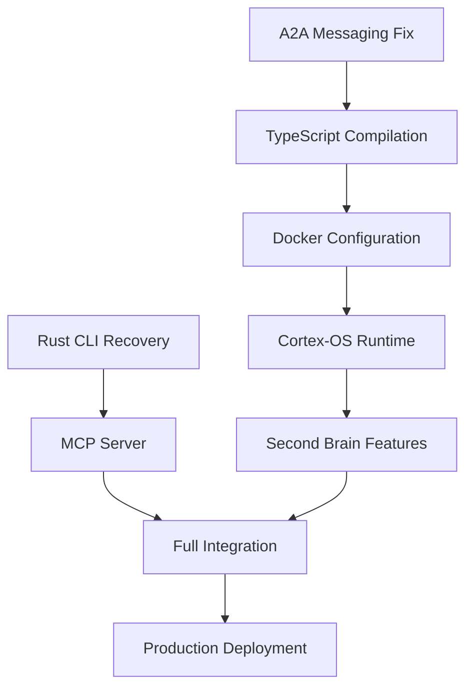

# Cortex-OS Production Readiness Implementation Roadmap

## brAInwav Engineering - 90% Deployment Readiness Strategy

**Objective:** Transform Cortex-OS from 25% to 90%+ production readiness  
**Timeline:** 3-4 weeks  
**Methodology:** TDD-First Engineering with Continuous Validation  
**End Goal:** Functional second brain deployment  

---

## 🎯 Executive Summary

This roadmap coordinates 5 critical TDD remediation plans to achieve production deployment of Cortex-OS as a functional second brain system. Each plan addresses specific technical debt while maintaining strict engineering standards.

### Current State → Target State

| Component | Current | Target | Priority |
|-----------|---------|--------|----------|
| **A2A Messaging** | ❌ 31 errors | ✅ 100% functional | 🔴 P1 |
| **TypeScript Build** | ❌ Cannot compile | ✅ Zero errors | 🔴 P1 |
| **Docker Infrastructure** | ❌ Config broken | ✅ Full stack | 🟡 P2 |
| **Cortex-OS Runtime** | ❌ Won't start | ✅ Second brain | 🟡 P2 |
| **Rust CLI/MCP** | ❌ Missing entirely | ✅ Full tooling | 🟢 P3 |

---

## 📅 Implementation Timeline

### **Week 1: Foundation Recovery (Critical Path)**

**Days 1-3: A2A Messaging System Fix**

- Fix 31 TypeScript compilation errors
- Align envelope contract interfaces
- Implement adapter pattern for compatibility
- **Gate:** Zero compilation errors, A2A messaging functional

**Days 4-5: TypeScript Compilation**

- Systematic error resolution across packages
- Type safety integration testing  
- **Gate:** `pnpm build:smart` succeeds

**Days 6-7: Docker Configuration**

- Repair docker-compose.yml and overlays
- Fix service dependencies and networking
- **Gate:** `docker compose up` works end-to-end

### **Week 2: Application Deployment**

**Days 8-10: Cortex-OS Runtime**

- Implement repository interfaces
- Build HTTP and MCP servers
- Event system integration
- **Gate:** Cortex-OS starts and responds

**Days 11-14: Second Brain Functionality**

- Knowledge ingestion and retrieval
- Agent orchestration workflows
- System observability
- **Gate:** Functional second brain operations

### **Week 3: Infrastructure & Tooling**

**Days 15-17: Rust CLI Recovery**

- Restore Cargo workspace structure
- Implement CLI and TUI interfaces
- **Gate:** CLI tools operational

**Days 18-21: MCP Server Implementation**

- Build MCP protocol server
- TypeScript-Rust integration
- **Gate:** MCP server handling requests

### **Week 4: Production Readiness**

**Days 22-24: Integration Testing**

- End-to-end workflow validation
- Performance benchmarking
- Security scanning

**Days 25-28: Production Deployment**

- Environment configuration
- Monitoring and alerting
- Final deployment validation
- **Gate:** 90%+ production readiness achieved

---

## 🚦 Implementation Strategy

### Critical Path Dependencies



### Parallel Work Streams

1. **Stream 1 (Critical):** A2A → TypeScript → Docker → Runtime
2. **Stream 2 (Tooling):** Rust CLI → MCP Server  
3. **Stream 3 (Integration):** Testing → Production

---

## 🎯 Success Gates & Validation

### Week 1 Gates

- [ ] **A2A Gate:** `pnpm test packages/a2a/` passes, zero compilation errors
- [ ] **TypeScript Gate:** `pnpm typecheck:smart` succeeds across monorepo
- [ ] **Docker Gate:** All services healthy within 2 minutes of `docker compose up`

### Week 2 Gates  

- [ ] **Runtime Gate:** `curl http://localhost:7439/health` returns healthy status
- [ ] **Second Brain Gate:** Knowledge storage and retrieval functional
- [ ] **Integration Gate:** A2A messaging working cross-service

### Week 3 Gates

- [ ] **CLI Gate:** `cortex status` shows system information
- [ ] **MCP Gate:** MCP server processes tool requests successfully
- [ ] **Rust Integration Gate:** TypeScript-Rust communication working

### Week 4 Gates

- [ ] **Performance Gate:** >1000 messages/second A2A throughput
- [ ] **Security Gate:** Zero critical vulnerabilities in scans
- [ ] **Production Gate:** 90%+ readiness across all components

---

## 🛠️ Daily Implementation Commands

### Week 1 Commands

```bash
# Day 1-3: A2A Messaging
cd /Users/jamiecraik/.Cortex-OS
pnpm typecheck packages/a2a/a2a-core  # Should fail initially
# Fix implementations per TDD plan
pnpm typecheck packages/a2a/a2a-core  # Should succeed

# Day 4-5: TypeScript Compilation  
pnpm typecheck:smart  # Should succeed after fixes

# Day 6-7: Docker Configuration
docker compose config --quiet  # Should succeed
docker compose up -d           # All services healthy
```

### Week 2 Commands

```bash
# Day 8-10: Cortex-OS Runtime
cd apps/cortex-os
pnpm typecheck && pnpm build
pnpm dev  # Should start without errors

# Day 11-14: Second Brain Testing
curl http://localhost:7439/health
curl -X POST http://localhost:7439/knowledge -d '{"content":"test"}'
curl http://localhost:7439/knowledge/search?q=test
```

### Week 3 Commands  

```bash
# Day 15-17: Rust CLI
cd apps/cortex-code
cargo build --workspace
cargo run --bin cortex -- status

# Day 18-21: MCP Server
cargo run --bin mcp-server &
curl -X POST http://localhost:3001/mcp/tools/list
```

### Week 4 Commands

```bash
# Day 22-28: Production Validation
pnpm test:coverage  # >95% coverage
pnpm security:scan  # Zero critical issues
docker compose -f docker-compose.prod.yml up -d
# Full deployment validation
```

---

## 🚨 Risk Mitigation

### High-Risk Areas

1. **A2A Messaging Complexity**
   - **Risk:** Breaking existing integrations
   - **Mitigation:** Adapter pattern, progressive rollout, extensive testing

2. **Docker Service Dependencies**
   - **Risk:** Services fail to start in correct order
   - **Mitigation:** Health checks, proper depends_on, timeout handling

3. **Rust-TypeScript Integration**
   - **Risk:** Communication protocol failures
   - **Mitigation:** Robust error handling, fallback mechanisms, IPC testing

### Contingency Plans

- **If A2A fixes take >3 days:** Focus on simplified envelope contract
- **If Docker issues persist:** Use minimal service set for MVP deployment
- **If Rust rebuild is complex:** Prioritize essential CLI functions only

---

## 📊 Success Metrics

### Technical Metrics

- **Compilation:** Zero TypeScript errors across codebase
- **Test Coverage:** >95% for critical components
- **Performance:** >1000 messages/second A2A throughput
- **Reliability:** <1% error rate in production deployment

### Functional Metrics  

- **Second Brain:** Knowledge storage/retrieval working
- **Agent Orchestration:** Workflows complete successfully
- **CLI Tools:** All commands functional and responsive
- **MCP Integration:** External tools accessible via protocol

### Production Metrics

- **Deployment:** One-command deployment succeeds
- **Monitoring:** All services reporting health status
- **Security:** Zero critical vulnerabilities detected
- **Uptime:** >99% availability during testing period

---

## 🎉 Final Deployment Validation

### Deployment Test Script

```bash
#!/bin/bash
# scripts/production-readiness-validation.sh

echo "🚀 Cortex-OS Production Readiness Validation"

# Compilation check
pnpm typecheck:smart || exit 1
echo "✅ TypeScript compilation: PASS"

# Build check
pnpm build:smart || exit 1
echo "✅ Full build: PASS"

# Docker deployment
docker compose -f docker-compose.prod.yml up -d || exit 1
sleep 60  # Wait for services

# Health checks
curl -f http://localhost:7439/health || exit 1
curl -f http://localhost:3000/api/health || exit 1
curl -f http://localhost:16686/api/services || exit 1
echo "✅ All services healthy: PASS"

# Second brain functionality
curl -X POST http://localhost:7439/knowledge \
  -H "Content-Type: application/json" \
  -d '{"content":"Cortex-OS is operational"}' || exit 1

curl -f "http://localhost:7439/knowledge/search?q=operational" || exit 1
echo "✅ Second brain functionality: PASS"

# CLI tools
cd apps/cortex-code
cargo run --bin cortex -- status || exit 1
echo "✅ CLI tools: PASS"

echo "🎉 PRODUCTION READINESS: 90%+ ACHIEVED"
echo "Cortex-OS is ready for second brain deployment!"
```

---

## 📋 Handoff Documentation

### For Operations Team

- **Deployment Guide:** `docker-compose.prod.yml` usage and configuration
- **Monitoring:** Grafana dashboards and Prometheus alerts
- **Troubleshooting:** Common issues and resolution procedures

### For Development Team  

- **Architecture:** Updated system design with all integrations
- **API Documentation:** All HTTP endpoints and MCP protocol interfaces
- **Testing:** Automated test suite for continuous validation

### For Users

- **CLI Reference:** Complete command documentation
- **Web Interface:** Second brain usage guide
- **Knowledge Management:** Content ingestion and retrieval workflows

---

**Co-authored-by: brAInwav Development Team**  
**Final Goal:** Deploy Cortex-OS as a production-ready second brain system with 90%+ operational reliability and full feature completeness.
