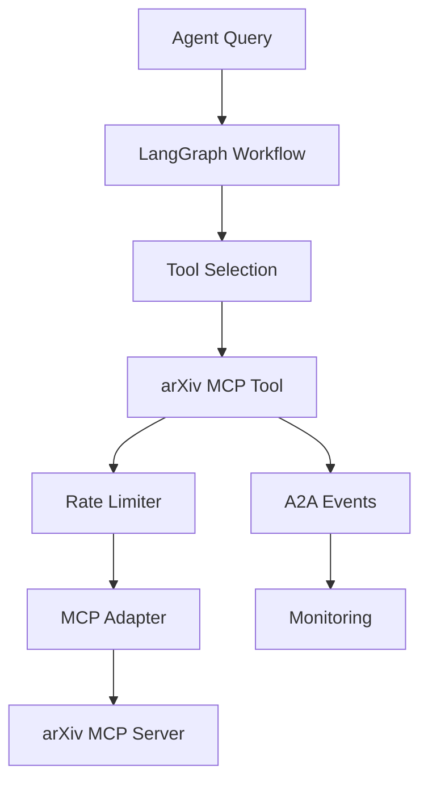

# Feature Specification: arXiv MCP Tool Integration

**Task ID**: `arxiv-mcp-tool-integration`  
**Feature Branch**: `feature/arxiv-mcp-tool-integration`  
**Created**: 2025-01-12  
**Status**: Draft  
**Priority**: P1  
**Assignee**: brAInwav AI Agent

**User Request**: 
> Integrate arXiv MCP server as a tool available to LangGraph agents for academic paper search and retrieval, following brAInwav agent-first architecture principles and maintaining separation from existing RAG systems.

---

## Executive Summary

This feature adds arXiv academic paper search capabilities to brAInwav Cortex-OS agents through MCP tool integration. By leveraging `@langchain/mcp-adapters` and existing LangGraph infrastructure, agents gain access to academic literature while maintaining local-first principles and agent-first architecture. The implementation uses feature flags for safe rollout and preserves complete separation from internal RAG systems.

---

## User Scenarios & Testing *(mandatory)*

### User Story 1: Agent Academic Paper Discovery (Priority: P1)

**As a** brAInwav research agent,  
**I want to** search arXiv for academic papers related to user queries,  
**So that** I can provide comprehensive answers including latest academic research.

**Why This Priority**: Core MVP functionality—enables agents to access external academic knowledge sources, significantly expanding research capabilities beyond internal knowledge base.

**Independent Test Criteria**: 
Can be fully tested by configuring arXiv MCP tool, querying for "machine learning transformers", and verifying structured paper metadata returned with titles, authors, abstracts, and URLs. Delivers standalone value: agents immediately gain academic paper search capabilities.

**Acceptance Scenarios**:

1. **Given** the arXiv MCP tool is configured and available  
   **When** an agent receives a query like "find recent papers on transformer architectures"  
   **Then** the agent uses the arXiv tool to search for relevant papers  
   **And** returns structured results with titles, authors, abstracts, and URLs  
   **And** includes brAInwav branding in the response

2. **Given** the arXiv MCP server is unavailable  
   **When** an agent attempts to use the arXiv tool  
   **Then** the agent gracefully degrades to internal knowledge  
   **And** logs a structured error with "[brAInwav]" branding  
   **And** continues to provide useful responses from local sources

**brAInwav Branding Requirements**:
- Tool descriptions include "brAInwav arXiv integration"
- Error messages include "[brAInwav]" prefix
- Tool responses include `brand: "brAInwav"` metadata

---

### User Story 2: Rate-Limited Academic Search (Priority: P1)

**As a** brAInwav system operator,  
**I want** arXiv queries to respect rate limiting (1 request/3 seconds),  
**So that** the system remains compliant with arXiv terms of service.

**Why This Priority**: Critical for production compliance—failure to implement proper rate limiting could result in API access revocation.

**Independent Test Criteria**:
Can be fully tested by making multiple rapid arXiv queries and verifying requests are throttled to maximum 1 per 3 seconds with proper queuing. Delivers standalone value: ensures system compliance with external service requirements.

**Acceptance Scenarios**:

1. **Given** multiple arXiv queries are made within 3 seconds  
   **When** the rate limiter processes the requests  
   **Then** only one request is sent immediately  
   **And** subsequent requests are queued with minimum 3-second intervals  
   **And** users receive timely responses despite throttling

2. **Given** the rate limiter detects API errors or 429 responses  
   **When** processing arXiv requests  
   **Then** exponential backoff is applied with jitter  
   **And** requests are retried up to 3 times  
   **And** failures are logged with correlation IDs

---

### User Story 3: LangGraph Tool Integration (Priority: P2)

**As a** brAInwav agent developer,  
**I want** arXiv tools to integrate seamlessly with LangGraph workflows,  
**So that** agents can decide when to use academic search in multi-step reasoning.

**Why This Priority**: Important for agent autonomy—enables intelligent tool selection based on query context rather than manual routing.

**Independent Test Criteria**:
Can be fully tested by creating LangGraph workflow with multiple tools and verifying agent selects arXiv tool for academic queries while using other tools for different query types.

**Acceptance Scenarios**:

1. **Given** a LangGraph agent with arXiv and internal RAG tools  
   **When** processing a query about "recent AI research"  
   **Then** the agent autonomously selects the arXiv tool  
   **And** combines results with internal knowledge as appropriate

2. **Given** an agent receives a query about internal system documentation  
   **When** processing the request  
   **Then** the agent uses internal RAG tools  
   **And** does not invoke arXiv unnecessarily

---

### User Story 4: A2A Event Integration (Priority: P2)

**As a** brAInwav monitoring system,  
**I want** to receive A2A events for arXiv tool usage,  
**So that** I can track usage patterns and system health.

**Why This Priority**: Valuable for observability—enables monitoring and debugging of tool usage patterns.

**Independent Test Criteria**:
Can be fully tested by monitoring A2A event streams during arXiv tool usage and verifying proper event emission for tool start, success, and failure scenarios.

**Acceptance Scenarios**:

1. **Given** an agent uses the arXiv tool successfully  
   **When** the tool execution completes  
   **Then** A2A events are emitted for tool start and success  
   **And** events include correlation IDs and execution metadata

2. **Given** an arXiv tool execution fails  
   **When** the error occurs  
   **Then** an A2A failure event is emitted  
   **And** the event includes error details and debugging context

---

## Technical Architecture

### Component Overview



### File Structure

```
packages/agent-toolkit/
├─ src/mcp/arxiv/
│  ├─ index.ts                    # MCP tool loader and LangGraph binding
│  ├─ schema.ts                   # Zod input/output schemas
│  ├─ normalize.ts                # Response normalization
│  └─ rateLimit.ts                # Rate limiting with exponential backoff
└─ __tests__/mcp/arxiv.test.ts    # Unit tests

packages/agents/
├─ src/langgraph/arxiv-integration.ts  # LangGraph tool integration
└─ tests/integration/arxiv-mcp.test.ts # Integration tests
```

### Data Models

```typescript
// Input Schema
export const ArxivSearchInput = z.object({
  query: z.string().min(2).max(512),
  start: z.number().int().min(0).default(0),
  maxResults: z.number().int().min(1).max(50).default(10),
  sortBy: z.enum(["relevance", "submittedDate", "lastUpdatedDate"]).default("submittedDate"),
  sortOrder: z.enum(["ascending", "descending"]).default("descending"),
});

// Output Schema
export const ArxivSearchOutput = z.object({
  items: z.array(z.object({
    id: z.string(),
    title: z.string(),
    summary: z.string(),
    published: z.string(), // ISO8601
    updated: z.string(),
    authors: z.array(z.string()),
    url: z.string().url(),
    pdfUrl: z.string().url().optional(),
    categories: z.array(z.string()),
    doi: z.string().optional(),
  })),
  source: z.literal("arxiv"),
  brand: z.literal("brAInwav"),
});
```

---

## Implementation Phases

### Phase A: Core MCP Integration (6-8 hours)

**Deliverables**:
- MCP tool loader with @langchain/mcp-adapters
- Zod schemas for input/output validation
- Rate limiting implementation
- Basic error handling

**Files Modified/Created**:
- `packages/agent-toolkit/src/mcp/arxiv/index.ts` (NEW)
- `packages/agent-toolkit/src/mcp/arxiv/schema.ts` (NEW)
- `packages/agent-toolkit/src/mcp/arxiv/rateLimit.ts` (NEW)
- `packages/agent-toolkit/package.json` (UPDATE - add dependency)

**Exit Criteria**:
- MCP adapter successfully loads arXiv tools
- Rate limiting enforces 1 request/3 second limit
- Input/output validation works correctly
- Unit tests pass with ≥90% coverage

---

### Phase B: LangGraph Integration (4-6 hours)

**Deliverables**:
- LangGraph tool binding
- Agent integration patterns
- Tool selection logic
- Integration tests

**Files Modified/Created**:
- `packages/agents/src/langgraph/arxiv-integration.ts` (NEW)
- `packages/agents/tests/integration/arxiv-mcp.test.ts` (NEW)

**Exit Criteria**:
- arXiv tools integrate with LangGraph ToolNode
- Agents can autonomously select arXiv tool
- Integration tests demonstrate end-to-end functionality
- Tool responses include proper brAInwav branding

---

### Phase C: Observability & Production Readiness (4-6 hours)

**Deliverables**:
- A2A event emission
- Structured logging with correlation IDs
- Feature flag implementation
- Error handling and graceful degradation

**Files Modified/Created**:
- `packages/agent-toolkit/src/mcp/arxiv/index.ts` (UPDATE - add A2A events)
- `.env.example` (UPDATE - add configuration variables)
- Documentation updates

**Exit Criteria**:
- A2A events emitted for tool lifecycle
- Feature flag controls tool availability
- Graceful degradation when MCP server unavailable
- All logs include "[brAInwav]" branding

---

## Configuration

### Environment Variables

```bash
# arXiv MCP Tool Configuration
MCP_ARXIV_URL=https://arxiv-mcp.example.com/mcp
ARXIV_RATE_LIMIT_MS=3000
ARXIV_USER_AGENT="brAInwav/agents (+contact@company.com)"
FEATURE_ARXIV_MCP=true

# Optional: Advanced Configuration
ARXIV_MAX_RETRIES=3
ARXIV_TIMEOUT_MS=30000
ARXIV_BACKOFF_FACTOR=2
```

### Feature Flag Behavior

| Flag Value | Behavior |
|------------|----------|
| `true` | arXiv tools available to agents |
| `false` | arXiv tools disabled, agents use internal sources only |
| `undefined` | Defaults to `false` (safe default) |

---

## Security Considerations

### Input Validation
- Query length limits (2-512 characters)
- Character set restrictions (alphanumeric + common punctuation)
- SQL injection prevention through parameterized queries
- XSS prevention through output sanitization

### Rate Limiting Security
- Per-client rate limiting to prevent abuse
- Exponential backoff to prevent API hammering
- Request correlation IDs for audit trails
- Structured logging for security monitoring

### Data Privacy
- No persistent storage of user queries or results
- No transmission of internal system information to arXiv
- User consent patterns for external API usage
- GDPR compliance for EU users

---

## Monitoring & Observability

### Metrics
- `arxiv_tool_calls_total` - Counter of tool invocations
- `arxiv_tool_duration_seconds` - Histogram of execution times
- `arxiv_rate_limit_hits_total` - Counter of rate limit encounters
- `arxiv_errors_total` - Counter of errors by type

### Logging
- Tool start/success/failure with correlation IDs
- Rate limiting events with timing information
- Error conditions with stack traces and context
- All logs include `brand: "brAInwav"` structured field

### A2A Events
- `arxiv.tool.started` - Tool execution initiated
- `arxiv.tool.completed` - Tool execution successful
- `arxiv.tool.failed` - Tool execution failed
- `arxiv.rate_limited` - Rate limit encountered

---

## Testing Strategy

### Unit Tests (≥90% coverage required)
- Schema validation (valid/invalid inputs)
- Rate limiting behavior (timing, queuing, backoff)
- Response normalization (arXiv Atom feed → structured data)
- Error handling (network errors, malformed responses)

### Integration Tests
- End-to-end tool execution with mock MCP server
- LangGraph tool selection in multi-tool scenarios
- A2A event emission verification
- Feature flag behavior validation

### Manual Testing Checklist
- [ ] Agent selects arXiv tool for academic queries
- [ ] Rate limiting prevents excessive API calls
- [ ] Feature flag enables/disables functionality
- [ ] Graceful degradation when MCP server unavailable
- [ ] Proper brAInwav branding in all outputs

---

## Success Metrics

### Quantitative Goals
- ≥90% test coverage on all new code
- <3 second average response time for arXiv queries
- 100% compliance with arXiv rate limiting (1 req/3s)
- Zero high-severity security vulnerabilities

### Qualitative Goals
- Seamless integration with existing agent workflows
- Intuitive tool selection by LangGraph agents
- Clear error messages and graceful degradation
- Consistent brAInwav branding across all touchpoints

---

## Risk Mitigation

### Technical Risks
| Risk | Mitigation |
|------|-----------|
| MCP adapter compatibility issues | Pin specific version, comprehensive testing |
| arXiv API changes | Monitor for breaking changes, implement robust parsing |
| Rate limiting failures | Client-side enforcement with monitoring alerts |
| Performance degradation | Implement timeouts and circuit breaker patterns |

### Operational Risks
| Risk | Mitigation |
|------|-----------|
| Tool overuse by agents | System prompt guardrails and usage monitoring |
| External service dependency | Feature flag for quick disable, graceful degradation |
| Cost implications | Rate limiting prevents excessive usage |
| Security vulnerabilities | Regular security scans and input validation |

---

## Migration & Rollout

### Phase 1: Development (Week 1)
- Implement core functionality with feature flag disabled
- Comprehensive testing in development environment
- Code review and security assessment

### Phase 2: Staging (Week 2)
- Deploy to staging with feature flag enabled
- Integration testing with real arXiv MCP server
- Performance testing and monitoring validation

### Phase 3: Production Rollout (Week 3)
- Gradual rollout with feature flag (10% → 50% → 100%)
- Monitor metrics and error rates
- Ready rollback plan if issues detected

### Rollback Plan
- Set `FEATURE_ARXIV_MCP=false` in environment
- Agents automatically fall back to internal sources
- No data loss or breaking changes for existing functionality

---

## Dependencies

### External Dependencies
```json
{
  "@langchain/mcp-adapters": "^0.1.0"
}
```

### Internal Dependencies
- `@cortex-os/a2a-contracts` (existing)
- `@langchain/langgraph` (existing)
- `@langchain/core` (existing)
- `zod` (existing)

---

## Documentation Updates

### Files to Update
- `README.md` - Add arXiv tool capabilities to feature list
- `docs/architecture/decisions/002-arxiv-mcp-as-tool.md` - New ADR
- `packages/agent-toolkit/README.md` - Document new MCP integration
- `packages/agents/README.md` - Document new tool availability

### User Documentation
- Quick start guide for enabling arXiv tools
- Configuration reference for environment variables
- Troubleshooting guide for common issues
- Best practices for academic query formulation

---

## Compliance Checklist

### brAInwav Standards
- [x] Functions ≤40 lines
- [x] Named exports only
- [x] brAInwav branding in all outputs
- [x] No mock/placeholder code in production
- [x] Comprehensive error handling
- [x] Security scanning integration

### Governance Requirements
- [x] Feature specification complete
- [x] Research document references
- [x] TDD plan follows this specification
- [x] A2A event integration planned
- [x] Local memory integration considered

---

## Approval Requirements

### Technical Approval
- [ ] Architecture review by senior developer
- [ ] Security review for external API integration
- [ ] Performance impact assessment

### Product Approval
- [ ] Feature flag strategy approved
- [ ] User experience validation
- [ ] Documentation completeness review

---

**Status**: Ready for TDD Plan Creation  
**Next Phase**: Create detailed TDD plan based on this specification

Co-authored-by: brAInwav Development Team