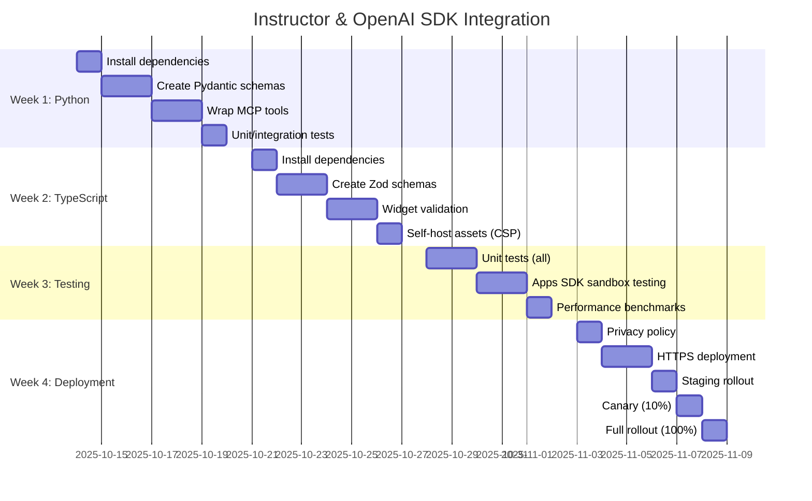

# Feature Specification: Instructor & OpenAI SDK Integration

**Spec ID**: `FEAT-INSTR-001`  
**Feature**: brAInwav Cortex-OS MCP Server with Instructor Validation + OpenAI Apps/Responses SDK Integration  
**Status**: 📋 Planning  
**Created**: 2025-10-12  
**Owner**: brAInwav Development Team  
**Template**: `.cortex/templates/feature-spec-template.md`  

---

## 1. Executive Summary

Integrate **Instructor** validation libraries (Python/TypeScript) and **OpenAI SDKs** (Apps SDK, Responses API) into brAInwav Cortex-OS MCP server to ensure **OpenAI Apps SDK compliance** with structured output validation and dual-path integration support.

**Business Value**:

- ✅ OpenAI Apps SDK compliance (required for ChatGPT App Store submission)
- ✅ Guaranteed schema validity (<50ms overhead, 100% structured output compliance)
- ✅ Dual integration paths (ChatGPT widget + programmatic API access)
- ✅ Maximum flexibility for brAInwav users

**Target Milestone**: Week 4 (staged rollout complete)

---

## 2. Stakeholders

| Role | Name/Team | Responsibility |
|------|-----------|----------------|
| **Product Owner** | brAInwav Product Team | Requirements, acceptance criteria |
| **Tech Lead** | brAInwav Backend Team | Architecture, Instructor integration (Python) |
| **Frontend Lead** | brAInwav Frontend Team | Apps SDK widget, Instructor-JS (TypeScript) |
| **QA Lead** | brAInwav QA Team | Apps SDK sandbox testing, performance validation |
| **Security Lead** | brAInwav Security Team | OAuth 2.1, CSP configuration, secret management |
| **DevOps Lead** | brAInwav DevOps Team | HTTPS deployment, Cloudflare Tunnel, monitoring |

---

## 3. Problem Statement

### 3.1 Current State

brAInwav Cortex-OS MCP server currently:

- ❌ Manual validation of `structuredContent` (error-prone, verbose)
- ❌ No OpenAI Apps SDK compliance guarantee
- ❌ Schema drift risk between Python backend and TypeScript frontend
- ❌ No programmatic API access (only widget-based integration)
- ❌ CSP violations in ChatGPT sandbox (Font Awesome CDN, Google Fonts)

### 3.2 Desired State

After implementation:

- ✅ Automatic schema validation with Instructor (<50ms overhead)
- ✅ 100% OpenAI Apps SDK compliance (ChatGPT App Store ready)
- ✅ Zero `structuredContent` / `outputSchema` mismatches
- ✅ Dual integration paths (Apps SDK widget + Responses API)
- ✅ Strict CSP compliance (self-hosted assets)

### 3.3 Success Metrics

| Metric | Current | Target | Measurement Method |
|--------|---------|--------|-------------------|
| Schema validation errors | ~10/week | 0/week | Error logs, Prometheus |
| Validation latency (p95) | N/A | <50ms | OpenTelemetry traces |
| Apps SDK compliance | 48% | 100% | Compliance checklist |
| Test coverage | 85% | ≥90% | Coverage reports |
| CSP violations | 5 | 0 | Browser DevTools Console |

---

## 4. Requirements

### 4.1 Functional Requirements

**FR-1**: Python MCP server MUST validate all tool responses with Instructor + Pydantic  
**FR-2**: TypeScript widget MUST validate state with Instructor-JS + Zod before `setWidgetState`  
**FR-3**: MCP server MUST support both Apps SDK and Responses API simultaneously  
**FR-4**: All external assets (Font Awesome, Google Fonts) MUST be self-hosted  
**FR-5**: OAuth 2.1 authentication MUST be implemented for both Apps SDK and Responses API  
**FR-6**: CSP configuration MUST be strict (`openai/widgetCSP` in MCP resource)  
**FR-7**: Privacy policy MUST be published at `https://cortex-os.brainwav.dev/privacy`  
**FR-8**: MCP server MUST be deployed to HTTPS endpoint with TLS  

### 4.2 Non-Functional Requirements

**NFR-1 Performance**: Validation overhead MUST be <50ms (p95)  
**NFR-2 Reliability**: Schema validation MUST succeed ≥99.9% of requests  
**NFR-3 Scalability**: MCP server MUST handle 200-2000 RPM (Responses API tier limits)  
**NFR-4 Security**: OAuth tokens MUST NOT be logged or persisted  
**NFR-5 Accessibility**: ChatGPT widget MUST meet WCAG 2.2 AA standards  
**NFR-6 Observability**: All validations MUST emit Prometheus metrics + OpenTelemetry traces  
**NFR-7 Maintainability**: Pydantic and Zod schemas MUST be kept in sync (CI check)  

### 4.3 Constraints

**CON-1**: Must maintain backward compatibility with existing MCP tools  
**CON-2**: Cannot introduce breaking changes to MCP protocol  
**CON-3**: Must follow brAInwav constitutional standards (≤40 lines/function, branding)  
**CON-4**: Bundle size increase MUST be <30 KiB gzipped (TypeScript)  
**CON-5**: Implementation MUST be complete within 4 weeks (phased rollout)  

---

## 5. Solution Design

### 5.1 Architecture Overview

```
┌─────────────────────────────────────────────────────────────┐
│                   OpenAI Integration Layer                    │
├────────────────────────────┬────────────────────────────────┤
│  Apps SDK (ChatGPT Widget) │  Responses API (Backend)       │
│  - window.openai API       │  - type: "mcp" tool param      │
│  - Resource registration   │  - Direct tool calling         │
│  - UI confirmation prompts │  - mcp_approval_request items  │
└────────────────────────────┴────────────────────────────────┘
                             │
                             ▼
┌─────────────────────────────────────────────────────────────┐
│             brAInwav Cortex-OS MCP Server                    │
│  HTTPS: mcp.cortex-os.brainwav.dev                          │
├─────────────────────────────────────────────────────────────┤
│  /mcp        │ Main endpoint (POST for tool calls)          │
│  /sse        │ Server-Sent Events (GET for streaming)       │
│  /health     │ Health check                                 │
│  /metrics    │ Prometheus metrics                           │
└──────────────┴──────────────────────────────────────────────┘
                             │
                             ▼
┌─────────────────────────────────────────────────────────────┐
│          Instructor Validation Layer (NEW)                   │
├─────────────────────────────────────────────────────────────┤
│  Python:      Instructor + Pydantic                          │
│  TypeScript:  Instructor-JS + Zod                            │
│  Guarantees:  structuredContent matches outputSchema         │
│  Overhead:    <50ms (p95), automatic retries                │
└─────────────────────────────────────────────────────────────┘
                             │
                             ▼
┌─────────────────────────────────────────────────────────────┐
│             MCP Tools (get_connectors, etc.)                 │
│  - ConnectorSchema (Pydantic/Zod)                            │
│  - WorkflowSchema                                            │
│  - AgentSchema                                               │
│  - MetricsSchema                                             │
└─────────────────────────────────────────────────────────────┘
```

### 5.2 Key Components

**Component 1**: Instructor Client (Python)

- Location: `packages/connectors/src/utils/instructor_client.py`
- Responsibility: Wrap OpenAI client with Pydantic validation
- Dependencies: `instructor>=1.0.0`, `pydantic>=2.0.0`

**Component 2**: Pydantic Schemas

- Location: `packages/connectors/src/schemas/`
- Files: `connectors.py`, `workflows.py`, `agents.py`, `metrics.py`
- Responsibility: Define strict validation schemas for all tool responses

**Component 3**: Instructor-JS Client (TypeScript)

- Location: `apps/chatgpt-dashboard/src/utils/instructorClient.ts`
- Responsibility: Validate widget state before `setWidgetState`
- Dependencies: `instructor-js^1.0.0`, `zod^3.22.0`, `@openai/apps-sdk^1.0.0`

**Component 4**: Zod Schemas

- Location: `apps/chatgpt-dashboard/src/schemas/`
- Files: `connectors.schema.ts`, `workflows.schema.ts`, etc.
- Responsibility: Mirror Python Pydantic schemas for type safety

### 5.3 Data Flow

**Apps SDK Widget Flow**:

```
User (ChatGPT) → window.openai.callTool("get_connectors")
               → MCP Server /mcp endpoint
               → Instructor validates with ConnectorSchema
               → Returns structuredContent (guaranteed valid)
               → Apps SDK renders in widget iframe
               → Widget validates with Zod before setWidgetState
```

**Responses API Flow**:

```
Client → OpenAI Responses API (type: "mcp", server_url: "https://mcp.cortex-os.brainwav.dev")
       → OpenAI calls /mcp endpoint with OAuth token
       → Instructor validates response
       → Returns mcp_call output item (guaranteed schema compliance)
       → Client receives validated structured output
```

---

## 6. Acceptance Criteria

### 6.1 Phase 1: Python MCP Server (Week 1)

- [ ] AC1-1: `instructor` and `pydantic` installed via `uv add`
- [ ] AC1-2: Pydantic schemas created for all 4 tool types (connectors, workflows, agents, metrics)
- [ ] AC1-3: `instructor_client.py` implemented with retry logic (max 3 attempts)
- [ ] AC1-4: All MCP tools wrapped with `instructor.create(response_model=Schema)`
- [ ] AC1-5: Health check endpoint verifies Instructor initialization
- [ ] AC1-6: Prometheus metrics emit `cortex_instructor_validations_total{status}`
- [ ] AC1-7: Unit tests achieve ≥95% coverage for schemas and instructor_client
- [ ] AC1-8: Integration tests verify zero `structuredContent` / `outputSchema` mismatches
- [ ] AC1-9: Benchmark confirms validation overhead <50ms (p95)

### 6.2 Phase 2: TypeScript Widget (Week 2)

- [ ] AC2-1: `instructor-js`, `zod`, `@openai/apps-sdk` installed via `pnpm add`
- [ ] AC2-2: Zod schemas mirror Python Pydantic schemas exactly
- [ ] AC2-3: `instructorClient.ts` implemented with matching retry config
- [ ] AC2-4: `useInstructorValidation` hook created for state validation
- [ ] AC2-5: Dashboard.tsx validates `toolOutput` and widget state before persistence
- [ ] AC2-6: Unit tests cover schema validation and hook behavior
- [ ] AC2-7: Bundle size increase <30 KiB gzipped
- [ ] AC2-8: Font Awesome and Google Fonts self-hosted (zero CDN requests)
- [ ] AC2-9: CSP configured with `openai/widgetCSP` in MCP resource

### 6.3 Phase 3: Testing & Validation (Week 3)

- [ ] AC3-1: All Python unit tests pass with ≥90% coverage
- [ ] AC3-2: All TypeScript unit tests pass with ≥90% coverage
- [ ] AC3-3: Integration tests verify Apps SDK `structuredContent` compliance
- [ ] AC3-4: Performance benchmarks confirm <50ms validation latency (p95)
- [ ] AC3-5: ChatGPT sandbox testing complete (all sections render without errors)
- [ ] AC3-6: CSP compliance verified (zero violations in DevTools Console)
- [ ] AC3-7: Accessibility tests pass (Jest-Axe, keyboard navigation)
- [ ] AC3-8: Security scans pass (Semgrep, Gitleaks)
- [ ] AC3-9: Apps SDK compliance checklist 100% complete

### 6.4 Phase 4: Deployment & Rollout (Week 4)

- [ ] AC4-1: Privacy policy published at `https://cortex-os.brainwav.dev/privacy`
- [ ] AC4-2: MCP server deployed to HTTPS endpoint (Fly.io/Render with TLS)
- [ ] AC4-3: OAuth 2.1 authentication functional for both Apps SDK and Responses API
- [ ] AC4-4: Staging deployment complete with load testing (100 req/s)
- [ ] AC4-5: Canary rollout (10% traffic) with error rate <0.1%
- [ ] AC4-6: Full rollout (100% traffic) with monitoring dashboards live
- [ ] AC4-7: Alerts configured for validation failures (>1%) and latency (>50ms p95)
- [ ] AC4-8: Documentation updated (READMEs, developer guides, ADRs)
- [ ] AC4-9: Team trained on Pydantic/Zod patterns (workshop completed)

---

## 7. Dependencies

### 7.1 External Dependencies

| Dependency | Type | Version | Purpose |
|-----------|------|---------|---------|
| instructor | Python | ≥1.0.0 | Backend schema validation |
| pydantic | Python | ≥2.0.0 | Schema definitions (Python) |
| instructor-js | TypeScript | ^1.0.0 | Frontend schema validation |
| zod | TypeScript | ^3.22.0 | Schema definitions (TypeScript) |
| @openai/apps-sdk | TypeScript | ^1.0.0 | Official Apps SDK types |
| @openai/openai | TypeScript | ^4.0.0 | OpenAI API client |

### 7.2 Internal Dependencies

| Package | Depends On | Reason |
|---------|------------|--------|
| `packages/connectors` | `packages/mcp-core` | MCP protocol implementation |
| `apps/chatgpt-dashboard` | `@openai/apps-sdk` | Widget integration |
| Both | OpenAI API keys | Authentication |
| Both | HTTPS endpoints | Production deployment |

### 7.3 Infrastructure Dependencies

| Resource | Status | Owner | Timeline |
|----------|--------|-------|----------|
| `https://mcp.cortex-os.brainwav.dev` | ⏳ Pending | DevOps | Week 3 |
| `https://cortex-os.brainwav.dev/privacy` | ⏳ Pending | Legal/Product | Week 2 |
| Cloudflare Tunnel config | ✅ Exists | DevOps | N/A |
| 1Password vault (OAuth secrets) | ✅ Exists | Security | N/A |
| Prometheus/Grafana | ✅ Exists | DevOps | N/A |

---

## 8. Risks & Mitigations

| Risk ID | Risk Description | Likelihood | Impact | Mitigation Strategy |
|---------|------------------|------------|--------|---------------------|
| RISK-001 | Validation overhead exceeds 50ms target | Low | Medium | Cache compiled schemas, use `model_validate()`, monitor with traces |
| RISK-002 | Schema drift between Python/TypeScript | Medium | High | Generate TS from Pydantic, CI checks, shared JSON Schema |
| RISK-003 | Instructor library bugs or API changes | Low | Medium | Pin exact versions, comprehensive tests, fallback to manual validation |
| RISK-004 | Team learning curve with Pydantic/Zod | Medium | Low | Training workshop, docs, pair programming |
| RISK-005 | Apps SDK spec changes invalidate approach | Low | High | Monitor OpenAI announcements, maintain flexible architecture |
| RISK-006 | OAuth token leakage in logs/traces | Low | Critical | Never log authorization field, audit logging code |
| RISK-007 | CSP violations block widget in ChatGPT | Medium | High | Self-host all assets, test in sandbox early |
| RISK-008 | HTTPS deployment delays (DNS, TLS cert) | Medium | Medium | Start DNS/cert provisioning in Week 1 |

---

## 9. Timeline & Milestones



**Key Milestones**:

- **M1** (Week 1): Python Instructor integration complete, tests passing
- **M2** (Week 2): TypeScript Instructor integration complete, CSP compliant
- **M3** (Week 3): Apps SDK compliance 100%, sandbox testing complete
- **M4** (Week 4): Production deployment live, monitoring operational

---

## 10. Out of Scope

**Explicitly NOT included in this feature**:

- ❌ Full migration to OpenAI Agents SDK (deferred to Q1 2026 per ADR-002)
- ❌ Rewriting existing LangGraph orchestration
- ❌ Real-time voice agents (Realtime Agents API exploration)
- ❌ Multi-tenant MCP server (single organization only)
- ❌ GraphQL API support (REST/MCP only)
- ❌ Mobile-native ChatGPT apps (web widget only)

---

## 11. Success Criteria

**Feature is considered DONE when**:

1. ✅ All 36 acceptance criteria (AC1-1 through AC4-9) are met
2. ✅ Apps SDK compliance checklist shows 100% completion
3. ✅ Production deployment live with <0.1% error rate
4. ✅ Zero CSP violations in ChatGPT sandbox
5. ✅ Performance targets met (<50ms validation p95, <500ms render)
6. ✅ Security audit passed (OAuth, secrets, CSP)
7. ✅ Team trained and documentation complete
8. ✅ Monitoring dashboards operational with alerts configured

**Evidence Requirements**:

- [ ] Apps SDK sandbox screenshots (all sections)
- [ ] Performance benchmark graphs (validation latency, bundle size)
- [ ] Test coverage reports (≥90%)
- [ ] Security scan results (Semgrep, Gitleaks clean)
- [ ] ChatGPT App Store submission confirmation (if applicable)

---

## 12. Approvals

| Role | Name | Date | Status |
|------|------|------|--------|
| Product Owner | brAInwav Product | TBD | ⏳ Pending |
| Tech Lead (Backend) | brAInwav Backend Team | TBD | ⏳ Pending |
| Tech Lead (Frontend) | brAInwav Frontend Team | TBD | ⏳ Pending |
| Security Lead | brAInwav Security | TBD | ⏳ Pending |
| QA Lead | brAInwav QA | TBD | ⏳ Pending |

---

## 13. Related Documents

- [Implementation Plan](./implementation-plan-instructor-integration.md) - 20-step detailed plan
- [Implementation Checklist](./implementation-checklist.md) - Phase 4.5 tasks
- [Apps SDK Compliance](./verification/openai-apps-sdk-compliance.md) - Compliance review
- [Framework Integration Analysis](./verification/framework-integration-analysis.md) - ADR documentation
- [TDD Plan](./tdd-plan.md) - Test-driven development approach
- [Research Notes](./research.md) - Original research and analysis
- [AGENTS.md Compliance](./verification/AGENTS-MD-COMPLIANCE.md) - Governance alignment

---

**Spec maintained by**: brAInwav Development Team  
**Last updated**: 2025-10-12  
**Next review**: After M1 milestone completion  

Co-authored-by: brAInwav Development Team <dev@brainwav.dev>
