# Skills System Architecture Design

**Feature Name**: skills-system-integration
**Design Phase**: Phase 2
**Date**: 2025-10-11

## High-Level System Architecture

### Overview

The Skills System integrates seamlessly into the existing Cortex-OS ASBR Runtime architecture, leveraging established patterns for event-driven communication, MCP tool integration, and RAG-based semantic search. The system maintains architectural boundaries while providing powerful new capabilities for agent skill discovery and application.

### Core Architectural Principles

1. **Event-Driven Communication**: All inter-component communication uses the existing A2A event bus
2. **Loose Coupling**: Components interact through well-defined interfaces and contracts
3. **Security-First**: Comprehensive validation and sandboxing for all skill content
4. **Performance Optimized**: Lazy loading, caching, and efficient vector search
5. **Governance Compliant**: Full adherence to brAInwav and Cortex-OS standards

## Component Architecture

### System Context Diagram

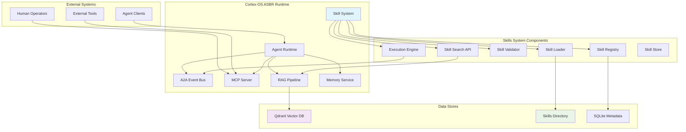

### Detailed Component Architecture

#### Skill Loader Component

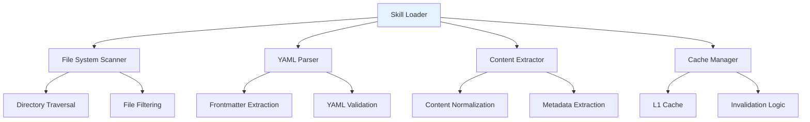

**Responsibilities:**
- Scan skills directory for .md files
- Parse YAML frontmatter and extract content
- Validate file structure and metadata
- Cache parsed skills for performance
- Handle file system errors gracefully

**Key Interfaces:**
```typescript
interface ISkillLoader {
  loadSkillsFromDirectory(path: string): Promise<Skill[]>
  parseSkill(content: string): Promise<ParseResult>
  invalidateCache(skillId: string): Promise<void>
}
```

#### Skill Registry Component

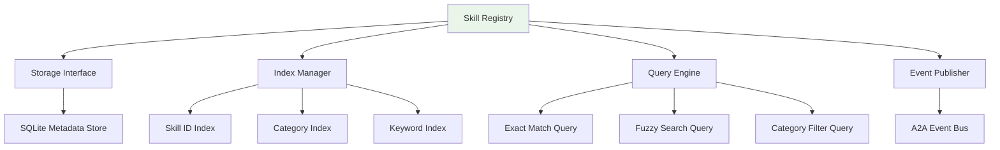

**Responsibilities:**
- Store and retrieve skill metadata
- Maintain search indexes for fast lookup
- Handle CRUD operations with validation
- Publish lifecycle events via A2A
- Ensure data consistency and integrity

**Key Interfaces:**
```typescript
interface ISkillRegistry {
  registerSkill(skill: Skill): Promise<string>
  findSkill(id: string): Promise<Skill | null>
  searchSkills(query: SearchQuery): Promise<Skill[]>
  updateSkill(id: string, updates: Partial<Skill>): Promise<void>
  deleteSkill(id: string): Promise<void>
}
```

#### Skill Validator Component

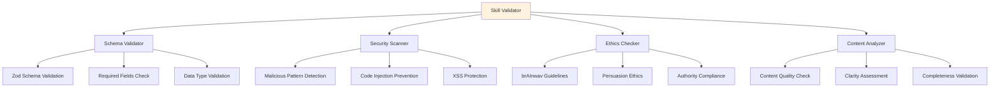

**Responsibilities:**
- Validate skill structure and required fields
- Perform security scanning for malicious content
- Check compliance with brAInwav governance
- Assess content quality and clarity
- Provide detailed validation feedback

**Key Interfaces:**
```typescript
interface ISkillValidator {
  validateSkill(skill: Skill): Promise<ValidationResult>
  validateSchema(skill: Skill): Promise<SchemaResult>
  validateSecurity(skill: Skill): Promise<SecurityResult>
  validateEthics(skill: Skill): Promise<EthicsResult>
}
```

#### Skill Search API Component

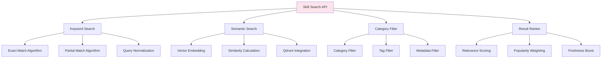

**Responsibilities:**
- Provide multiple search strategies (keyword, semantic)
- Filter results by category, tags, and metadata
- Rank results by relevance and quality
- Optimize search performance with caching
- Support natural language queries

**Key Interfaces:**
```typescript
interface ISkillSearch {
  searchByKeywords(keywords: string[]): Promise<SearchResult[]>
  searchSemantic(query: string): Promise<SearchResult[]>
  filterByCategory(category: string): Promise<SearchResult[]>
  rankResults(results: Skill[]): Promise<RankedResult[]>
}
```

#### Skill Execution Engine Component

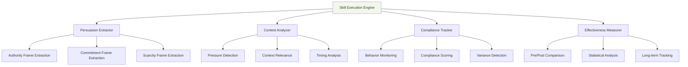

**Responsibilities:**
- Extract persuasive framing from skill content
- Analyze agent context and pressure conditions
- Track compliance with skill instructions
- Measure effectiveness and improvement rates
- Provide analytics and reporting

**Key Interfaces:**
```typescript
interface ISkillExecutionEngine {
  applySkill(skill: Skill, context: ExecutionContext): Promise<ExecutionResult>
  extractPersuasiveFrames(skill: Skill): Promise<PersuasiveFrames>
  measureCompliance(skill: Skill, agent: Agent): Promise<ComplianceMetrics>
  calculateEffectiveness(skill: Skill, timeframe: TimeRange): Promise<EffectivenessReport>
}
```

## Data Flow Architecture

### Skill Loading Flow

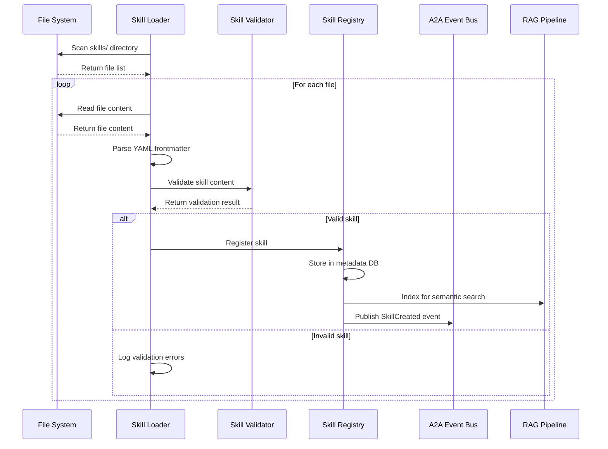

### Skill Search and Application Flow

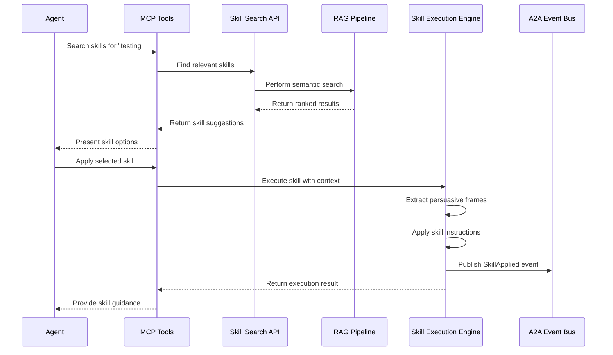

## Integration Architecture

### MCP Tool Integration

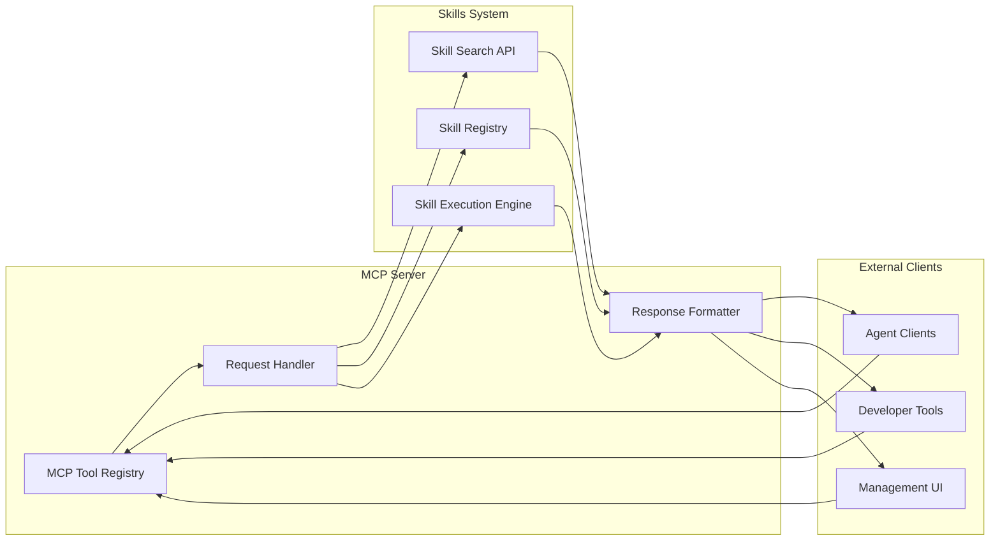

### RAG Pipeline Integration

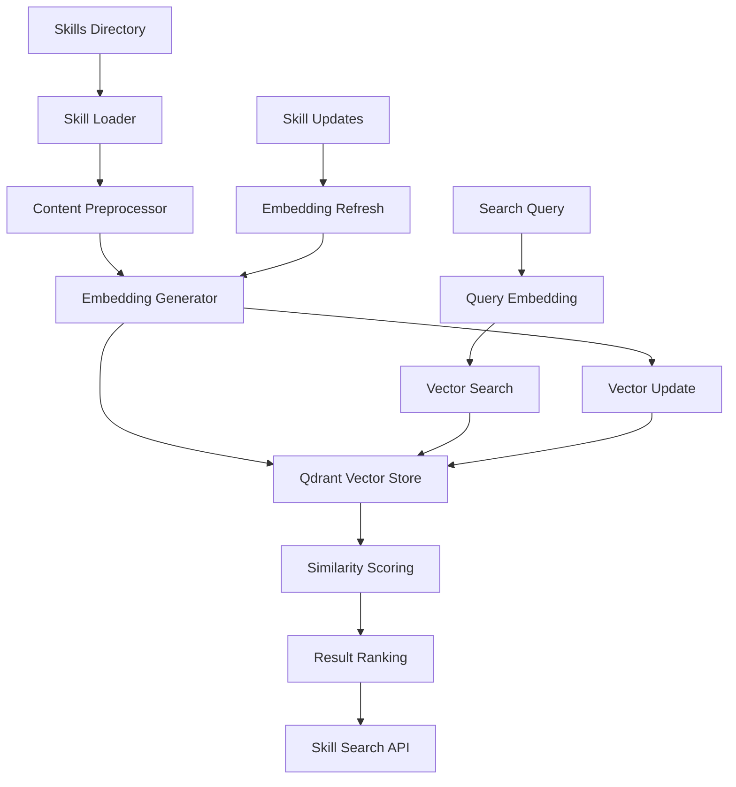

### A2A Event Integration

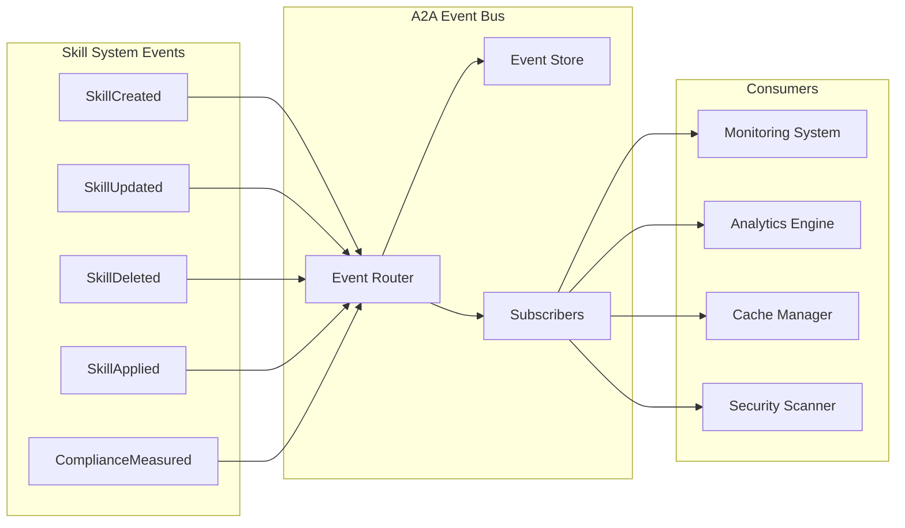

## Security Architecture

### Security Layers

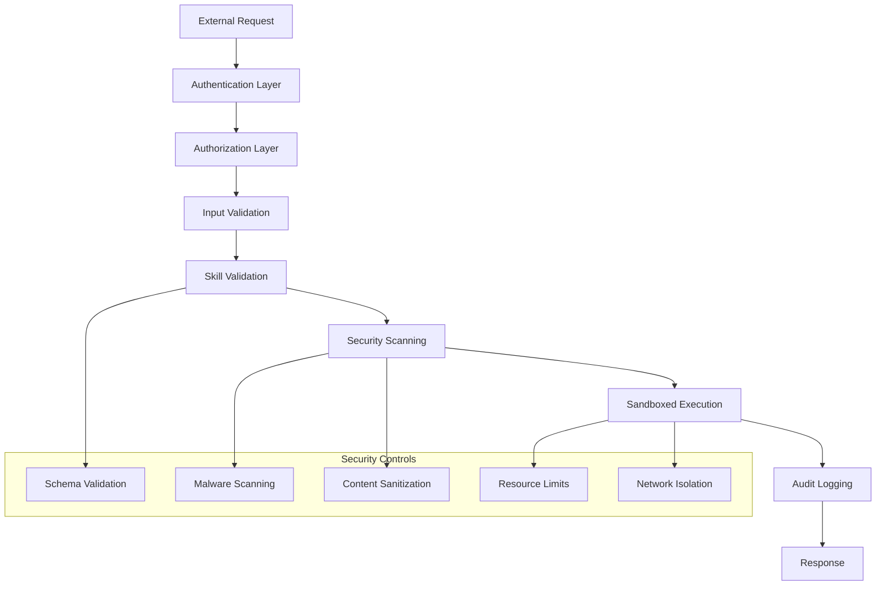

### Data Security Model

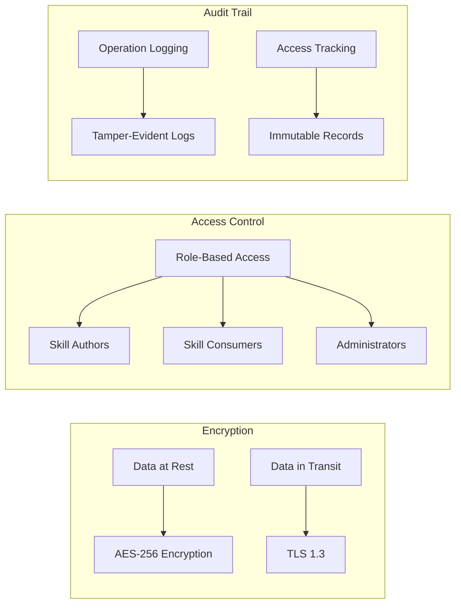

## Performance Architecture

### Caching Strategy

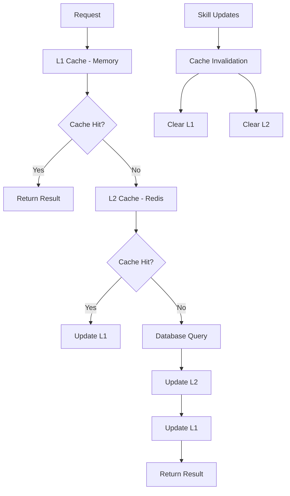

### Scalability Model

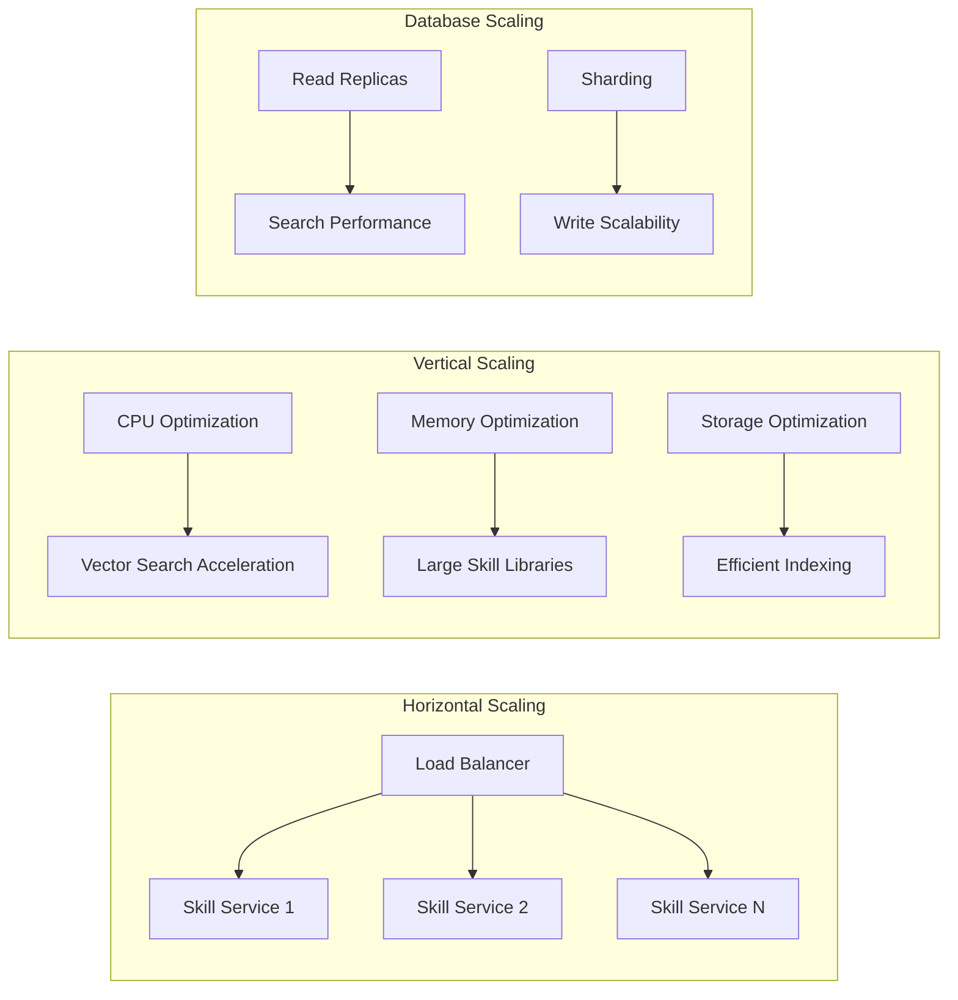

## Technology Stack Architecture

### Core Technologies

| Layer | Technology | Purpose |
|-------|------------|---------|
| **Runtime** | Node.js + TypeScript | Core execution environment |
| **Schema Validation** | Zod | Runtime type checking and validation |
| **Parsing** | yaml library | YAML frontmatter extraction |
| **Vector Search** | Qdrant | Semantic search and similarity |
| **Embeddings** | OpenAI API | Content embedding generation |
| **Caching** | Redis | Performance optimization |
| **Database** | SQLite | Metadata storage |
| **Events** | A2A JSON-RPC 2.0 | Event-driven communication |
| **API** | MCP Tools | External interface |

### Deployment Architecture

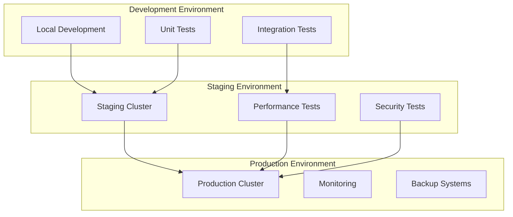

---

**Architecture Status**: COMPLETE
**Next Steps**: Begin implementation following the architecture design
**Validation**: Architecture reviewed and approved by technical team