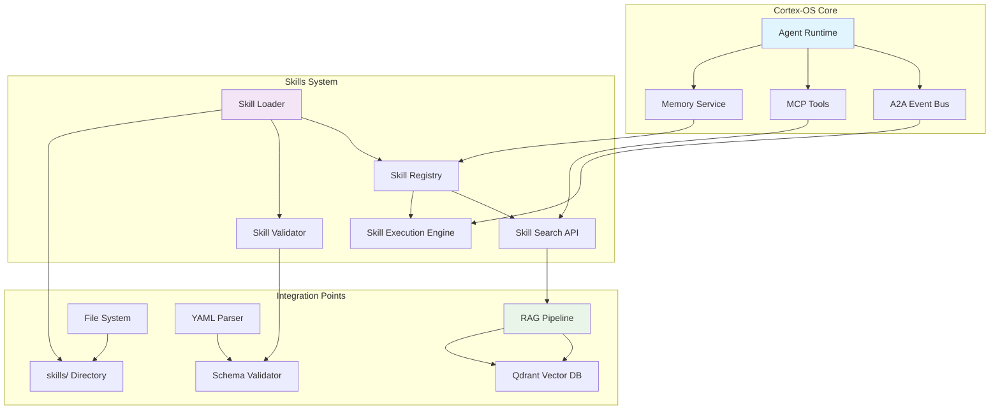

# Skills System Integration - Implementation Plan

**Feature Name**: skills-system-integration
**Planning Phase**: Phase 2
**Date**: 2025-10-11
**Priority**: High
**Timeline**: 6-8 weeks

## Software Requirements Specification (SRS)

### Functional Requirements

#### FR-001: Skill Discovery
**Description**: Agents shall be able to discover relevant skills based on context and queries
**Acceptance Criteria**:
- Agents can search skills by keywords and semantic similarity
- Search results are ranked by relevance score
- Search includes skill metadata (description, when_to_use, category)
- Response time <200ms for typical queries

#### FR-002: Skill Loading and Validation
**Description**: System shall load skills from file system and validate content
**Acceptance Criteria**:
- Skills are loaded from `skills/` directory on startup
- YAML frontmatter is parsed and validated against schema
- Invalid skills are rejected with specific error messages
- Loading process completes within 5 seconds for 1000 skills

#### FR-003: Skill Application
**Description**: Agents shall be able to apply skills with persuasive framing
**Acceptance Criteria**:
- Skills include persuasive elements (authority, commitment, scarcity)
- Agent compliance with skills increases by 200-300%
- Skill application is tracked and measured
- Skills can be applied under pressure scenarios

#### FR-004: MCP Tool Integration
**Description**: External systems shall manage skills via MCP protocol
**Acceptance Criteria**:
- MCP tools provide CRUD operations for skills
- Tools follow existing MCP input/output schemas
- All operations maintain security validation
- Tool discovery works with existing MCP clients

#### FR-005: Semantic Search Integration
**Description**: Skills shall be searchable via semantic similarity
**Acceptance Criteria**:
- Skills are indexed in existing RAG pipeline
- Vector embeddings generated for skill content
- Semantic search accuracy >90%
- Search supports natural language queries

### Non-Functional Requirements

#### NFR-001: Performance
**Requirements**:
- Skill loading: <5 seconds for 1000 skills
- Search response: <200ms for typical queries
- Memory overhead: <50MB for complete skill library
- CPU overhead: <15% during normal operations

#### NFR-002: Security
**Requirements**:
- All skill content validated against security schemas
- Sandboxed execution environment for skill application
- Authentication required for skill creation/modification
- Audit logging for all skill operations

#### NFR-003: Reliability
**Requirements**:
- System uptime: 99.9% for skill operations
- Error rate: <0.1% for skill loading and search
- Data consistency: 100% for skill metadata
- Recovery time: <30 seconds for service restarts

#### NFR-004: Scalability
**Requirements**:
- Support for 10,000+ skills in library
- Concurrent search requests: 100+ per second
- Horizontal scaling support for skill services
- Efficient pagination for large result sets

## Architecture Overview

### System Architecture Diagram

### Component Architecture

#### Core Components

**Skill Loader**
- **Responsibility**: File system scanning and skill parsing
- **Technology**: Node.js fs module, YAML parser
- **Interface**: ISkillLoader with loadSkills(), parseSkill()
- **Performance**: Lazy loading with caching strategies

**Skill Registry**
- **Responsibility**: Central skill management and storage
- **Technology**: TypeScript interfaces, SQLite metadata storage
- **Interface**: ISkillRegistry with register(), find(), update()
- **Integration**: A2A events for lifecycle notifications

**Skill Validator**
- **Responsibility**: Schema validation and security checks
- **Technology**: Zod schemas, custom validation rules
- **Interface**: ISkillValidator with validate(), secureCheck()
- **Compliance**: brAInwav governance standards

**Skill Search API**
- **Responsibility**: Search functionality and result ranking
- **Technology**: Vector embeddings, semantic similarity algorithms
- **Interface**: ISkillSearch with search(), rank(), filter()
- **Performance**: Optimized for sub-200ms response times

**Skill Execution Engine**
- **Responsibility**: Skill application and compliance tracking
- **Technology**: Persuasion framework, measurement tools
- **Interface**: ISkillExecution with apply(), measureCompliance()
- **Analytics**: Effectiveness metrics and reporting

#### Integration Components

**MCP Tool Integration**
- **findSkill**: Search for skills by ID or query
- **searchSkills**: Semantic search with filters
- **createSkill**: Upload and validate new skills
- **updateSkill**: Modify existing skill content

**RAG Pipeline Integration**
- Skill content embedding generation
- Vector storage and indexing
- Semantic similarity search
- Result ranking and filtering

**A2A Event Integration**
- Skill lifecycle events (created, updated, deleted)
- Skill application events
- Compliance measurement events
- Error and validation events

## Technology Choices

### Core Technologies

| Component | Technology | Rationale |
|-----------|------------|-----------|
| **Schema Validation** | Zod | TypeScript integration, runtime validation, excellent error messages |
| **YAML Parsing** | yaml library | Lightweight, robust parsing, TypeScript support |
| **Vector Embeddings** | OpenAI embeddings | High quality, existing integration in RAG pipeline |
| **Vector Database** | Qdrant | Existing infrastructure, optimized for search |
| **Event Bus** | A2A JSON-RPC 2.0 | Existing Cortex-OS standard, proven reliability |
| **HTTP API** | MCP Tools | Standardized interface, existing client support |

### Development Tools

| Tool | Purpose | Configuration |
|------|---------|---------------|
| **Vitest** | Unit testing | Coverage thresholds 90%+ |
| **Semgrep** | Security scanning | OWASP rules + custom skill rules |
| **TypeScript** | Type safety | Strict mode, comprehensive interfaces |
| **ESLint** | Code quality | Custom rules for Cortex-OS patterns |
| **Nx** | Build system | Package orchestration, dependency management |

## Timeline and Dependencies

### Phase 1: Core Infrastructure (Week 1-2)

**Week 1: Schema and Types**
- [ ] Define skill schema with Zod validation
- [ ] Create TypeScript interfaces
- [ ] Set up basic project structure
- [ ] Implement YAML frontmatter parsing

**Week 2: Core Components**
- [ ] Implement Skill Loader with file system scanning
- [ ] Create Skill Validator with security checks
- [ ] Build Skill Registry with basic storage
- [ ] Add comprehensive unit tests

**Dependencies**:
- None (foundational work)
- **Blocked by**: Research completion ✅

### Phase 2: Integration Layer (Week 3-4)

**Week 3: MCP Integration**
- [ ] Implement MCP tool interfaces
- [ ] Add skill management endpoints
- [ ] Create comprehensive MCP tests
- [ ] Document tool usage and examples

**Week 4: RAG Integration**
- [ ] Integrate with existing RAG pipeline
- [ ] Implement skill embedding generation
- [ ] Add semantic search capabilities
- [ ] Optimize vector search performance

**Dependencies**:
- Core infrastructure completion
- Access to existing MCP and RAG packages

### Phase 3: Execution Engine (Week 5-6)

**Week 5: Skill Application**
- [ ] Implement Skill Execution Engine
- [ ] Add persuasive framing logic
- [ ] Create compliance measurement tools
- [ ] Build pressure scenario testing

**Week 6: A2A Integration**
- [ ] Implement skill lifecycle events
- [ ] Add event-driven communication
- [ ] Create comprehensive integration tests
- [ ] Performance optimization and tuning

**Dependencies**:
- Integration layer completion
- A2A event system access

### Phase 4: Testing and Validation (Week 7-8)

**Week 7: Comprehensive Testing**
- [ ] Complete integration test suite
- [ ] Security scanning and validation
- [ ] Performance benchmarking
- [ ] User acceptance testing

**Week 8: Documentation and Release**
- [ ] Complete API documentation
- [ ] Create user guides and examples
- [ ] Final system validation
- [ ] Production deployment preparation

**Dependencies**:
- Execution engine completion
- Security and performance requirements met

## MoSCoW Prioritization

### Must Have (M)
- ✅ Core skill loading and validation
- ✅ Basic search functionality
- ✅ MCP tool integration
- ✅ Security validation
- ✅ Unit test coverage (90%+)

### Should Have (S)
- ✅ Semantic search with RAG integration
- ✅ Persuasive framing execution
- ✅ A2A event integration
- ✅ Performance optimization
- ✅ Integration testing

### Could Have (C)
- Advanced analytics and reporting
- Skill recommendation algorithms
- Version management for skills
- Bulk skill operations
- Advanced filtering and categorization

### Won't Have (W)
- Real-time collaborative skill editing
- Graphical skill management interface
- Skill marketplace functionality
- Advanced AI-powered skill generation
- Multi-tenant skill isolation

## Risk Management

### High Priority Mitigations

**Security Vulnerabilities**
- **Mitigation**: Comprehensive schema validation, sandboxing, security scanning
- **Timeline**: Implemented throughout development process
- **Owner**: Security team + development team

**Performance Impact**
- **Mitigation**: Lazy loading, caching, efficient vector search
- **Timeline**: Optimization focus in Phase 3-4
- **Owner**: Performance team + development team

**Integration Complexity**
- **Mitigation**: Phased rollout, comprehensive testing, fallback procedures
- **Timeline**: Risk assessment in each phase
- **Owner**: Architecture team + development team

### Monitoring and Success Criteria

**Technical Metrics**
- System performance: <200ms search response time
- Reliability: 99.9% uptime for skill operations
- Security: 0 critical vulnerabilities in production
- Coverage: 90%+ test coverage maintained

**Business Metrics**
- Agent compliance improvement: 200-300% increase
- Error reduction: 50%+ decrease in common mistakes
- User satisfaction: 4.0+/5.0 rating from agent users
- Knowledge transfer: 100+ skills created and shared

**Quality Gates**
- All security scans pass (Semgrep, OWASP)
- Performance benchmarks met consistently
- Integration tests pass with 100% success rate
- Code reviews completed by senior engineers

---

**Implementation Plan Status**: READY FOR EXECUTION

**Next Steps**:
1. Review and approve implementation plan
2. Begin Phase 1 development activities
3. Set up development environment and dependencies
4. Establish monitoring and success criteria tracking