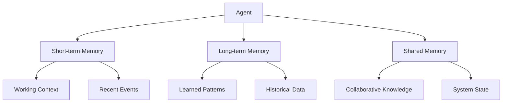

# Memory & State

Cortex-OS agents maintain sophisticated memory systems that enable learning,
adaptation, and collaboration across complex workflows.

## Memory Architecture



## Memory Types

### Short-term Memory

- Current task context
- Recent observations
- Active conversations
- Temporary calculations

### Long-term Memory

- Learned strategies
- Historical performance
- User preferences
- Domain knowledge

### Shared Memory

- Inter-agent coordination
- System-wide state
- Collaborative learning
- Resource allocation

## Memory Providers

Cortex-OS supports multiple memory backends:

| Provider | Use Case | Characteristics |
|----------|----------|-----------------|
| **In-Memory** | Development, testing | Fast, temporary |
| **SQLite** | Local development | Persistent, file-based |
| **PostgreSQL** | Production deployment | Scalable, concurrent |
| **Vector DB** | Semantic search | Embeddings, similarity |

## Usage Example

```typescript
import { createMemoryStore } from '@cortex-os/memories';

const memory = await createMemoryStore({
  provider: 'sqlite',
  path: './agent-memory.db'
});

// Store a memory
await memory.store({
  id: 'task-123',
  type: 'task-completion',
  content: 'Successfully completed code review',
  metadata: { duration: '15min', outcome: 'success' }
});

// Retrieve memories
const memories = await memory.query({
  type: 'task-completion',
  limit: 10
});
```

## Best Practices

- Use appropriate memory types for different data
- Implement memory cleanup to prevent unbounded growth
- Consider memory sharing patterns for collaborative agents
- Monitor memory usage and performance characteristics
