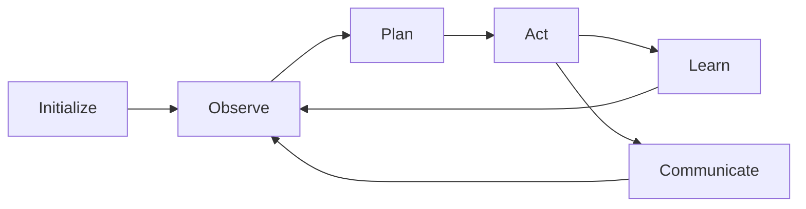

# Agent Overview

Cortex-OS uses autonomous agents as the primary orchestration mechanism for complex AI workflows.
Agents communicate through an event-driven architecture and maintain their own state and memory.

## What are Cortex Agents?

Cortex agents are autonomous software entities that:

- **Make decisions** based on their observations and goals
- **Communicate** through the A2A (Agent-to-Agent) event bus
- **Maintain memory** of past interactions and learning
- **Execute actions** through the MCP (Model Context Protocol) tool system
- **Collaborate** with other agents to accomplish complex tasks

## Agent Lifecycle



## Key Concepts

### Memory and State

Each agent maintains its own memory system for:

- **Short-term memory**: Current task context and immediate observations
- **Long-term memory**: Learned patterns, successful strategies, and historical data
- **Shared memory**: Collaborative knowledge accessible to other agents

### Event-Driven Communication

Agents communicate through structured events:

```typescript
interface AgentEvent {
  type: string;
  source: string;
  target?: string;
  data: unknown;
  timestamp: string;
  correlationId?: string;
}
```

### Tool Integration

Agents can execute actions through MCP tools:

- File system operations
- API calls
- Database queries
- External service integrations

## Agent Types

| Type | Purpose | Examples |
|------|---------|----------|
| **Orchestrator** | Coordinate multi-agent workflows | Task decomposition, resource allocation |
| **Specialist** | Domain-specific expertise | Code analysis, security scanning, testing |
| **Monitor** | Observe and report on system state | Performance monitoring, error detection |
| **Facilitator** | Enable agent collaboration | Message routing, conflict resolution |

## Getting Started

Ready to build your first agent? Check out:

- [Contracts & Validation](./contracts-validation) - Understanding agent communication
- [Memory & State](./memory-state) - Managing agent memory
- [Quick Start Guide](../getting-started/quick-start) - Setting up your environment
