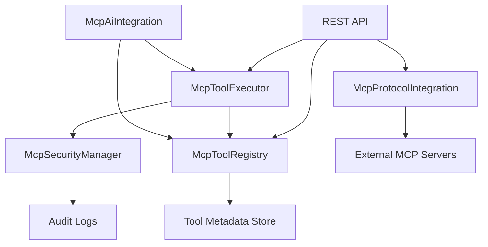

# MCP Tool Integration Guide for Cortex-WebUI

## Overview

This guide documents the comprehensive MCP (Model Context Protocol) tool integration system implemented in Cortex-WebUI. The system provides secure, scalable, and feature-rich tool management with AI integration capabilities.

## Architecture

### Core Components

1. **McpToolRegistry** - Central tool registry with dynamic discovery and lifecycle management
2. **McpToolExecutor** - Secure sandboxed execution engine with timeout handling
3. **McpSecurityManager** - Comprehensive security validation and audit logging
4. **McpProtocolIntegration** - Protocol handler for stdio/HTTP/WebSocket transports
5. **McpAiIntegration** - AI-powered tool recommendations and multimodal processing
6. **REST API** - HTTP endpoints for tool and server management

### Component Interactions



## Features

### 1. Tool Registry

**Dynamic Tool Discovery and Registration**
- Automatic tool metadata validation
- Conflict detection and resolution
- Category and tag-based organization
- Usage tracking and analytics
- Tool lifecycle management (register/unregister/update)

**API Example:**
```typescript
const toolRegistration = {
  metadata: {
    id: 'tool-uuid',
    name: 'search-documents',
    version: '1.0.0',
    description: 'Search through document repositories',
    category: 'search',
    tags: ['documents', 'search', 'analysis'],
    transport: 'stdio',
    serverName: 'doc-server',
    permissions: ['read'],
    resourceLimits: {
      maxExecutionTime: 30000,
      maxMemoryUsage: 512 * 1024 * 1024,
    }
  },
  schema: {
    name: 'search-documents',
    description: 'Search documents tool',
    inputSchema: z.object({
      query: z.string(),
      limit: z.number().optional(),
    }),
    outputSchema: z.object({
      results: z.array(z.object({
        title: z.string(),
        content: z.string(),
        score: z.number(),
      })),
    }),
  },
  handler: async (params, context) => {
    // Tool implementation
  }
};

await mcpToolRegistry.registerTool(toolRegistration);
```

### 2. Tool Execution Engine

**Secure Sandboxed Execution**
- Parameter validation and sanitization
- Async execution with timeout handling
- Resource limit enforcement
- Error handling and recovery
- Execution statistics and monitoring

**Execution Example:**
```typescript
const executionRequest = {
  toolId: 'tool-uuid',
  params: { query: 'AI research', limit: 10 },
  context: {
    userId: 'user-123',
    sessionId: 'session-456',
    correlationId: 'corr-789',
    timestamp: new Date().toISOString(),
    permissions: ['read'],
  },
  timeout: 30000,
};

const result = await toolExecutor.execute(executionRequest);
```

### 3. Security System

**Comprehensive Security Validation**
- Permission-based access control
- Rate limiting and throttling
- Input validation and sanitization
- Resource limit enforcement
- Audit logging and monitoring
- Content security scanning

**Security Configuration:**
```typescript
const securityConfig = {
  enableRateLimiting: true,
  enableInputValidation: true,
  enablePermissionCheck: true,
  enableResourceLimits: true,
  enableAuditLogging: true,
  maxRequestsPerMinute: 60,
  maxRequestsPerHour: 1000,
  maxPayloadSize: 1024 * 1024, // 1MB
  blockedTools: ['dangerous-tool'],
  adminRoles: ['admin', 'superadmin'],
  defaultTimeout: 30000,
};

const securityManager = new McpSecurityManager(securityConfig);
```

### 4. Protocol Integration

**Multi-Transport Support**
- **stdio**: Process-based communication
- **HTTP**: RESTful API communication
- **WebSocket**: Real-time bidirectional communication
- **SSE**: Server-sent events for streaming

**Server Registration:**
```typescript
await protocolIntegration.registerServer({
  name: 'document-processor',
  version: '1.0.0',
  transport: 'stdio',
  command: 'python',
  args: ['-m', 'doc_processor_server'],
  env: { PYTHONPATH: '/app' },
});
```

### 5. AI Integration

**Context-Aware Tool Recommendations**
- RAG query optimization
- Multimodal content processing
- Usage-based recommendations
- Category relevance scoring

**RAG Tool Recommendations:**
```typescript
const recommendations = await aiIntegration.getRAGToolRecommendations({
  query: 'research machine learning papers',
  contextType: 'research',
  userId: 'user-123',
  maxRecommendations: 10,
});

const multimodalResult = await aiIntegration.processMultimodalContent({
  modality: 'image',
  input: {
    imageData: 'base64-encoded-image',
    metadata: { format: 'png', size: 1024 },
  },
  processingOptions: {
    extractText: true,
    generateDescription: true,
  },
});
```

## API Reference

### Tools API

#### List Tools
```http
GET /api/v1/mcp/tools?category=search&status=active&limit=20&offset=0
```

**Response:**
```json
{
  "success": true,
  "data": {
    "tools": [
      {
        "id": "tool-uuid",
        "name": "search-documents",
        "description": "Search through document repositories",
        "category": "search",
        "tags": ["documents", "search"],
        "status": "active",
        "usageCount": 42,
        "lastUsed": "2024-01-15T10:30:00Z"
      }
    ],
    "total": 1,
    "limit": 20,
    "offset": 0
  },
  "timestamp": "2024-01-15T11:00:00Z"
}
```

#### Execute Tool
```http
POST /api/v1/mcp/tools/tool-uuid/execute
Content-Type: application/json

{
  "toolId": "tool-uuid",
  "params": {
    "query": "AI research",
    "limit": 10
  },
  "timeout": 30000,
  "correlationId": "req-123"
}
```

**Response:**
```json
{
  "success": true,
  "toolId": "tool-uuid",
  "data": {
    "results": [
      {
        "title": "Machine Learning Advances",
        "content": "Recent advances in ML...",
        "score": 0.95
      }
    ]
  },
  "metadata": {
    "correlationId": "req-123",
    "executionTime": 1250,
    "timestamp": "2024-01-15T11:00:01Z"
  }
}
```

### Servers API

#### Register Server
```http
POST /api/v1/mcp/servers/register
Content-Type: application/json

{
  "name": "document-processor",
  "version": "1.0.0",
  "transport": "stdio",
  "command": "python",
  "args": ["-m", "doc_processor_server"],
  "env": {
    "PYTHONPATH": "/app"
  }
}
```

#### List Servers
```http
GET /api/v1/mcp/servers
```

**Response:**
```json
{
  "success": true,
  "data": {
    "servers": [
      {
        "id": "document-processor",
        "name": "document-processor",
        "version": "1.0.0",
        "transport": "stdio",
        "status": "connected",
        "toolCount": 5,
        "lastActivity": "2024-01-15T10:45:00Z"
      }
    ],
    "total": 1
  },
  "timestamp": "2024-01-15T11:00:00Z"
}
```

## Integration Examples

### 1. Adding a Custom Tool

```typescript
import { mcpToolRegistry } from '../services/mcp/McpToolRegistry.js';
import { z } from 'zod';

// Define tool schema
const customToolSchema = {
  name: 'data-analyzer',
  description: 'Analyze data patterns',
  inputSchema: z.object({
    data: z.array(z.number()),
    analysisType: z.enum(['mean', 'median', 'std']),
  }),
  outputSchema: z.object({
    result: z.number(),
    metadata: z.object({
      samples: z.number(),
      analysisType: z.string(),
    }),
  }),
};

// Register tool
await mcpToolRegistry.registerTool({
  metadata: {
    id: 'data-analyzer-tool',
    name: 'data-analyzer',
    version: '1.0.0',
    description: 'Analyze numerical data patterns',
    category: 'analysis',
    tags: ['data', 'statistics', 'analysis'],
    transport: 'stdio',
    serverName: 'analysis-server',
    permissions: ['read', 'analyze'],
    status: 'active',
    registeredAt: new Date().toISOString(),
    usageCount: 0,
  },
  schema: customToolSchema,
  handler: async (params, context) => {
    const { data, analysisType } = params;

    switch (analysisType) {
      case 'mean':
        return {
          result: data.reduce((sum, val) => sum + val, 0) / data.length,
          metadata: { samples: data.length, analysisType: 'mean' },
        };
      case 'median':
        const sorted = [...data].sort((a, b) => a - b);
        const mid = Math.floor(sorted.length / 2);
        return {
          result: sorted.length % 2 === 0
            ? (sorted[mid - 1] + sorted[mid]) / 2
            : sorted[mid],
          metadata: { samples: data.length, analysisType: 'median' },
        };
      case 'std':
        const mean = data.reduce((sum, val) => sum + val, 0) / data.length;
        const variance = data.reduce((sum, val) => sum + Math.pow(val - mean, 2), 0) / data.length;
        return {
          result: Math.sqrt(variance),
          metadata: { samples: data.length, analysisType: 'standard deviation' },
        };
    }
  },
});
```

### 2. AI-Powered Tool Selection

```typescript
import { McpAiIntegration } from '../services/mcp/McpAiIntegration.js';
import { McpToolExecutor } from '../services/mcp/McpToolExecutor.js';
import { McpSecurityManager } from '../services/mcp/McpSecurityManager.js';

const aiIntegration = new McpAiIntegration(toolExecutor);

// Get recommendations for research workflow
const recommendations = await aiIntegration.createAIWorkflowRecommendations('research');

// Execute top recommended tool
if (recommendations.length > 0) {
  const topTool = recommendations[0];
  const result = await toolExecutor.execute({
    toolId: topTool.toolId,
    params: { query: 'machine learning research 2024' },
    context: {
      userId: 'researcher-123',
      correlationId: 'research-query-001',
      timestamp: new Date().toISOString(),
      permissions: ['read', 'research'],
    },
  });
}
```

### 3. Multimodal Processing

```typescript
// Process an image with text extraction
const imageResult = await aiIntegration.processMultimodalContent({
  modality: 'image',
  input: {
    imageData: 'base64-encoded-image-data',
    metadata: {
      format: 'png',
      dimensions: { width: 1920, height: 1080 },
      source: 'user-upload'
    },
  },
  preferredTools: ['image-ocr', 'vision-analyzer'],
  processingOptions: {
    extractText: true,
    generateDescription: true,
    analyzeContent: true,
  },
});

console.log('Extracted text:', imageResult.processedData.text);
console.log('Description:', imageResult.processedData.description);
console.log('Analysis:', imageResult.processedData.analysis);
```

## Security Considerations

### 1. Permission System
- Tools require explicit permissions
- Role-based access control
- Admin override capabilities

### 2. Rate Limiting
- Per-user rate limits
- Configurable time windows
- Automatic limit reset

### 3. Input Validation
- Schema-based validation
- Content security scanning
- Path traversal prevention
- Payload size limits

### 4. Audit Logging
- Complete access logging
- Failed attempt tracking
- Security event monitoring

## Performance Optimization

### 1. Tool Caching
- Metadata caching
- Connection pooling
- Result caching

### 2. Resource Management
- Memory usage monitoring
- Execution time limits
- Concurrent execution control

### 3. Statistics and Monitoring
- Usage analytics
- Performance metrics
- Error rate tracking

## Troubleshooting

### Common Issues

1. **Tool Registration Fails**
   - Check tool metadata validation
   - Verify unique name and ID
   - Ensure schema compatibility

2. **Execution Timeout**
   - Increase timeout values
   - Check tool performance
   - Monitor resource usage

3. **Permission Denied**
   - Verify user permissions
   - Check tool requirements
   - Review security configuration

4. **Server Connection Issues**
   - Verify server availability
   - Check transport configuration
   - Review network connectivity

### Debug Logging

Enable debug logging for detailed troubleshooting:

```typescript
import logger from '../utils/logger.js';

logger.level = 'debug';

// Enable specific module logging
logger.debug('brAInwav MCP: Debug mode enabled');
```

## Best Practices

### 1. Tool Development
- Use descriptive names and descriptions
- Provide comprehensive schemas
- Implement proper error handling
- Include usage examples

### 2. Security
- Follow principle of least privilege
- Validate all inputs
- Implement proper logging
- Regular security reviews

### 3. Performance
- Optimize tool execution time
- Use appropriate resource limits
- Monitor usage patterns
- Implement caching strategies

### 4. Documentation
- Document tool capabilities
- Provide usage examples
- Include troubleshooting guides
- Maintain API documentation

## Future Enhancements

### Planned Features
1. **Advanced Tool Composition** - Chain multiple tools
2. **Tool Marketplace** - Community tool sharing
3. **Enhanced AI Integration** - GPT-4 tool selection
4. **Real-time Collaboration** - Multi-user tool sharing
5. **Advanced Analytics** - Usage prediction and optimization

### Extension Points
- Custom transport protocols
- Additional security validators
- Custom AI recommendation engines
- Advanced monitoring integrations

## Support

For support and questions:
- Check the troubleshooting section
- Review audit logs for errors
- Contact the development team
- Submit issues via GitHub

---

**Note**: This MCP tool integration system is part of the brAInwav Cortex-OS ecosystem and follows brAInwav production standards with comprehensive security, monitoring, and quality assurance.