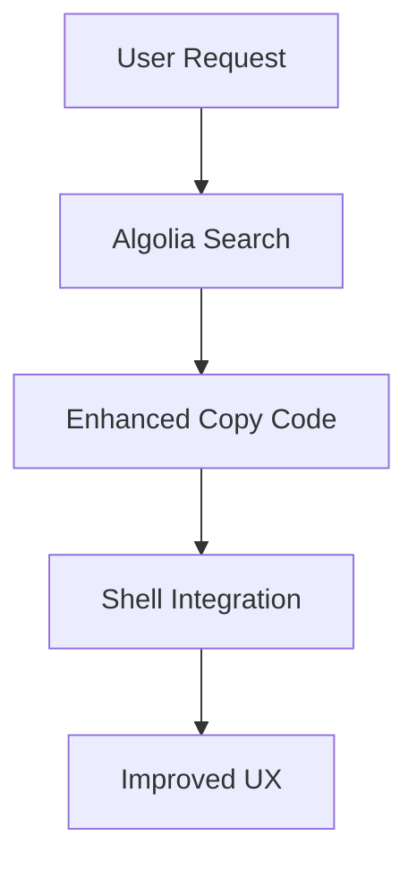

# Test Page for Enhanced Features

This page tests our enhanced Docusaurus features:

## Copy Code Button Test

Here's a code block to test the enhanced copy code functionality:

```javascript
// Test code for copy button
function greetUser(name) {
  console.log(`Hello, ${name}! Welcome to Cortex-OS.`);
  return `Greeting sent to ${name}`;
}

// Usage example
greetUser('Developer');
```

## Shell Integration Test

Here's a shell command example:

```bash
# shell-command
npm install @docusaurus/theme-search-algolia
npm start
```

```bash
# shell-output
+ @docusaurus/theme-search-algolia@3.8.1
added 1 package, and audited 1 package in 2s
```

## Algolia Search

The search functionality is configured and ready to use. To activate:

1. **Get Algolia Credentials**: See [Algolia Setup Guide](/guides/algolia-setup) for detailed instructions
2. **Apply for DocSearch**: Visit [docsearch.algolia.com/apply](https://docsearch.algolia.com/apply/)
3. **Update Configuration**: Replace placeholder values in `docusaurus.config.ts`:

- `appId` → Your Algolia App ID
- `apiKey` → Your search-only API key
- `indexName` → Your index name (default: `cortex-os-docs`)

## Mermaid Diagram



## Features Implemented

✅ **Algolia DocSearch Integration** - Ready for configuration  
✅ **Enhanced Copy Code Button** - Hover animations, success feedback  
✅ **Shell Command Highlighting** - Special styling for shell commands/output  
✅ **Port 3005 Configuration** - Development server on specified port  
✅ **Dark Theme Optimization** - Anthropic-inspired design  
✅ **Mobile Responsive** - Enhanced copy button on mobile devices
